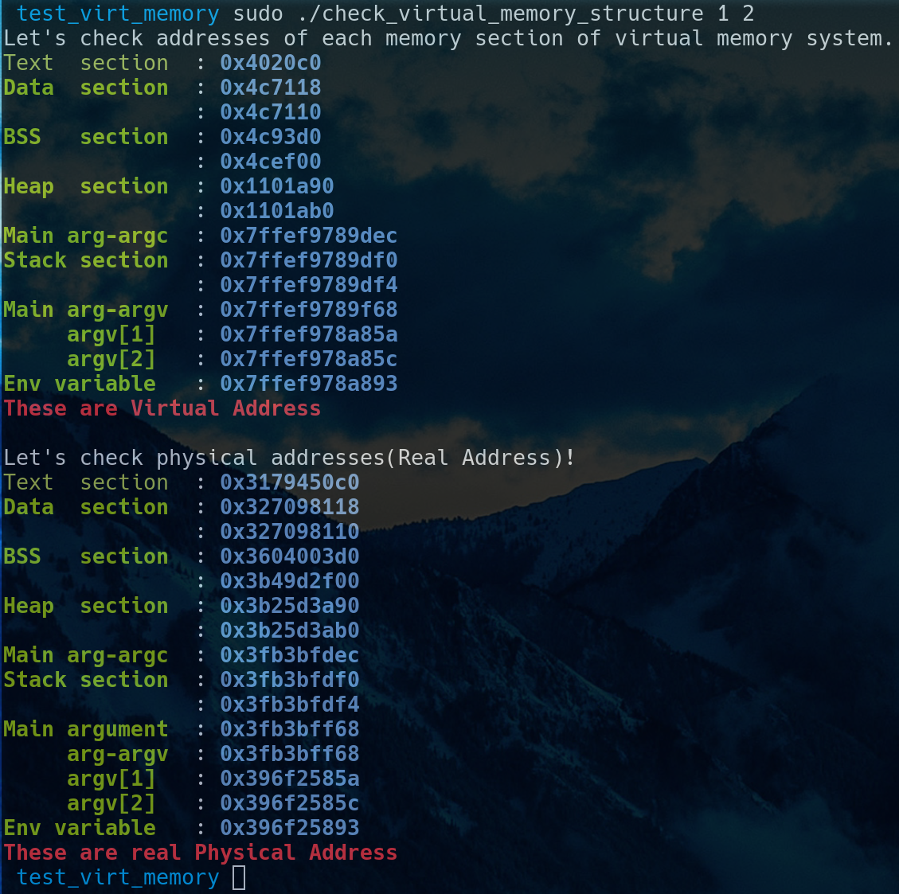
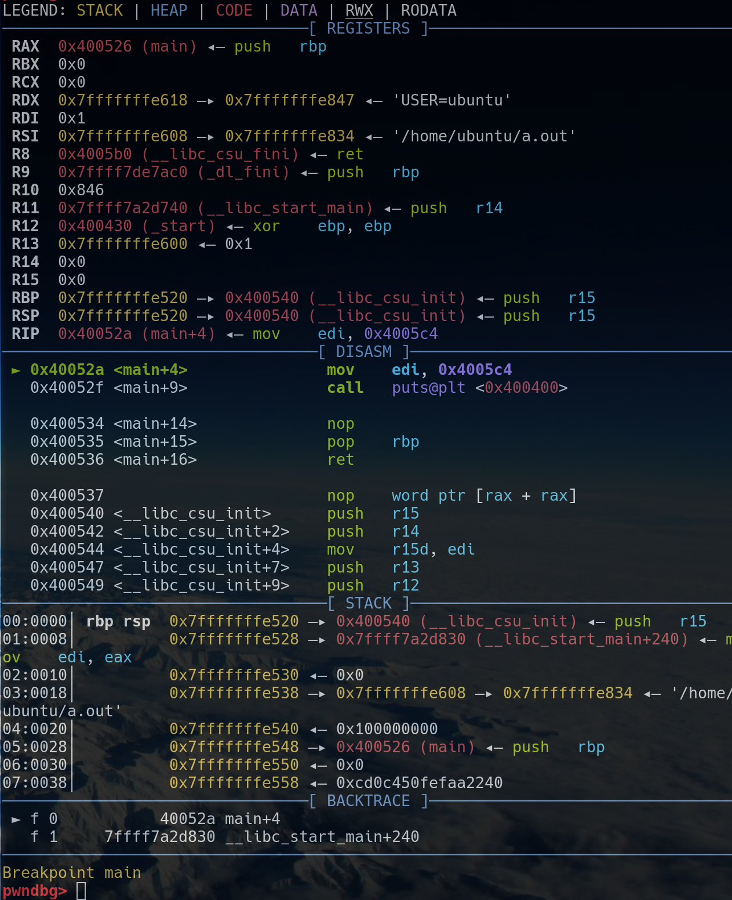
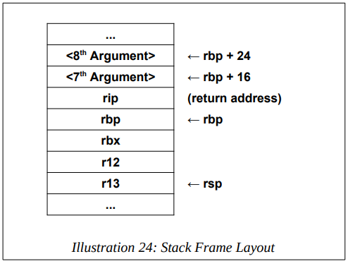

# 컴퓨터를 밑바닥부터 이해해보자 (2) 

# 간단하게 살펴보는 컴퓨터의 구조와 작동 원리 (2)

## 비트 연산

C 언어에서 비트 쉬프트 << 과 >>, ~ 은 내부적으로 shl, shr, not 어셈블리어를 사용한다. 

- `shl <dest> <src>` : `<dest> = <dest> << <src>` 의 의미이다. 

  - SHift Left 의 줄임말이다.
  
  - `1` 번 쉬프트 하면 `2`배 커지고 `2` 번 쉬프트하면 `2^2` 배 커진다. 
  
  - `n` 번 쉬프트 하면 `2^n` 배 커진다. 

  ```assembly
  shl ax, 8  
  shl eax, cl
  ```

- `shr <dest> <src>` : `<dest> = <dest> >> <src>` 의 의미이다.

  - SHift Right 의 줄임말이다. 
  
  - `1` 번 쉬프트 하면 `2`배 나눠지고 `2` 번 쉬프트하면 `2^2` 배 나눠진다. 
  
  - `n` 번 쉬프트 하면 `2^n` 배 나눠진다. 

  ```assembly
  shr rcx, 32     
  shr qword[qNum], cl   
  ```

  - 비트 이동 연산자는 다음 그림과 같이 동작한다. 

  

## 메모리 관리

사용자가 프로그램을 실행하면 HDD 또는 SSD 에 저장되어 있던 프로그램의 바이너리가 RAM 으로 복사된다. RAM 에 로드된 프로그램을 프로세스라고 부르는데 CPU 는 RAM 에서 이 프로세스를 읽으면서 명령을 수행한다. 


현대의 컴퓨터는 프로그램을 HDD 또는 SSD 에서 RAM 으로 로드할 때 가상 메모리 시스템으로 관리한다. 64 비트 시스템에서는 `0x0000000000000000` 부터 `0xffffffffffffffff` 까지의 가상 메모리 영역이 하나의 프로세스에 할당된다. 즉 실질적인 물리적 주소를 할당하는 것이 아니라 가상의 메모리 영역을 할당하는 것이다.

### 가상 메모리 시스템의 메모리 영역

프로그램 바이너리가 RAM 에 로드될 때 할당되는 가상 메모리는 두 영역으로 나뉜다. 하나는 커널 영역, 하나는 사용자 영역이다. 커널영역은 커널 관련 메모리가 로드되고 시스템 콜을 통해서만 접근할 수 있다. 실제 실행될 프로그램은 사용자 영역에 5 등분되서 로드되는데 스택Stack, 힙Heap, BSS 영역, Data 영역, Text 영역이 그것이다.

- 스택Stack 에는 함수의 인자, 함수의 리턴 주소값, 지역 변수가 로드된다.

- 힙Heap 에는 동적 할당 메모리(malloc, new 등) 가 저장된다.

- BSS 영역 : 초기화되지 않았거나 0 으로 초기화된 전역변수, static 변수들이 저장된다.
  
- Data 영역 : 초기화된 전역변수, static 변수들이 Data 영역에 저장된다.

- Text 영역에는 실행될 어셈블리어들이 저장된다. 

  

  - 위의 그림처럼 가장 낮은 주소부터 Text 영역, Data 영역, BSS 영역, Heap 영역, Stack 영역, 그리고 메인함수의 인자와 환경변수, 가장 높은 주소에 커널 영역이 저장된다.
  
  - 이 영역들은 모두 가상 메모리 영역이고 주소값도 가상 주소값이다.
  
  - 게임이든, 문서작업이든, 카카오톡이든 컴퓨터의 어떤 프로그램이라도 이런 식으로 가상 메모리가 할당이 된다. 
    
    

  - 그리고 그러한 가상 메모리 영역은 위와 같이 적절히 쪼개져서 물리 메모리, 즉 실제 메모리에 저장된다. 만약 실제 메모리가 부족할 경우 HDD 또는 SSD 를 사용하게 된다.
    
  - 가상 메모리를 사용하게 되면 메모리 주소값을 일관되게 사용할 수 있고 만약 RAM 이 부족하면 HDD 또는 SSD 를 사용할 수 있게 된다.
    
  - `적절히 쪼개진다(Paging 기법)` 는 것이 구체적으로 어떻게 되는 것인지 설명하려면 한 학기가 필요할테니 그만두고 OS 시간 때 배우시길 바랍니다.

#### 가상 메모리 영역과 물리 메모리 영역 확인해보기 

```c
// https://github.com/ccss17/test_virt_memory
#include <stdio.h>
#include <stdlib.h>
#include "libkdump.h"

#define R "\033[31m"
#define G "\033[32m"
#define B "\033[34;1m"
#define E "\033[0m"

int data = 5555;
int bss = 0;
int bss2;

void text(){ 1+1 == 2; }

int main(int argc, char * argv[]){
    if (argc != 3) {
        fputs(R "Please pass TWO arguments...\n" E , stderr);
        return 1;
    }
    static char * data2 = "twice";
    int stack = 78;
    int stack2 = 23;
    int * heap = (int *)malloc(sizeof(int));
    int * heap2 = (int *)malloc(sizeof(int));
    char * environment_variable = getenv("PATH");

    printf("Let's check addresses of each memory section of virtual memory system.\n");
    printf(G"Text  section " E " : " B "%p\n", text);
    printf(G"Data  section " E " : " B "%p\n", &data2);
    printf(G"              " E " : " B "%p\n", &data);
    printf(G"BSS   section " E " : " B "%p\n", &bss);
    printf(G"              " E " : " B "%p\n", &bss2);
    printf(G"Heap  section " E " : " B "%p\n", heap);
    printf(G"              " E " : " B "%p\n", heap2);
    printf(G"Main arg-argc " E " : " B "%p\n", &argc);
    printf(G"Stack section " E " : " B "%p\n", &stack);
    printf(G"              " E " : " B "%p\n", &stack2);
    printf(G"Main arg-argv " E " : " B "%p\n", argv);
    printf(G"     argv[1]  " E " : " B "%p\n", argv[1]);
    printf(G"     argv[2]  " E " : " B "%p\n", argv[2]);
    printf(G"Env variable  " E " : " B "%p\n", environment_variable);
    printf(R "These are Virtual Address\n\n"E);

    printf("Let's check physical addresses(Real Address)!\n");
    void * physical_text = libkdump_virt_to_phys((size_t)text);
    if (physical_text == NULL) {
        puts(R "If you want to see physical memory address, reexecute with root privileges!"E);
        return 1;
    }
    printf(G"Text  section " E " : " B "%p\n", physical_text);
    printf(G"Data  section " E " : " B "%p\n", libkdump_virt_to_phys((size_t)&data2));
    printf(G"              " E " : " B "%p\n", libkdump_virt_to_phys((size_t)&data));
    printf(G"BSS   section " E " : " B "%p\n", libkdump_virt_to_phys((size_t)&bss));
    printf(G"              " E " : " B "%p\n", libkdump_virt_to_phys((size_t)&bss2));
    printf(G"Heap  section " E " : " B "%p\n", libkdump_virt_to_phys((size_t)heap));
    printf(G"              " E " : " B "%p\n", libkdump_virt_to_phys((size_t)heap2));
    printf(G"Main arg-argc " E " : " B "%p\n", libkdump_virt_to_phys((size_t)&argc));
    printf(G"Stack section " E " : " B "%p\n", libkdump_virt_to_phys((size_t)&stack));
    printf(G"              " E " : " B "%p\n", libkdump_virt_to_phys((size_t)&stack2));
    printf(G"Main argument " E " : " B "%p\n", libkdump_virt_to_phys((size_t)argv));
    printf(G"     arg-argv " E " : " B "%p\n", libkdump_virt_to_phys((size_t)argv));
    printf(G"     argv[1]  " E " : " B "%p\n", libkdump_virt_to_phys((size_t)argv[1]));
    printf(G"     argv[2]  " E " : " B "%p\n", libkdump_virt_to_phys((size_t)argv[2]));
    printf(G"Env variable  " E " : " B "%p\n", libkdump_virt_to_phys((size_t)environment_variable));
    printf(R "These are real Physical Address\n"E);
    return 0;
}
```

위와 같은 간단한 C 프로그램으로 가상 메모리 영역과 물리 메모리 영역을 확인해보자. 

```shell
git clone https://github.com/ccss17/test_virt_memory
cd test_virt_memory
make
sudo ./check_virtual_memory_structure HELLO WOLRD
```

이러한 명령어로 실습을 해볼 수 있고 실행 결과는 다음과 같다. 



---

## 스택 메모리 관리

스택 메모리는 LIFO (Last-In, First-Out) 법칙으로 관리된다. 가장 마지막에 들어온 값이 가장 먼저 제거된다. 

`a = {7, 19, 37}` 이라는 배열을 생각해보자. 

```assembly
push a[0]
push a[1]
push a[2]

pop a[0]
pop a[1]
pop a[2]
```

그리고 그 배열에 대하여 위와 같은 6개 명령어를 실행시켰다. 


그러면 스택은 각각의 6개의 명령어마다 위의 그림과 같이 변하고 배열 a 는 `{37, 19, 7}` 이 된다. `push` 로 값이 스택에 저장된 후 `pop` 으로 스택의 가장 위에 있는 값이 제거 되면서 저장되는 것이다. 

- `push <op>` : push 명령어는 전달된 값을 스택에 저장한다.

  - `push` 는 내부적으로 `rsp` 레지스터를 사용해서 스택의 최상위 주소를 알아내고 그 주소에 값을 저장하게 된다. 그런데 64 비트 메모리 시스템의 스택에에서는 8 바이트 값이 저장되니까 스택이 8 만큼 커진다. 그래서 `rsp` 에 저장된 값이 `8` 을 감소된다. 

  - `8` 을 더하는 게 아니라 왜 뺄까? [메모리 레이아웃](https://notes.shichao.io/tlpi/figure_6-1.png) 에서도 확인할 수 있듯이 스택은 높은 주소에서 낮은 주소로 자라기 때문이다. 

    ```assembly
    push rax            ; rax 의 값을 스택에 저장하고 rsp 값에 8 을 뺀다. 
    push qword [qVal]   ; qVal 의 메모리 주소에 있는 값을 스택에 저장하고 rsp 값에 8 을 뺀다.
    ```

- `pop <op>` : 스택의 가장 위에 있는 값을 `<op>` 에 저장하고 스택을 `8` 만큼 줄여준다.

  - 스택의 가장 위는 `rsp` 가 가르키고 있으니 결국 `rsp` 에 있는 값이 가르키는 값을 `<op>` 에 저장한다는 말이다. 그리고 스택을 줄여주어야 하니 `rsp` 에 `8` 을 더해준다. 

    ```assembly
    pop rax            ; rsp 가 가르키고 있는 스택의 최상위 주소의 데이터를 rax 에 저장하고 rsp 값에 8 을 더한다.
    pop qword [qVal]   ; rsp 가 가르키고 있는 스택의 최상위 주소의 데이터를 qVal 의 메모리 주소에 에 저장하고 rsp 값에 8 을 더한다.
    ```

---

## 기타 명령어 

### test 명령어

- `test <op1> <op2>` : `<op1>` 과 `<op2>` 의 AND 연산 결과가 `0` 일 때 FLAG 레지스터의 Zero Flag, 즉 ZF 를 `True` 로 세팅한다. 

  - 한편 `je` 명령어는 ZF 가 True 로 세팅되어 있을 때 점프한다. 그래서 `je` 명령어는 jump-if-zero 와도 같은 말이다. `cmp` 명령어는 두 값을 비교한다고 이해했는데 실제로는 `cmp <op1> <op2>` 는 `<op1>` 에서 `<op2>` 를 빼서 결과값이 0 이면 FLAG 레지스터의 ZF 를 True 로 세팅한다. 그래서 이후에 `je` 명령어가 FLAG 레지스터의 ZF 플래그가 True 로 세팅되어 있으면 점프하게 되고 세팅되어 있지 않으면 점프하지 않는다. 반대로 `jne` 을 jump-if-not-zero 와도 같다고 이해하면 된다. 

  ```assembly
  test eax, eax
  je <locatoin>
  ```

  - 그래서 위와 같은 어셈블리어가 있을 때 `eax` 가 `0` 이 아니라면 `eax` 와 `eax` 의 AND 연산 결과는 `0` 이 아니다. 따라서 FLAG 레지스터의 ZF 플래그가 세팅되지 않을 것이고 `je` 는 점프하지 않는다. 한 마디로 `eax` 가 `0` 일 때 점프하라는 의미이다. 

### sete 명령어

`sete <reg>` : ZF (Zero Flag) 가 세팅되어 있다면 `<reg>` 를 `1` 로 만들고 그렇지 않으면 `0` 으로 만든다. 

### 나머지 어셈블리어들은?

http://www.jegerlehner.ch/intel/IntelCodeTable.pdf

이렇게 핵심 어셈블리어를 이해해보았기 때문에 나머지 어셈블리어도 스스로 충분히 이해할 수 있을 것이다. 모르는 어셈블리어가 나오면 구글에 검색해보아도 되고 위의 레퍼런스를 참고해도 된다. 

---

## gdb 사용법 (1)

**GNU Debugger** 라고도 하는 `gdb` 란 대중적으로 많이 사용되는 디버깅 툴이다. 프로그램의 작동의 정확성과 논리적 오류를 검증하기 위한 과정을 일컫는 디버깅으로 소스코드로 프로그램을 정적으로 분석하는 것에서 더 나아가서 런타임상에서 프로그램을 동적으로 분석할 수 있다. 디버깅 툴은 `radare2`, `lldb`, `rr-project`, `ida`, `ollydbg` 등등이 있지만 이번에는 `gdb` 로 프로그램을 디버깅하는 가장 기초적인 방식을 알아보자. 

### gdb 명령어 (1) - 기초 명령어 

- `gdb <program>` : gdb 디버깅 시작 

- `run` or `r` : 프로그램 시작 

- `break <location>` or `b` : 브레이크포인트 지정 

  - `break main` or `b main`

  - `break 0x408571` or `b 0x408571`

- `info breakpoints` or `i b` : 브레이크포인트 상태보기 

- `delete breakpoints <location>` or `d br <location>` : 브레이크포인트 삭제 

- `nexti` or `ni` : 하나의 명령어씩 실행. 단, 서브루틴으로 들어가지 않음 

- `stepi` or `si` : 하나의 명령어씩 실행. 단, 서브루틴으로 들어감 

- `next` or `n` : 소스코드 한 줄을 실행. 단, 서브루틴으로 들어가지 않음 

- `step` or `s` : 소스코드 한 줄을 실행. 단, 서브루틴으로 들어감

- `continue` or `c` : 브레이크 포인트를 무시하고 프로그램이 끝날 때가지 실행

- `x/<n-bytes>x <location>` : 해당 주소로부터 메모리를 n byte 를 본다. 

  - `x/10x <location>` : 해당 주소로부터 메모리를 10 byte 를 본다. 

- `disas <function>` : 함수의 어셈블리어를 본다. 

## gdb 연습 (1) - 간단한 C 프로그램 

### 프로그램 준비 및 컴파일 

다음과 같은 간단한 C 프로그램을 작성하고 `test.c` 라고 저장합니다. 

```c
#include <stdio.h>

int add(int n1, int n2)
{
    puts("Hello World!");
    return n1 + n2;
}

int main(void)
{
    int a = 8;
    int b = 1024;
    int result = hello(a, b);
    printf("a + b = %d\n", result);
    return 0;
}
```

그리고 컴파일을 하고 실행해봅니다. 

```shell
gcc test.c -o test
./test
```

### gdb 로 디버깅하기 

이제 `gdb` 로 디버깅을 해봅시다. 다음 명령어로 디버깅을 실습해보죠. 그리고 다른 명령어들도 스스로 실행해보고 어떻게 작동하는지 이해해봅시다. 

```shell
$ gdb test
pwndbg> i file      # info files : 프로그램의 정보를 보는 명령 
pwndbg> i func      # info functions : 프로그램의 함수들을 보는 명령 
pwndbg> b main      # break main : main 함수에 브레이크포인트를 걸어서 main 함수가 시작될 때 프로그램이 멈춘다. 
pwndbg> i b         # info breakpoints : 현재 설정된 브레이크포인트를 본다.
pwndbg> d br 1      # delete breakpoint 1 : 1 번 브레이크포인트를 삭제
pwndbg> b main      # 다시 main 함수에 브레이크포인트 설정 
pwndbg> r           # run : 프로그램을 실행 
pwndbg> disas main  # main 함수의 어셈블리를 본다 
pwndbg> ni          # nexti : 하나의 명령어 씩 실행. 단, 서브루틴으로 들어가지 않음. 
pwndbg> ni          # ni 를 계속 실행하면서 레지스터와 메모리가 변하는 상황을 관찰해본다. 
pwndbg> si          # stepi : 하나의 명령어 씩 실행. 단, 서브루틴으로 들어감.
pwndbg> si          # si 를 실행하면 call 된 함수의 루틴으로 계속해서 들어간다. 
pwndbg> c           # continue : 다음 브레이크포인트까지 프로그램을 진행시킴. 브레이크포인트가 없으면 프로그램이 끝날 때까지 진행시킴. 
```

### pwndbg 의 context 화면 분석 

`pwndbg` 환경에서 `gdb` 로 프로그램을 디버깅하기 시작하면 다음과 같은 화면을 볼 수 있습니다. 



- **RESIGSTERS** 섹션은 현재 레지스터에 저장된 값들을 보여준다. 

- **DISASM** 은 실행될 어셈블리어들을 보여준다. 

- **STACK** 은 스택 메모리 영역을 보여준다. 

- **BACKTRACE** 는 함수 호출 관계를 보여준다. 

---

## 함수 호출의 컴퓨터 내부적인 원리 

CPU 가 함수를 호출해서 프로그램의 흐름을 바꿀 때 `call` 명령어를 쓰고 원래 있던 곳으로 되돌아 갈 때 `ret` 명령어를 사용한다. 다음과 같은 간단한 C 프로그램을 생각하자. 

  ```c
  int add(int a, int b) { return a + b; }
  void main(){
      int a = add(1, 2);
      printf("%d\n", a);
  }
  ```
  
C 프로그램은 내부적으로 call 을 사용해서 add 함수로 뛰고 add 함수가 끝나면 ret 명령어로 다시 main 함수로 되돌아오게 된다. 

- `call <location>` : `call` 명령어는 `call` 명령어 다음 명령어의 주소값을 스택에 `push` 하고 `<location>` 으로 점프한다. 

  ```assembly
  call printf
  call 0x400421
  ```

- `ret` : ret 명령어(return) 는 call 명령어가 스택에 저장해놓은 리턴 주소값을 pop 해서 rip 레지스터에 저장한다. 한 마디로 PC(Program Counter) 를 바꿔서 이전에 실행되던 함수로 되돌아간다는 말이다. 

### 함수 인자 전달
    
- 함수에 인자를 전달할 때 차례대로 rdi, rsi, rdx, rcx, r8, r9 가 사용되고 인자가 7개 이상일 경우 7번째 인자부터는 어쩔 수 없이 레지스터보다 좀 더 느린 메모리를 사용한다. 함수의 반환값은 rax 레지스터에 저장된다.

  ```c
  #include <stdio.h>
  
  int add(int n1, int n2, int n3, int n4, int n5, int n6, int n7) {
      int result = n1 + n2 + n3 + n4 + n5 + n6 + n7;
      return result;
  }
  
  void main() {
      int result;
      result = add(1, 2, 3, 4, 5, 6, 7);
      printf("%d\n", result);
  }
  ```

- 위의 `add` 함수의 경우 rdi = 1, rsi = 2, rdx = 3, rcx = 4, r8 = 5, r9 = 6 이 저장되서 전달되고 7 은 메모리에 저장된 채로 전달된다. 그리고 call 명령어가 다음 명령어를 스택에 저장하고 add 함수로 건너 뛴다. add 함수가 끝나면 ret 명령어가 call 이 스택에 저장해놓은 리턴 주소값을 rip 에 저장한다. 



#### 함수의 시작(스택 메모리 공간 생성하기)

- 함수가 호출 될 때 이전 함수의 스택 베이스 주소를 복원하기 위해서 rbp 를 push 해서 스택에 저장해둔다. 위와 같은 경우 main 함수가 add 함수를 호출하고 있는데 add 함수가 스택을 사용하기 전에 main 함수에서 사용하던 스택 베이스 주소, 즉 rbp 에 있던 값을 스택에 저장해서 main 함수의 스택을 복원해야 할 때를 대비한다. 

  ```assembly
  push rbp        ; 이전에 있던 함수의 rbp 를 스택에 저장
  mov rbp, rsp    ; 스택의 베이스 주소를 스택의 탑 주소와 같게 만듦. 이 시점에서 스택의 크기는 최소 단위 8 바이트가 됨
  sub rsp, 0x60   ; 스택의 크기를 0x60 만큼 늘려줌 
  ```

- 그래서 일반적인 함수는 위와 같은 어셈블리 코드로 시작된다. 

### 함수의 끝 (스택 메모리 공간 정리하기)

- 함수가 일을 다 마치고 원래의 함수로 되돌아 가야 할 때는 위와 같은 어셈블리 코드로 늘려 놓은 스택을 되돌린 후 이전 함수의 rbp 를 복원한다. 이를 이해 다음과 같은 명령어를 사용한다.

  ```assembly
  leave
  ret
  ```

- 늘려진 스택을 줄이고 원래 함수의 스택 베이스 주소를 복원하는 용도로 leave 명령어가 사용된다. leave 명령어는 다음의 코드와 같은 기능을 한다.

  ```assembly
  mov rsp, rbp    ; rsp 에 rbp 를 대입해서 늘어난 스택을 다시 크기가 최소 단위인 8 바이트 스택으로 만든다. 
  pop rbp         ; pop 명령으로 그곳에 남아있던 원래의 함수의 스택 베이스 주소를 rbp 에 복원시킨다. 
  ```

### 32 비트 시스템에서의 함수 인자 전달

64 비트 시스템에서는 위와 같이 레지스터로 함수의 인자를 전달하지만 32 비트 시스템에서는 스택을 사용해서 함수의 인자를 전달한다. 그래서 `file` 명령어 등을 통해서 디버깅을 할 때 64 비트용 프로그램인지 32비트용 프로그램인지 확인해야 한다. 만약 32 비트 용 프로그램이라면 다음과 같은 출력을 볼 수 있다.

```shell
$ file crackme0x00a
crackme0x00a: ELF 32-bit LSB executable, Intel 80386, version 1 (SYSV), dynamically linked, interpreter /lib/ld-, for GNU/Linux 2.6.15, BuildID[sha1]=a01d6d16a59c7f0d7ec00ab5454eed2eb22bd20d, not stripped
```

반면 64 비트용 프로그램이라면 다음과 같은 출력이 나타난다.

```shell
$ file test64
test64: ELF 64-bit LSB shared object, x86-64, version 1 (SYSV), dynamically linked, interpreter /lib64/l, for GNU/Linux 3.2.0, BuildID[sha1]=95a71c9bbc3786b1fd05f214d63bce1fc7b3262b, not stripped
```

32 비트 시스템에서는 인자를 차례대로 `esp, esp+4, esp+8, ..., esp+4n` 의 위치에 저장한 후 `call` 명령어로 함수를 호출한다. 그리고 반환값을 `eax` 에 저장한다. 

```c
#include <stdio.h>

int add(int n1, int n2, int n3, int n4, int n5, int n6, int n7) {
    int result = n1 + n2 + n3 + n4 + n5 + n6 + n7;
    return result;
}

void main() {
    int result;
    result = add(1, 2, 3, 4, 5, 6, 7);
    printf("%d\n", result);
}
```

이 프로그램을 다시 살펴보자. 이 프로그램을 다음 명령어를 참고해서 32 비트 전용 프로그램으로 컴파일 해보자. 

```shell
$ gcc test.c -m32 -o test
$ file test
```

`-m32` 옵션을 붙혀주면 32 비트용 프로그램으로 컴파일 되는데...

# TODO...

---

## 과제 

### 과제 가이드 

1. [HW-3.md](HW-3/HW-3.md) 파일의 지시를 따르는 것이 과제이다. (발표를 하며 설명을 할 수 있어야 합니다)

2. 과제 파일은 [HW-3](HW-3) 디렉토리에 만들어야 한다. 

3. 과제 파일이 완성되면 다음 명령어를 참고하여 완성된 과제를 푸쉬한다. 

```shell
cd /path/to/security
git add .
git commit -m "complete HW-3"
git push -u origin master
```

4. 마지막으로 `pull requests` 를 한다. 
