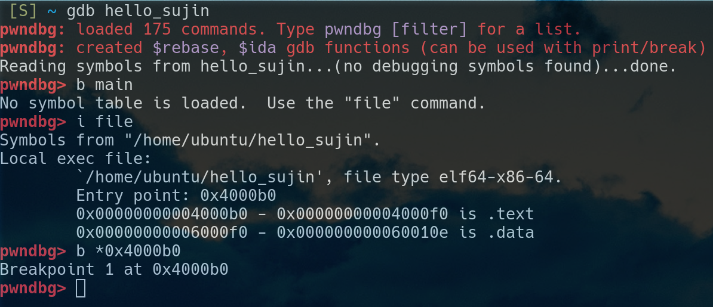

# 리버싱 (1)

## 해킹의 어원

https://ko.wikipedia.org/wiki/해킹

http://www.gachonnews.com/news/articleView.html?idxno=4930

본래 거칠게 자르거나 헤집는다는 뜻의 hack 이라는 낱말에 지금의 의미를 부여한 것의 유래는 분명하지 않으나 1948년 매사추세츠공과대학의 모형 기차 제작 동아리인 TMRC에서 전기 기차, 트랙, 스위치를 보다 빠르게 조작하다 라는 의미로 시작됐다. 해킹의 정의는 시간에 따라 변화되어 왔는데 초기에는 '컴퓨터와 컴퓨터간의 네트워크를 자유자재로 다루고 조작하는 행위'를 말했다. 이후 악의적인 행동이 늘어나면서 '다른 컴퓨터 시스템을 침입할 때 파괴적인 계획을 갖고 침입하는 행위'라는 부정적 의미를 갖게 되었으며, 일명 크래킹이라 하였다.

아톰 텍스트 에디터를 해킹해라? : https://flight-manual.atom.io/hacking-atom/

그런데 대상에 대하여 알고 있는 만큼 그것을 "자유자재로 다루고 조작" 할 수 있다. 사실 컴퓨터 뿐만 아니라 어떤 분야든지 알고 있는 만큼 그것을 마음대로 다룰 수 있는 능력이 생긴다. 요리를 할 때도 사람들의 입맛이 무엇이고 그 입맛을 맞추기 위해 재료를 어떻게 손질해야 하는지 알아야 요리를 자유자재로 할 수 있을 것이다. 또 뉴스를 보면 범죄를 저지르면서도 법 망을 요리조리 피해서 속편하게 살아가는 사람들이 있는데 대한민국 법에 대해서 잘 알고 있으니까 그런 식으로 법을 자유자재로 다루면서 법 망을 피해갈 수 있는 것이다. 

컴퓨터에 대해서도 마찬가지인데 컴퓨터가 작동하는 방식과 서로 통신하는 것, 그리고 특정한 프로그램이 어떻게 작동하는지 알고 있는만큼 그것을 "자유자재로 다룰(해킹)" 수 있다. 그래서 해킹의 사전작업은 리버싱으로 프로그램과 컴퓨터와 기타등등을 제대로 이해하는 것이다. 

## 리버싱이란 

https://ko.wikipedia.org/wiki/리버스_엔지니어링

https://www.foo.be/cours/dess-20122013/b/Eldad_Eilam-Reversing__Secrets_of_Reverse_Engineering-Wiley(2005).pdf

역공학 또는 리버싱reversing 이란 리버스 엔지니어링reverse engineering 의 줄임말이다. 공학이란 아이디어와 개념을 물질(최종 제품)로 구현하는 것이라 할 수 있는데, 역공학이란 공학과 정반대로 물질(최종 제품)에서부터 아이디어와 개념을 이해하는 것이다. 

두번째 링크의 저자가 정의하고 있는 리버싱이란 "어떤 소프트웨어의 모든 것에 대하여 이해할 수 있는 도구와 기술들" 이다. 그리고 저자는 정의를 좀 더 확장해서 자기 자신이 만든 프로그램일지라도 몇 일이 지난 후 어떻게 프로그램이 짜여져있는지 잊어버린 후 코드를 다시 살펴보는 것도 리버싱이라고 말한다. 자신이 코드를 어떻게 짰는지 까먹은 후 다시 살펴보는 것도 물질(최종 제품) 으로부터 아이디어와 개념을 이해하려는 시도로 볼 수 있다. 

또한 [어떤 해커가 메가스터디 서버를 해킹해서 사용자들의 정보를 탈취했는데](https://www.boannews.com/media/view.asp?idx=80375&kind=) 해커는 분명히 메가스터디 서버가 어떻게 작동하는지 알기 위해 리버싱을 하였고 그 리버싱으로 알아낸 개념과 아이디어, 원리들을 기반으로 해킹을 할 수 있었을 것이다. 그래서 비단 어셈블리어를 뒤지고 있는 게 리버싱이 아니라 우리가 알게 된 리버싱의 정의에 따르면 서버에 대하여 여러가지 테스트를 해보는 것도 리버싱이고 자기 자신의 코드를 자기 살펴보는 것도 리버싱인 것이다. 

대상에 대하여 알고 있는 정도와 대상을 자유자재로 다룰 수 있는 정도는 정비례한다. 그리고 리버싱을 많이 하면 할 수록 대상에 대하여 알고 있는 정도가 늘어날 것이고 해킹 할 수 있는 정도(자유자재로 다룰 수 있는 정도)도 늘어난다. 그래서 리버싱에 투자하는 시간이 무한에 가까워질 수록 해킹할 수 있는 범위도 무한히 넓어지지만 우리에게 주어진 시간은 무한하지 않기 때문에, 해킹의 목적에 따라서 필요한 만큼 리버싱을 하는 것도 중요하다. 

## 리버싱 도구

그렇기 때문에 리버싱이란 "대상(프로그램, 서버, 프로토콜 등등)의 작동방식을 이해하는 행위" 인데 지금부터는 비밀번호를 물어보는 프로그램들을 간단하게 해킹해 볼 것이기 때문에 지금은 "비밀번호를 물어보는 프로그램의 작동방식을 이해하는 것" 을 리버싱이라고 생각하자. 그럼에도 불구하고 그 프로그램의 작동방식을 전부 다 알 필요는 없다. 위에서도 언급했지만 시간이 무한하지 않기 때문에 해킹에 필요한 만큼의 작동방식만 이해하면 된다.

그래서 결국에 해킹을 위하여 프로그램의 작동방식을 이해하고 싶은데 프로그램은 실질적으로 눈에 보이지 않는 전자기들로 이루어져있으니 그것들을 볼 수 있게 도와주는 도구들이 필요하다. 그중에서 무료이면서 대중적인 리버싱 도구들이 **gdb** 와 **radare2** 이다. 

https://github.com/tylerha97/awesome-reversing : 여기에서 더 많은 리버싱 정보를 볼 수 있다. 

다른 리버싱 툴에 대해서는 Apple 의 LLVM 슈트에서 제공하는 [`lldb`](https://lldb.llvm.org/use/tutorial.html) 도 살펴보시길 바랍니다. 최근에는 [`rr`](https://rr-project.org/) 이라는 리버싱 툴도 각광받고 있습니다. 

### 참고 - awesome 레포지토리에 대해서

> 다양한 IT 분야의 프로그래머들은 자신의 분야에 대한 개쩌는(awesome) 정보들을 한 군데로 수집하기 위해서 awesome-??? 레포지토리들을 제작하기 시작했는데 그 awesome-??? 레포지토리를 한 군데로 모은 것이 [sindresorhus](https://github.com/sindresorhus) 라는 프로그래머의 [awesome 레포지토리](https://github.com/sindresorhus/awesome) 이다. 이 레포지토리는 스타를 11만 1362개(19/7/10 기준) 를 받아서 Github 단일 레포지토리 중에서 [스타 랭킹이 전체 8위](https://gitstar-ranking.com)를 기록했다. 그리고 이 sindresorhus 라는 프로그래머는 총 합산 스타가 402,004 (19/7/10 기준)으로써 전체 Github 유저 중 1위이다. 그 40만개의 스타 중에서 1/4 인 11만개를 awesome 레포지토리가 차지하고 있다. 

### elf 툴 

- GNU 바이너리 유틸리티 : GNU 유틸리티는 Linux 에 기본으로 탑재되어 있으니 설치하지 않아도 쓸 수 있는 툴들이니만큼 대중적이고 중요한 명령어들이다. 

  - GNU 의 바이너리 툴 : https://en.wikipedia.org/wiki/GNU_Binutils

  - 메뉴얼 : https://sourceware.org/binutils/docs/binutils/

  - [`objdump`](https://en.wikipedia.org/wiki/Objdump) : 바이너리 실행파일의 내부 내용을 분석하여 볼 수 있게 해주는 명령어. 

  - [`realelf`](https://www.cs.swarthmore.edu/~newhall/unixhelp/binaryfiles.html) : elf 실행파일의 구조를 분석하여 볼 수 있게 해주는 명령어. 

  - `strings` : 프로그램에 있는 문자열 출력 

  - `ltrace` : 프로그램이 사용하는 library 출력. 그래서 **l**trace

  - `strace` : 프로그램이 사용하는 syscall 출력. 

- 리눅스 리버싱 툴 : https://en.wikibooks.org/wiki/X86_Disassembly/Analysis_Tools

  - `xxd` : 헥스 뷰

  - `hd` : 헥스 뷰

  - `hexyl` : `find` 대체 명령어 `fd`, `cat` 대체 명령어 `bat` 을 만든 [sharkdp 라는 프로그래머](https://github.com/sharkdp/)가 만든 `xxd` 와 `hd` 대체 명령어

## gdb 사용법 (2)

### gdb 명령어 (2)

- `print <var or funct>` or `p <var or func>` : 변수 또는 함수의 정보를 볼 수 있음 

- `watch <location>` : 해당 메모리가 변하는 것을 볼 수 있음. pwndbg 의 경우 context 가 watch 의 출력을 씹어버려서 context 를 다른 tty 로 리다이렉트 해주어야 함. 

  - `watch *0x80808080` : 0x80808080 의 주소값의 값이 변하는 것을 관찰한다 

  - `info watchpoint` or `i wat` : 와치포인트 리스트를 본다. 

  - `delete watchpoint <num>` or `d wat <num>` : 와치포인트를 삭제한다.

- `backtrace` or `bt` : 호출 함수 스택을 볼 수 있음 

- `info register` or `i r` : 레지스터 정보

- `finish` : 자신을 호출한 함수로 리턴할 때까지 실행 

- `r <args>` : gdb 안에서 프로그램을 실행할 때 `<args>` 를 main 함수의 인자로 전달함

  - `./program <args>` 와 같은 효과라는 것임. 

- `r <<< $(command)` : gdb 안에서 프로그램에 `command` 의 결과를 입력으로 전달함 

  - `command | ./program` : 과 같은 효과임.

### gdb 명령어 (3) - 메모리 보기 

- `x/x $esp` : esp 주소값에 있는 값을 하나 본다. 

- `x/x $ebp` : ebp 주소값에 있는 값을 하나 본다. 

- `x/x 0x80808080` : 0x80808080 메모리에 있는 값을 하나 본다. 

- `x/b 0x80808080` : byte 형식으로 보기 

- `x/wx 0x80808080` : double-word 형식으로 보기 

- `x/10x 0x80808080` : 0x80808080 메모리에 있는 값을 10 개 본다. 

- `x/c 0x80808080` : 0x80808080 메모리에 있는 값을 char 형식으로 본다. 

- `x/s 0x80808080` : 0x80808080 메모리에 있는 값을 string 형식으로 본다. 

- `x/i 0x80808080` : 0x80808080 메모리에 있는 값을 instruction 형식으로(어셈블리어) 로 본다. 

### gdb 명령어 (4) - 메모리 쓰기  

- `set $esp = 0x4444` : esp 레지스터의 값을 0x4444 로 쓴다. 

- `set $rip = 0x80808080` : rip 레지스터의 값을 0x80808080 으로 쓴다. 다음에 실행할 명령어를 바꾸는 의미. 

- `set *0xffffce00 = 0` : 0xffffce00 메모리 주소에 있는 값을 0 으로 바꾼다. 

- `set *0xffffce00 = 0x41414141` : 0xffffce00 메모리 주소에 있는 값을 0x41414141 으로 바꾼다. 

### gdb 명령어 (5) - pwndbg 전용 명령어 

일반 `gdb` 에서는 실행할 수 없고 `pwndbg` 을 설치해야만 실행할 수 있는 명령어들입니다. 

- `nextcall` : 다음 `call` 까지 진행. 

- `nextjmp` : 다음 `jmp` 까지 진행.

- `pdisas <function>` : 함수의 어셈블리어를 이쁘게 보여줌 

- `set context-output <tty>` : `context` 화면을 다른 tty 세션으로 리다이렉트 시켜서 볼 수 있게 해줌. 보통 `tmux` 와 같이 사용된다. 

## gdb 연습 (2) - 어셈블리어  프로그램 

이번에는 여러분이 과제로 자신의 이름을 출력하는 어셈블리어 프로그램을 `gdb` 로 디버깅해봅시다.

```assembly
global    _start
section   .text

_start:
  mov       rax, 1
  mov       rdi, 1
  mov       rsi, message
  mov       rdx, 13
  syscall
  mov       rax, 1
  mov       rdi, 1
  mov       rsi, message2
  mov       rdx, 17
  syscall
  mov       rax, 60
  xor       rdi, rdi
  syscall
section   .data
  message db        "Hello, World", 10
  message2 db        "My name is Sujin", 10
```

위와 같은 어셈블리어 프로그램을 짜고 `hello_sujin` 으로 컴파일 했다고 하자. 그러면 `gdb hello_sujin` 으로 디버깅을 시작할 수 있다.



하지만 위와 같이 어셈블리어 파일은 `main` 함수가 없어서 `i file` 명령어로 엔트리 포인트를 확인하고 브레이크 포인트를 걸어주어야 한다. 그리고 `r` 명령어로 실행해보자.

그리고 지금까지 배웠던 다양한 `gdb` 명령어들을 실행해보자. 

## gdb 실습  

먼저 다음의 명령어를 참고해서 리버싱 문제를 내려받자.

```shell
$ wget http://security.cs.rpi.edu/courses/binexp-spring2015/lectures/2/challenges.zip
$ unzip challenges.zip
$ cd challenges
$ ls
```

그러면 crackme 라는 프로그램들이 보인다. 이 프로그램들은 실행하면 비밀번호를 묻는다. 즉 비밀번호를 아는 권한이 있는 사용자만이 이 프로그램을 사용할 수 있는 것이다. 하지만 gdb 로 리버싱을 해서 비밀번호를 알아낸 후 프로그램을 크래킹해보자. 만약 비밀번호가 틀렸다면 `Wrong!` 같은 문장이 보일 것이고 비밀번호를 맞췄다면 `Congrats!` 같은 문장이 출력될 것이다.

- 프로그램들은 crackme0x0N 의 형식으로 되어있는데 N 의 숫자가 클 수록 어려운 문제이다. 

- `crackme0x00a`, `crackme0x00b`, `crackme0x01`, `crackme0x02`, `crackme0x03` 을 풀어봅시다. (과제가 아니니까 조금 풀어보다가 못풀겠다 싶으면 그냥 아래의 설명을 읽으세요.)

### 리버싱 원칙 

1. "Correct" 가 출력되는 로직과 "Incorrect" 가 출력되는 로직이 있다는 것을 확인하고 "Correct" 가 출력될 수 있는 분기점을 확인한다.

   - 가령 게임 월핵을 만들고 싶다고 가정하면 게임 속 벽이 캐릭터를 가리는 로직의 분기점을 먼저 리버싱을 통해 이해하는 것이다.  

   - 일반적으로 말하면 프로그램에서 작동하길 바라는 어떤 동작이 실행되는 분기 및 조건을 이해하는 것이다. 

2. 어떻게 하면 프로그램 실행흐름이 그 분기로 넘어갈 수 있는지 조사한 후 프로그램의 실행 흐름을 조작한다. 분기가 어떻게 결정되는지 이해하면 분기를 조작할 수 있다(&rarr;해킹 할 수 있다). 

### crackme0x00b ~ crackme0x03 까지 설명

#### **crackme0x00b** 

1. scanf 가 `%ls` 의 형식으로 입력을 받음. `%ls` 에 대해서 검색해보니 와이드 스트링을 받는 용도로 `%s` 와는 구별이 됨. 

2. 또한 비밀번호를 비교할 때 wcscmp 함수를 사용.
  
3. wcscmp 함수에 대하여 알아보니 와이드 캐릭터에 대한 비교 함수임.
  
4. 그래서 와이드 캐릭터를 알아보니 일반적인 8 비트 캐릭터가 아닌 유니코드 같은 16 비트 캐릭터를 저장하기 위한 캐릭터. 

#### **crackme0x01**

1. `scanf` 의 파라미터가 ("%d", 0xffffd543) 임.

2. `cmp` 로 `[ebp - 4]` 를 0x149a 와 비교함. 그리고 같이 않으면 "Incorrect" 를 출력하는 로직으로 흘러감. 

    - `p $ebp - 4` 로 $ebp - 4 의 주소값을 확인해보니 0xffffd543 임. 

3. 그래서 입력한 값이 0x149a, 즉 5274 이면 `cmp` 문이 같다는 결과를 FLAG 레지스터에 씀.  

#### **crackme0x02**

1. `scanf` 의 파라미터가 ("%d", 0xffffd534) 이고 0xffffd534 는 ebp - 4 임.

2. ebp - 4 주소값에 있는 값을 eax 에 저장하고 이 값을 ebp - 0xc 주소값에 있는 값과 비교함. 

3. 그런데 ebp - 0xc 에는 0x52b24 가 저장되어 있음.

    - `p $ebp - 0xc` 로 주소값 확인

    - `x/x $ebp - 0xc` 로 메모리값 확인 

#### **crackme0x03**

1. `scanf` 의 파라미터가 ("%d", 0xffffd534) 이고 0xffffd534 는 ebp - 4 임.

2. `test` 라는 함수의 파라미터가 ("입력한 값", 0x52b24, 0xf7ffd000, 0xf7e166a5) 임. `si` 로 `test` 함수로 들어감

3. `test` 함수에서 입력한 값과 0x52b24 (338724) 를 비교함. 같지 않으면 "Invalid" 를 출력하는 로직으로 흘러감. 

---

## 과제 

### 과제 가이드 

1. [HW-4.md](HW-4/HW-4.md) 파일의 지시를 따르는 것이 과제이다. (발표를 하며 설명을 할 수 있어야 합니다)

2. 과제 파일은 [HW-4](HW-4) 디렉토리에 만들어야 한다. 

3. 과제 파일이 완성되면 다음 명령어를 참고하여 완성된 과제를 푸쉬한다. 

```shell
cd /path/to/security
git add .
git commit -m "complete HW-4"
git push -u origin master
```

4. 마지막으로 `pull requests` 를 한다. 
