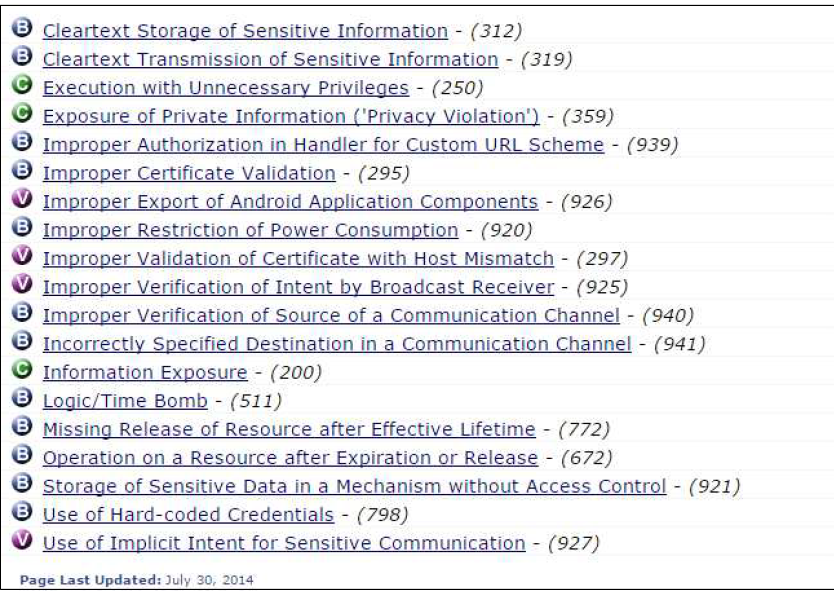

# 과제1 
1. CVE 
- cve란
    - Common Vulnerabilities and Exposure의 약자로 공개적으로 알려진 소프트웨어의 보안취약점을 가리키는 고유 표기를 뜻한다. 이는 취약점을 가진 다른 도구, 저장소 및 서비스 간에 데이터를 공유하는 것이 목표다.

- CVE 넘버를 포함한 최근 2년 안에 발생한 취약점

  - CVE 넘버 : CVE-2018-8477
    취약점 내용 : 	Windows 커널 메모리 정보 노출 취약점
    패치 일시 : ’18.12.11
    윈도우 커널이 메모리에서 객체들을 부적절하게 다룰 때 정보 노출 취약점이 발생한다.
    이 취약점을 성공적으로 착출한 공격자는 유저 시스템을 더 노출 시킬 수 있게 정보들을 더 얻을 수 있다.

2. 프로그램 결함
    - CWE는 Common Weakness Enumeration의 약자로 보안약점 리스트이다.
        - CWE-919
            - 모바일 어플리케이션 관련 보안약점
            
            안드로이드나 iOS에 기반을 둔 최근의 모바일 앱은 기존의 데스크톱이나 랩톱에서 구동되는 범용 운영 체제에서 제공하는 일반적인 기능들을 모바일 디바이스에서 거의 그대로 사용할 수 있다는 특징을 가지고 있다.
    
    - OWASP는 Open Web Application Security Project의 약자로  오픈소스 웹 애플리케이션 보안 프로젝트를 말한다. OWASP는 가장 큰 오픈소스 웹 애플리케이션 보안 프로젝트로 주로 웹에 관한 정보노출, 악성 파일 및 스크립트, 보안 취약점 등을 연구하며, 10대 웹 애플리케이션의 취약점(OWASP TOP 10)을 발표한다.
        - Injection(인젝션)
            - SQL, OS, XXE(Xml eXternal Entity), LDAP 인젝션 취약점은 신뢰할 수 없는 데이터가 명령어나 쿼리문의 일부분이 인터프리터로 보내질때 발생한다. 공격자의 악의적인 데이터는 예상하지 못하는 명령을 실행하거나 적절한 권한 없이 데이터에 접근하도록 인터프리터를 속일 수 있다.
3. 실제 사례
    - 
    - 유명한 해킹 사건 (역대로 있었던 유명한 해킹 사건을 1건 찾아서 간단하게 정리를 해옵시다)
  
    - 악성코드 (아무 악성코드의 소스코드를 가져옵시다)
  
      - Backdoor, DDoS, 도청 및 감시, Virus, Ransomware, Worm, Trojan(트로이목마), KeyLogger, RootKit 등등등

4. 아무거나 쓰세요
