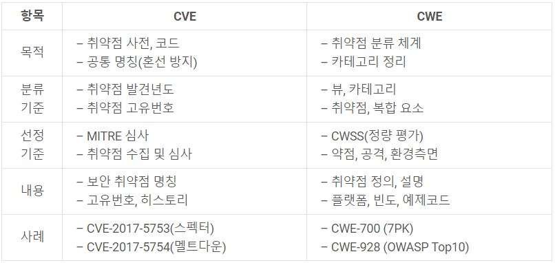
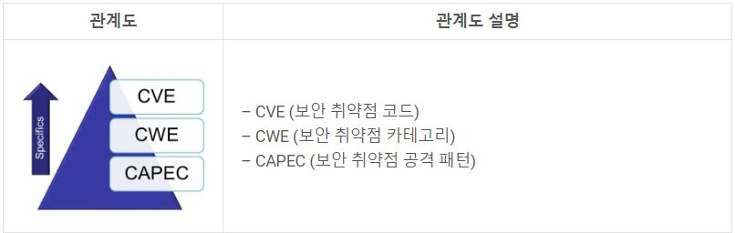

# GBC 과제 1 

---
## 1. CVE란 무엇인가
### **CVE : 'Common Vulnerabilities and Exposure' 의 약자로 정보 보안 취약점 표준 코드를 뜻한다**

- #### **현재까지 알려진 취약점을 식별하는 방식을 표준화하는 데 목적이 있는 코드이다**
- #### **표기 방식은 "CVE-[취약점이 발견된 년도]-[취약점고유번호]"이다**
- #### **최근 2년 내에 발견 된 CVE 2가지 예시**
  - CVE-2019-0797(Win32k 권한 상승 취약점) : Kaspersky 보안 업체를 통해 보고된 해당 취약점은 Windows 8.1, Windows 10, Windows Server 2012, Windows Server 2012 R2, Windows Server 2016, Windows Server 2019 운영 체제 환경에서 Win32k 구성 요소가 메모리에서 적절하게 객체 처리를 하지 못하여 권한 상승이 발생하는 취약점이다
    
  - CVE-2019-0808(Win32k 권한 상승 취약점) : Google 업체를 통해 보고된 Windows 7, Windows Server 2008 운영 체제 환경에서 Win32k 구성 요소가 메모리에서 적절하게 객체 처리를 하지 못하여 권한 상승이 발생하는 취약점이다.
   
  - > 위의 두가지 모두 해당 취약점 공격에 성공할 경우 커널 모드로 임의의 코드 실행이 가능하다. 이를 통해 공격자는 프로그램 설치, 데이터 보기, 변경 및 삭제가 가능하며 새로운 사용자 계정을 생성할 수 있다.

  - > 해당 Win32k 권한 상승 취약점은 Chrome 취약점과 함께 실제 FruityArmor, SandCat 공격 그룹에서 사이버 공격에 사용되었던 것으로 알려져 있기 때문에 Windows 운영 체제 사용자는 반드시 2019년 3월에 배포된 정기 보안 업데이트를 통해 최신 패치를 적용해야 한다.

  - CVE ID 예시
     
      

## 2. 프로그램의 결함
### **CWE : CVE를 관리하는 MITRE의 프로젝트로 'Common Weakness Enumeration'의 약자이다**
- #### **일반적으로 널리 통용되는 주요 취약점, 보안상의 문제들을 나열하여 정리하는 역할을 한다**
- #### **CVE가 취약점 정의 역할을 한다면 CWE는 애플리케이션 보안 취약점에 대한 카테고리 정리를 목표로 한다**
- #### **표기 방식은 "CWE-[보안약점고유번호]"이다**
- #### **CWE의 예시**
  - CWE-601 : 신뢰되지 않은 사이트로 URL 재지정('열린 재지정')

  - CWE-311 : 민감한 데이터에 대한 암호화 누락

    

- #### **CVE와 CWE 비교**

  - CVE의 V 는 취약점(Vulnerabilities) 를 의미하고 CWE의 W 는 보안약점(weakness)을 의미한다. CVE는 취약점 리스트이고 CWE는 보안약점 리스트이다

  - 취약점과 보안 약점의 차이는 mitre 홈페이지에 있는 문장을 직역하면 취약점은 해커가 시스템이나 네트워크에 액세스하기 위해 직접 사용할 수 있는 소프트웨어의 실수 (mistake)이고 보안 약점은 소프트웨어 취약점(vulnerabilities)으로 이어질 수 있는 오류 (error)이다.  

     

- #### **CVE와 CWE 비교**

       

## 3. 해킹의 실제 사례들

  - #### **블라디미르 레빈(Vladimir Levin)의 씨티은행을 해킹 사건**
    - 1995년 러시아 범죄 조직 우두머리인 블라디미르 레빈이 씨티은행 네트워크에 있는 계좌에 접속 해 수백 만 달러를 훔쳤던 일은 금전적 동기로 실행했던 최초의 해킹사건이었다. 레빈은 거대 범죄 조직을 배후에 두고 런던에 있는 컴퓨터를 사용해 고객 코드(customer codes) 및 비밀번호 목록을 얻어낸 후 몇 주에 걸쳐 여러 번 로그인을 해 범죄 조직이 관리하는 계좌로 돈을 빼돌렸다. 레빈은 결국 FBI에 의해 런던 공항에서 체포되었고 미국에서 재판에 넘겨진 후 유죄 판결을 받아 1998년 약 3년 간의 수감형을 받았다. 또한 씨티은행 측에는 24만 15 달러를 배상하라는 판결이 내려졌다.
  
  - #### **조나단 제임스(Jonathan James)의 나사 해킹 사건**  
    - ‘c0mrade’라는 해커 명으로 활동했던 조나단 제임스는 1999년 앨러배마 주 헌츠빌(Huntsville)의 마샬우주비행센터(Marshall Space Flight Center)를 해킹해 국제우주정거장의 특허 소프트웨어를 다운로드했다. 특허 소프트웨어는 국제우주정거장의 물리적 환경을 지탱하고 우주 생활에서 중요한 습도 및 온도를 조절하는 데 매우 중요한 역할을 하는 소프트웨어였다. 나사 관계자들의 말에 따르면 조나단이 훔친 것은 약 170만 달러의 가치가 있었다. 나사는 이를 계기로 컴퓨터 시스템을 약 3주간 정지시키고 수리해야 했는데 이로 인해 4만 1,000달러가 소요됐다.


## 4. 아무거나 쓰세요

- #### 마크다운 너무 재밌다
> #### 마크다운 너무 재밌다
>> #### 마크다운 너무 재밌다
>>> #### 마크다운 너무 재밌다

```c
#include <stdio.h>
void main() {
    printf("This is a GBC security course");
}

```

------------------ 
- Go to Google: [Google](https://www.google.com/)

- Go to Naver: [NAVER](https://www.naver.com/)

- Go to Hisnet: [Hisnet](https://hisnet.handong.edu/)
------------------ 


