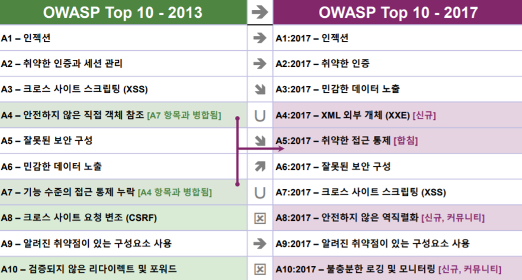
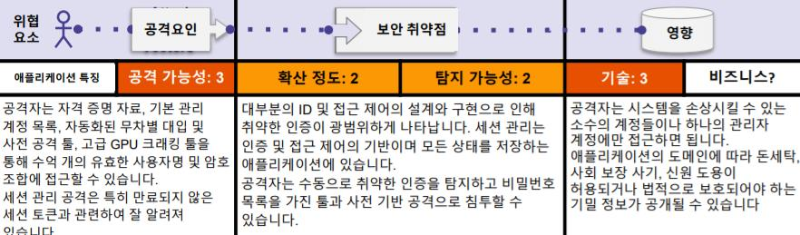

## 1. CVE 찾아보기

#### CVE는 '정보 보안 취약점 표준 코드(Common Vulnerabilities and Exposures)'의 약자이다.

##### 미국 연방 정부의 후원을 받는 비영리 연구 개발 기관인 MITRE가 소프트웨어와 펌웨어의 취약점들을 파악하고 분류해, 기업과 기관이 보안 강화에 사용할 수 있는 무료 '코드(Dictionary)'를 만들기 위해 시작한 프로그램이다.

#### 최근 2년 안에 발생한 취약점, 2019.03.28

* ##### 개요

  * 카카카오톡 윈도우 PC 메신저에서 발생하는 원격 코드 실행 취약점

    | 취약점 종류    | 영향     | Severity | CVE ID        |
    | :------------- | :------- | :------- | ------------- |
    | 원격 코드 실행 | 코드실행 | High     | CVE-2019-9132 |


  * 설명

    카카오톡 윈도우 PC 메신저에서 메세지에 포함된 특수하게 제작된 링크를 사용자가 클릭할 경우 임의 코드 실행으로 이어지는 취약점(CVE-2019-9132)


  * 영향을 받는 제품

    | 제품명                    | 버전                 |
    | :------------------------ | :------------------- |
    | 카카오톡 윈도우 PC 메신저 | 2.7.5.2024 이하 버전 |


## 2.프로그램 결함 찾아보기

#### OWASP(Open web Application Security Project) Top 10 List 는 웹서버에서 가장 많이 발생하는 침해 사고 유형 10가지를 정리한 리스트 이다.

##### OWASP에서는 애플리케이션 보안을 전문으로 하는 7개 기업에서 여러기업들의 웹 어플리케이션에서 발생된 수십만개의 취약점을 대상으로 여러가지를 고려해 가장 많이 퍼져있고, 위험도가 큰 상위 10개를 선정해 발표하고 있다. 2004, 2007, 2010, 2013, 2017년에 발표 되었다.

###### :OWASP Top 10 프로젝트의 원래 목표는 단순히 개발자와 관리자의 인식을 높이는 것이었지만, 사실상 애플리케이션 보안의 업계 표준이 되었다.

##### 사이트: http://www.owasp.org




### A1:2017 인젝션



* #### 취약점 확인 방법

  ##### 애플리케이션은 아래와 같은 경우 공격에 취약하다.

  ##### • 사용자 제공 데이터가 유효하지 않거나, 필터링 되어지지 않거나, 애플리케이션에 의해 정제되지 않는다.

  ##### • 상황 인식 기반 필터링 없이 동적 쿼리나 매개 변수화 되지 않은 호출이 인터프리터에서 직접 사용된다

  ##### • 악의적인 데이터가 객체 관계형 매핑(ORM) 검색 매개 변수 내에서 사용되어 추가로 민감한 정보를 추출한다.

  ##### • 악의적인 데이터가 직접적으로 동적 쿼리 안에 포함된 구조적 데이터와 악의적 데이터를 포함한 명령어, 일반 명령어, SQL, 저장 프로시저에 사용되거나 연결된다.


  보다 일반적으로 SQL, NoSQL, 운영체제 명령어, ORM(Object Relational Mapping), LDAP, EL(Expression Languages), OGNL(Object Graph Navigation Library) 인젝션이 있다

  이 개념은 모든 인터프리터 간에 동일하고, 애플리케이션이 인젝션에 취약한지 판별하기 위해서는 소스코드를 리뷰하는 것과 더불어 모든 파라미터, 헤더, URL, 쿠키, JSON, SOAP, XML 데이터 입력에 대한 철저한 자동화 테스트를 하는 것이 가장 좋은 방법이다.

  기관은 (운영 시스템 배포 전에) 정적 애플리케이션 보안 테스트(SAST)와 동적 애플리케이션 테스트(DAST) 툴을 CI/CD 파이프라인에 포함시켜 새로운 인젝션 결합을 발견 할 수 있다.


* #### 보안대책

  ##### 인젝션을 예방하기 위해서는 데이터를 지속적으로 명령어와 쿼리로부터 분리시켜야 한다.

  ##### • 기본 옵션은 인터프리터 사용을 피하거나 매개변수화된 인터페이스를 제공하는 안전한 API를 사용하거나 ORMs 툴을 사용하도록 마이그레이션 하는 것입니다.

  ###### 주의 : 매개변수화 된 경우에도 PL/SQL이나 T-SQL과 데이터/쿼리가 연결되거나 악의적인 데이터가 EXECUTE IMMEDIATE 또는 exec()와 함께 실행된다면 저장 프로시저는 여전히 SQL 인젝션을 실행할 수 있습니다.

  ##### • 서버측 “화이트리스트”나 적극적인 입력값 유효성 검증을 하십시오. 하지만 많은 애플리케이션이 모바일 애플리케이션을 위한 텍스트 영역이나 API와 같은 특수 문자를 필요로 하기에 완벽한 방어책은 아닙니다.

  #####  • 남은 동적 쿼리들을 위하여 특정 필터링 구문을 사용하여 인터프리터에 대한 특수 문자를 필터링 처리하십시오.

  ###### 주의 : 테이블, 컬럼 이름 등과 같은 SQL 구조는 필터링 처리를 할 수가 없기 때문에 사용자가 제공한 구조 이름은 안전하지 않습니다. 이는 보고서 작성 소프트웨어의 일반적인 문제입니다.

  ##### • LIMIT과 다른 SQL 컨트롤 쿼리를 사용하여 SQL 인젝션으로 인한 대량 노출을 예방하십시오.


* #### 공격 시나리오 예제

  ##### 시나리오 #1: 애플리케이션은 다음과 같은 취약한 SQL 호출 구조에서 신뢰되지 않은 데이터를 사용합니다.

  ```SQL
  String query = "SELECT * FROM accounts WHERE
  custID='"+request.getParameter("id")+"'";
  ```

  ##### 시나리오 #2: 마찬가지로, 프레임워크에 대한 애플리케이션의 맹목적인 신뢰는 여전히 취약한 쿼리를 초래합니다. (예시, Hibernate Query Language (HQL)):

  ```SQL
  Query HQLQuery = session.createQuery("FROM accounts
  WHERE custID='" + request.getParameter("id") + "'");
  ```

  ###### 두 개의 사례로 보아, 공격자는 브라우저에서 전송할 ‘id’ 파라미터 값을 수정합니다: ‘ or ‘1’=1.  예제: http://example.com/app/accountView?id=' or '1'='1

  이렇게 하면, 두 쿼리의 의미가 변경되어 accounts 테이블의 모든 레코드가 반환됩니다. 더 위험한 공격은 저장 프로시저의 데이터를 수정하거나 파괴합니다.


## 3.실제 사례를 찾아보자

### 유명한 해킹 사건: 미국 Target 양판점 해킹


##### 대규모 해킹 피해자 가운데 하나는 미국 대형 양판점인 타깃(Target) 사건. 지난 2013년 11월 27일∼12월 15일까지 발생한 이 사태로 미국 내 타깃 매장 1,797개가 해킹 당했다. 매장을 해킹해 POS 시스템에 기록된 4,000만 건에 달하는 신용카드와 직불카드 정보 외에 7,000만 건에 달하는 주소와 전화번호, 이메일 주소 같은 개인 정보가 유출됐다. (피해액은 보험금을 제외, 최소 1억4800만달러로 추산됐다.)


##### 해커가 POS 시스템에 설치한 악성코드가 계산대에서 이용되는 카드 리더기에 침투, 카드를 읽을 때마다 카드 정보를 훔쳐 타깃 서버에 업로드했다고 한다. 또 악성코드 일부는 러시아어였다고 한다.

###### 이 여파로 최고경영자(CEO) 그렉 스타인하펠과 5년간 타깃 최고정보관리책임자(CIO)를 역임하고 있었던 베스 제이컵도 전격 사퇴했다.

##### 회사 측은 사건 이후 피해고객들에게 신용카드(Credit) 감시 및 명의도용 방지 프로그램을 무상으로 제공하고 보안 시스템을 강화했다.

##### 회사는 당시 사태 수습에 1700만달러, 피해복구비용으로 지난해까지 1억6000만달러를 들인 것으로 알려졌다. 작년 법률 비용에 들어간 금액은 1억9000만달러에 달한다. 이번 피해배상액까지 포함하면 총1억7000만달러(1908억여원)에 가까운 지출을 하게 되는 셈이다.

##### 타깃은 해킹 사건 이후 고객 신뢰가 추락하면서 실적 부진에서 헤어 나오지 못하고 있다. 이에 이달 초 1700여명을 구조조정하고 1400개 일자리를 없애는 등 총 20억달러의 비용을 절감하겠다고 발표한 바 있다.


## 4.아무거나 쓰세요

##### 우리 모두 GBC PASS 하고 즐거운 방학 보냅시다!
