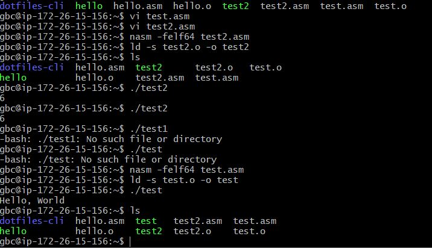
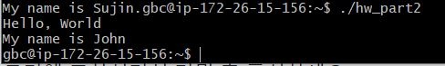

### 컴파일러 설치 :  sudo apt install  nasm(혹은 sudo apt-get install nasm)

### hello.asm 코드 분석

```
global    _start    ; _start라는 이름의 Procedure / C의 main함수 역할
section   .text     ; 텍스트 섹션 선언 (코드를 작성하기 위해 ) 

_start:
    mov       rax, 1       ; 사용하는 시스템 호출이 write라는 것을 뜻함

    mov       rdi, 1       ; rdi(값을 출력할 파일의 descriptor)가 1이다 / 표준 출력을 의미 
    mov       rsi, message ; rsi 레지스터에 메세지("Hello World" 담고있는 변수) 저장
    mov       rdx, 13      ; 문자열의 길이 저장
    syscall                ; 위의 4가지 설정 완료 후 write 시스템 호출
    mov       rax, 60      ; 시스템 정상종료 하도록 exit 시스템 설정
    xor       rdi, rdi     ; mov rdi, 0 과 같은 의미 // 종료할 때 rdi 값을 초기화
    syscall                ; 위의 2가지 설저 완료 후 exit 시스템 호출
    section   .data                    ; 문자열이 데이터 영역에 담겨 있기 때문에 데이터 영역을 선언해준다
message:                               ; "Hello World\n"를 담고있는 변수 이름 선언
    db        "Hello, World", 10       ; 10은 개행문자('\n'의 아스키 코드 값)
```
### strlen.asm 코드 분석

```
BITS 64               ; 64비트

section .text         ; 텍스트 섹션 선언 (코드를 작성하기 위해 ) 
global _start         ; _start라는 이름의 Procedure / C의 main함수 역할

strlen:                   ; 함수이름
    mov rax,0             ; rax를 0으로 초기화 // 문자 개수               
.looplabel:
    cmp byte [rdi],0      ; rdi 문자열이 0이 있는지 비교 / rdi 인덱스 를 증가시키면 h, e, l 이런식으로 올라간다(byte = 한글자씩 비교하도록)          
    je  .end              ; 비교 결과가 같을때 end로 가라(반복문 종료)      
    inc rdi               ; 문자열 시작 주소 / 문자열 개수를 세기위해 rdi +=1 / interrupt-type (rdi에 할당된 영역을 system call)  
    inc rax               ; 문자 개수 / rax가 가리키는 주소의 배열을 1 증가 / interrupt-type (rax에 할당된 영역을 system call) / +=1    
    jmp .looplabel        ; continue (looplabel로 가라)  
.end:
    ret                   ; return   
    
_start:
    mov   rdi, msg   ; rdi에 msg 문자열을 복사         
    call  strlen     ; strlen 함수 호출
    add   al, '0'    ; al = al + '0'      / al(char 나 bool값으로 리턴된 값)에 '0'을 추가
    mov  [len],al    ; len의 주소값에 있는 값을 al로 바꾼다 / al의 크기를 len에 저장 
    mov   rax, 1     ; 사용하는 시스템 호출이 write라는 것을 뜻함      
    mov   rdi, 1     ; rdi(값을 출력할 파일의 descriptor)가 1이다 / 표준 출력을 의미     
    mov   rsi, len   ; rsi 레지스터에 len(문자열의 길이 정보 담고 있는 변수)저장 / rsi가 출력  
    mov   rdx, 2     ; 문자열의 길이 저장   
    syscall          ; 위의 4가지 설정 완료 후 write 시스템 호출
    mov   rax, 60    ; 60 - sys_exit system call number 
    mov   rdi, 0     ; 0
    syscall          ; 운영체제 종료

section .data                       ; 데이터 영역 선언
    msg db "hello",0xA,0            ; "hello"라는 메세지(meg)변수에 저장
    len db 0,0xA                    ; len 변수를 0으로 설정(초기값)
```
> OUTPUT

  

  