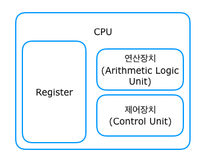

# 레지스터란 무엇인가

## 레지스터 : CPU 내에 있는 있는 '고속 임시 저장장치' 

## CPU의 구성
- - - 

#### CPU는 크게 레지스터, 연산장치, 제어장치로 구성되어 있다

- 연산장치 : 산술논리장치 또는 ALU(Arithmetic Logic Unit)라고도 부르며 연산을 수행한다
- 제어장치 : CU(Control Unit)이라고도 부르며 제어 명령을 전달한다
- 레지스터 : CPU의 작업 처리 시간을 줄이기 위해 사용되는 CPU 내부의 임시 기억 장치로 데이터를 읽고 쓰는 기능이 매우 빠르다(매번 메모리에서 가져오면 시간 지연이 발생하기 때문에 필요한 데이터를 레지스터에 저장하고 필요할때마다 다시 가져와서 저장하는 방식 / cf) 반찬 덜어먹기)

## 메모리 계층 구조
- - - 
 
  

## 메모리(주 기억장치)
- - - 
- 컴퓨터가 켜지고 나서 운영체제와 각종 사용자 프로그램등이 올라오는 공간이다(메모리 안에 올라온 프로그램들을 프로세스라고 부른다)
- CPU에서 명령이 실행되기 위해 메모리의 데이터가 CPU로 전달되어야 하는데 매번 데이터를 옮기는 것이 성능상으로 효율적이지 못하기 때문에 레지스터가 존재하는 것
- 대표적으로 ROM과 RAM이 있다
- 메모리는 가상 메모리 시스템으로 관리 되는데 커널 영역(커널 관련 메모리)과 사용자 영역(낮은 주소 순서대로 텍스트 영역, 데이터 영역, BSS 영역, 힙 영역, 스택 영역)으로 나뉜다

  

## 레지스터의 종류 
- - -
- 범용 레지스터 : 여러가지로 널리 쓰이는 레지스터(rax ~ r15)
- 인덱스 레지스터 : 인덱스 주소지정과 덧셈, 뺄셈에서 사용 가능한 레지스터(SI - Source(복사할 때 데이터 주소 저장, DS와 연관됨) / DI - Destination(복사할 데이터의 목적지 주소 저장, ES와 연관됨) )
- 포인터 레지스터 : 주소를 저장하는데에 쓰이는 레지스터(SP - Stack(스택 프레임의 끝 주소) / BP - Base(스택 프레임의 시작주소) / IP - Instruction(다음에 실행될 명령어의 주소))
- 세그먼트 레지스터 : 프로그램에 정의된 특정 영역 저장하는 레지스터(CS-Code Segment / SS - Stack S / DS - Data S / ES - Extra S / FS / GS)
- 플래그 레지스터 : 프로그램이 실행되고 있는 상황의 연산의 결과나 시스템 제어 등의 상태 정보를 저장하는 레지스터

- 비트별 운영체제의 레지스터
  + 8 bit Register : AH, AL    => H(High), Low(Low) 접미사가 붙는다
  + 16bit Register : AX        => AH와 AL이 합쳐졌다
  + 32bit Register : EAX      => AX가 확장되어 E(Extend) 접두사가 붙었다
  + 64bit Register : RAX      => 접두사 E가 R로 변경되었다

- 범용 레지스터의 예시

  

  > 64비트 환경에서는 rax, rbx, rcx, rdx, rbp, rsp, rsi, rdi 에다가 8개의 레지스터(r8 ~ r15)를 추가로 가진다

   

# 실험을 통한 레지스터의 확인

## 1. 레지스터는 메모리보다 처리 속도가 더 빠르다

- C 코드에서 레지스터형 변수를 지정할 수 있다는 점과 시간 측정이 가능하다는 점을 이용해 대규모 반복문을 돌리고  시간을 측정해본다
  + Case 1

  
  > 반복문을 10억번 돌리고 int형으로 반복문을 돌렸을때(RAM의 데이터 영역 사용)

  + Case 2

  
  > 반복문을 10억번 돌리고 register int형으로 반복문을 돌렸을때(레지스터의 데이터 영역 사용)

  + Case 3

    
   > 반복문을 100억번 돌리고 register int형으로 반복문을 돌렸을때(레지스터의 데이터 영역 사용)
  + Case 4

    
   > 반복문을 100억번 돌리고 int형으로 반복문을 돌렸을때(RAM의 데이터 영역 사용)
### 결과(GCC)

  > 예상대로 큰 차이가 났다. 혹시 몰라 다른 컴파일러(Visual Studio)로 같은 코드를 돌려봤다.

### 결과(VS)

  > gcc로 컴파일한것과 달리 비주얼 스튜디어로 컴파일 했을땐 큰 차이가 나진 않았지만 일관적으로 시간차이가 나는 것을 확인할 수가 있었다. 또 다른 컴파일러(Dev C++)로 같은 코드를 돌려봤다

### 결과(Dev C++)

  > Dev C++ 역시 큰 차이가 나는 것을 확인할 수 있었다.

### 결론 
> 컴파일러 별로 컴파일 하는 속도도 다르고 레지스터 변수를 썼을 때 차이가 나는 비율도 다르지만 실험했던 모든 경우에 레지스터 변수를 썼을 때 걸린 시간은 더 짧았던 것을 확인할 수 있었다. 컴파일러 별로 컴파일 하는 속도가 다른건 이미 알고 있었지만 레지스터 변수를 썼을때 컴파일러 별로 시간차이가 나는 비율이 일정하지 않은것은 컴파일러마다 레지스터형 변수를 할당하는 레지스터가 다르기 때문이라고 한다. 또한 CPU의 플랫폼(인텔, AMD)의 영향도 많이 받는다고 한다. 

## 2. 리눅스는 System V AMD64 ABI라는 함수호출 규약을 따른다

- System V AMD64 ABI 에 정의된 내용에 따르면 함수를 호출할때 최초 6개의 정수/포인터 인자는 rdi, rsi, rdx, rcx, r8, r9를 통해 순서대로 넘겨지고, 그 이상의 매개변수가 전달돼야 할 때는 스택을 통해 전달된다

- 실수인자는 xmm0 ~ xmm7 까지 8개의 레지스터를 순서대로 사용하여 전달하고 그 이상이면 동일하게 스택을 통해 전달된다

- 반환 값은 정수일때 rax(하위 64비트), rdx(상위 64비트) 를 사용하고 실수일때는 xmm0(하위 128비트), xmm1(상위 128비트) 를 사용한다
  
  
 
- 확인을 위해 직접 함수를 코드로 작성해 보았다. 인자는 총 9개이고 1~7번째 인자는 정수형, 8,9번째 인자는 실수형이다.

    

- 3 ~ 6줄에 해당되는 어셈블리어를 확인해 보았다 
- - -

    
  > 3줄에 해당되는 어셈블리어 코드이다. 비주얼 스튜디오를 통해 어셈블리어를 확인했는데 32비트로 설정되어서 r이 아닌 e로 시작한다. 코드에서 ebp와 esp가 보이는데 bp는 스택 프레임의 시작 주소를 저장하는 포인터 레지스터이고 sp는 스택 프레임의 끝 주소를 저장하는 레지스터이다. 함수를 스택에 저장하기 위해 함수의 시작주소와 끝 주소를 참조하는 것을 확인할 수 있다. esp, ebx, esi, edi, ecx, eax 전부 범용 레지스터인데 정확히 어떤 의미인지는 모르겠다.  esi, edi, ecx의 경우 인자를 받는 레지스터인데 인자를 받는 용도로 쓰이는것 같진 않다. 마지막에 call이란 키워드로 함수가 불리는 것을 알 수 있다 
  - - -
    
  > 4줄에 해당되는 어셈블리어 코드이다. n1의 값을 포인터를 통해 eax 레지스터에 저장하는 것을 확인할 수 있다. eax(또는 edx)는 정수 반환값을 저장하는 레지스터이기 때문에 처음에 n1변수의 값을 eax에 저장하고 같은 정수 변수인 n2 부터 n7까지는 mov가 아닌 add를 통해 더해서 저장하고 있다. 그 다음줄은 cvtsi2sd는 정수값을 실수값으로 바꿔주는 명령어이다. 정수반환값을 저장하는 레지스터인 eax의 값을 cvtsi2sd 명령을 통해 실수반환값인 xmm0에 저장하고 있다. 그 다음부터는 eax가 아닌 xmm0(또는 xmm1)에 n8과 n9를 저장해주고 있는데 add 대신에 addsd가 쓰이는 것을 볼 수 있다. addsd는 add와 같은 기능이지만 정수가 아닌 실수를 더할때 쓰는 명령어이다. 마지막줄에 movsd를 통해 n1부터 n9까지의 값을 전부 더한 xmm0의 값을 result에 저장해주고 있다.  

  - [cvtsi2sd 참고자료](https://www.felixcloutier.com/x86/cvtsi2sd)

  - [addsd 참고자료](https://www.felixcloutier.com/x86/addsd)
  - - -
    
  > 5 ~ 6줄에 해당되는 어셈블리어 코드이다. 5줄은 반환값이 저장되어 있는 result를 fld라는 명령어를 통해서 FPU 레지스터 스택에 넣어주고 있다. FPU 레지스터 스택은 8개의 공간이 있는데 메모리에서 스택으로 올라왔다가 스택의 자원을 다 쓰고 나면 다시 메모리로 돌아간다. 이 경우에는 함수가 종료되어도 반환값이 메모리에서 스택을 통해 접근될 수 있게 result값을 스택에 넣어주고 있다는 것을 확인할 수 있다. 함수가 스택을 이용한다는 것이 확인된 것이다. 마찬가지로 3줄에서 push 되었던 ebx, esi, edi가 6줄에서 pop 되는 것을 확인할 수 있는데 ebx, esi, edi가 정확히 어떻게 쓰이는지는 모르지만 함수가 시작될 때 스택에 push 했다가 함수가 끝날때 반환값을 제외하고 전부 pop되는 걸로 봐서 함수와 관련된 정보라는 것을 예상할 수 있다. 또 cmp 명령어를 통해 ebp(함수의 시작 주소)와 esp를 비교하는데 같을 시 __RTC_CheckEsp함수를 콜 한다. __RTC_CheckEsp함수는 사용된 지역 변수가 정상적으로 반환 되었는지(사용자 임의대로 ESP를 줄이지 않았는지)체크하는 함수라고 한다. 그리고 함수의 시작주소를 스택에서 없애고 함수를 종료시킨다(ret)

  - [fld 참고자료](https://c9x.me/x86/html/file_module_x86_id_100.html)

  - [addsd 참고자료](https://darpangs.tistory.com/entry/%EB%94%94%EB%B2%84%EA%B7%B8-%EB%AA%A8%EB%93%9C%EC%97%90%EC%84%9C%EC%9D%98-%EB%A9%94%EB%AA%A8%EB%A6%AC-%ED%8A%B9%EC%A7%95)
  - - -
    
  > 12줄에 해당되는 어셈블리어 코드이다. 코드 순서상으로 위의 3~6줄보다 먼저 실행되는 코드이다. 맨 첫줄을 보면 esp(함수의 끝 주소)에서 8비트를 빼주고 있다. 이것은 마지막 인자(9.5)를 함수에 전달하기 위함이다. 그리고 그 다음 줄에 xmm0 레지스터에 해당 인자의 주소를 통해 인자의 값을 넣어주고 있다. 그리고 esp(8트가 빼진)에 xmm0을 넣어주고 있다. 그 다음줄 역시 마찬가지로 끝 주소를 다시 8비트를 빼서 그 다음 마지막 인자(8.5)를 xmm0에 임시로 저장했다가 esp주소에 xmm0을 넣어주고 있다. 그리고 나서 7번 인자부터 1번 인자까지는 바로 push를 통해 스택으로 넣어주고 있다. 그리고 나서 add함수를 call하는 것을 볼 수 있다. 그 다음 fstp 명령어를 통해 ebp의 주소로 FPU안의 st0 레지스터를 써주고 st0을 pop해준다(함수의 스택에 저장되 있던 반환값을 받고 하고 그 값을 스택에서 없앤다). ebp의 주소로 받았던 반환값을 xmm0에 임시로 저장해주고(movsd) result값에 그 값을 더해준다

 - [fstp 참고자료](https://forum.cheatengine.org/viewtopic.php?t=553800&sid=81ac05546d5eb4c909702de88f8f011c)  

 ### 결론 
  > 함수 인자 전달 시에 rdi, rsi, rdx, rcx, r8, r9로 전달되는 것은 확인하진 못했지만 그 외에 정수 반환값이 rax(rdx)로 저장되고 실수 반환값이 xmm0(xmm1로 저장되는 것과) 함수가 스택을 통해 정보가 넘어가고 다시 메모리로 돌아온다는 것을 어셈블리어를 통해 자세하게 확인할 수 있었다.

 # 전체 결론

 - 레지스터가 메모리보다 데이터 처리 속도가 더 빠르다는 것이 코드로도 확인이 된다

 - 어셈블리어는 생각보다 고급 언어(high language)와 밀접하게 관련이 있고 생각보다 직관적이다

 - 하지만 고급언어가 있어서 정말 다행이다