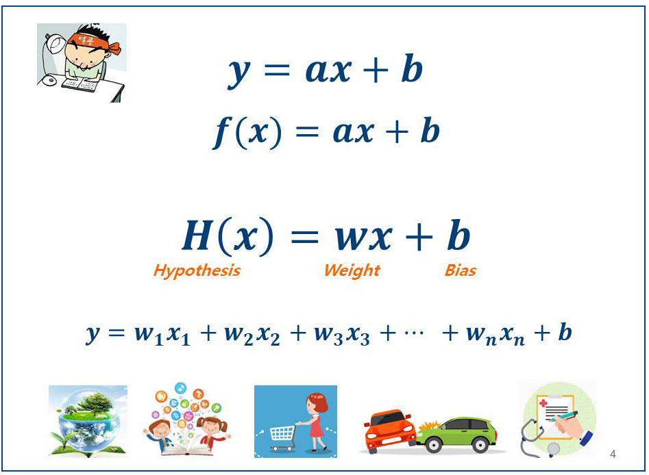
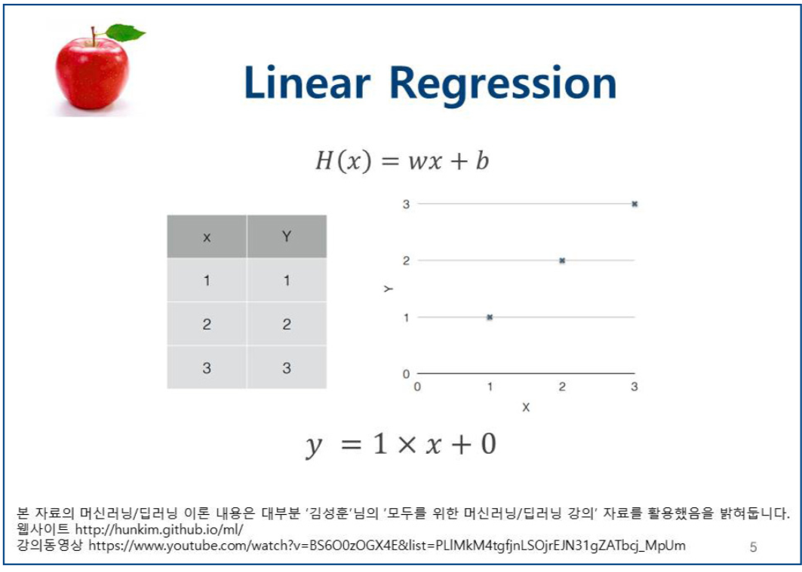

# 과제
인공지능이 확률과 통계 분석을 통해서 인간에게 도움이 된다고 함.
근데 이게 어떻게 확률과 통계를 분석해서 인간에게 도움이 되는건지 전혀 모르겠음.
그래서 알아봄.

## AI에 관하여

AI란 무엇인가
- 인공지능(AI)은 기계가 경험을 통해 학습하고 새로운 입력 내용에 따라 기존 지식을 조정하며 사람과 같은 방식으로 과제를 수행할 수 있도록 지원하는 기술입니다.
- 체스를 두는 컴퓨터에서부터 직접 운전을 하는 자동차에 이르기까지 오늘날 대부분의 인공지능(AI) 사례들은 [딥러닝](#딥러닝)과 [자연어_처리](#자연어 처리)에 크게 의존하고 있으며, 이러한 기술들을 통해 대량의 데이터를 처리하고 데이터에서 패턴을 인식함으로써 특정한 과제를 수행하도록 컴퓨터를 훈련할 수 있습니다.

AI가 갑자기 뜬 이유
1. 데이터 처리능력의 급격한 상승
- 병렬처리가 간으한 GPU의 도입으로 가속화
- CPU 처리능력 향상
2. 빅데이터 시대의 도래
- 데이터의 효율적 사용법 필요

기초 원리

위 식을 바탕으로 데이터를 분석해 문제를 해결하려는 사례를 들어봅시다.
여러 정보들을 활용해서 사람에게서 고혈압 질환이 발생할 가능성을 예측하려고 합니다.
우리는 고혈압 발생에 영향을 미치는 요소들을 뽑게 됩니다. ex) 식습관, 술담배 여부, 수면습관 등등
이런 요인들을 y식에서 x1,x2,x3 등으로 표현하게 되고
각 요인들이 문제 발생에 얼마나 큰 영향을 미치는지를 판단하여 각 요인별로 가중치를 부여합니다.
w가 가중치입니다.
이 항들의 합을 구함으로써 우리가 원하는 답을 예측하게 됩니다.
b는 bias로 편향성을 뜻하는데 데이터가 얼마나 치우쳐졌는지를 표현합니다.
H(x)=wb+b는 기본형이고, 각 상황에 적합한 여러 형태의 응용식이 존재합니다.

- 요약: 신경망을 구현하면 기계 스스로 학습하여 최적의 알고리즘을 만들어 나가는 것

## 딥러닝

정의
- 딥러닝은 음성 인식, 이미지 식별 또는 예측 등 사람의 작업을 대신 수행하도록 컴퓨터를 학습시키는 일종의 [머신러닝](#머신러닝) 입니다. 데이터가 사전 정의된 방식을 통해 실행되도록 구성하는 다른 기술과 달리, 딥러닝은 데이터에 대한 기본 파라미터를 설정하고 컴퓨터가 여러 처리 계층을 이용해 패턴을 인식함으로써 스스로 학습하도록 훈련시키는 기술입니다. 

                      <딥러닝 신경망 단순화> 
- 입력층, 중간층, 출력층으로 나뉘게 되며, 중간층은 하나가 아닌 여러 층으로 구현될 수 있습니다.
- 그림에서 보이듯이, 입력신호를 센서로 받아 중간층으로 신호를 전달합니다.
- 이때 그냥 전달하는 것이 아닌 특정 함수를 활용하여 확률에 기반한 프로세싱과정(가중치 부여)을 거치게 됩니다.
- 이러한 확률과 가중치는 출력값을 선택하는데 영향을 주게 되며, 가중치는 학습과정을 통해 계속 변하게 됩니다.
- 최종단계에서는 가중치가 출력이 가장 정확하게 나오는 값으로 최적화되게 됩니다.

- 요약: 수많은 입력데이터을 받아 신경망이 출력을 정확하게 낼수 있었던 중간단계를 만들어가는 과정
        딥러닝은 머신러닝의 하위 분야, 대량의 데이터(빅데이터) 분석을 기반, 목표는 학습한 내용을 분류하고 파악하는 것

## 머신러닝
정의
- 머신러닝은 인공지능(AI)의 한 분야로, 데이터 분석을 위한 모델 생성을 자동화 하여 소프트웨어가 데이터를 바탕으로 학습하고 패턴을 찾아냅니다. 이를 통해 사람의 개입을 최소화 하고 빠르게 의사 결정을 내릴 수 있도록 지원합니다.
- 요약 : 데이터를 분석하여 패턴을 인식하고, 기계 스스로 예측기계의 패턴인식이 반복되어 자신의 오류를 수정하고 반복하면서 정확도를 높여감

## 자연어 처리 
정의
- 자연어 처리(NLP)는 컴퓨터가 인간의 언어를 이해하고 해석하며 조작하도록 돕는 인공지능( artificial intelligence)의 한 분야입니다. NLP에는 인간의 의사 소통 방식과 컴퓨터의.이해력의 간극을 메우기 위해 컴퓨터 과학이나 전산 언어학 등 많은 분야가 동원됩니다.
- 요약 : 우리가 일상에서 사용하는 언어
중요성
- 일관적이고 중립적인 방식으로 언어 기반의 데이터를 사람보다 더 많이, 지치지 않고 분석해냄
- 언어의 모호성을 완화하고, 음성 인식이나 텍스트 분석 같은 다수의 다운스트림(downstream) 애플리케이션용 데이터에 유용한 숫자 구조를 추가함
NLP 기능
- 콘텐츠 분류(Content categorization)
    - 언어 기반의 문서 요약 기술로, 검색과 색인, 콘텐츠 알림 복사 감지 등에 사용됩니다.
- 주제 발견 및 모델링(Topic discovery and modeling
    - 텍스트 집합에서 의미와 주제를 정확히 포착하고, 최적화나 예측과 같은 고급 분석을 텍스트에 적용합니다.
- 맥락 추출(Contextual extraction)
    - 텍스트 기반 소스에서 정형 정보를 자동으로 추출합니다.
- 감정 분석(Sentiment analysis)
    - 량의 텍스트에서 분위기나 주관적인 의견을 파악합니다.일반적인 감정 및 감성 분석이 이에 해당합니다. 
- 음성-텍스트(STT) 변환 및 텍스트-음성(TTS) 변환(Speech-to-text and text-to-speech conversion)
    - Trans음성 명령을 문자 텍스트로 변환하거나 문자 텍스트를 음성 명령으로 변환합니다.
- 문서 요약(Document summarization)
    - 많은 양의 본문을 자동으로 요약합니다
- 머신 분석(Machine translation)
    - 텍스트나 음성을 한 언어에서 다른 언어로 자동 번역합니다.
응용 분야
- Siri나 빅스비
- 스팸 메일
- 소셜 미디어 분석 
    - 특정 주제에 대한 사람들의 인식과 정서를 추적하고 영향력 있는 인물(influencer)을 식별합니다.
