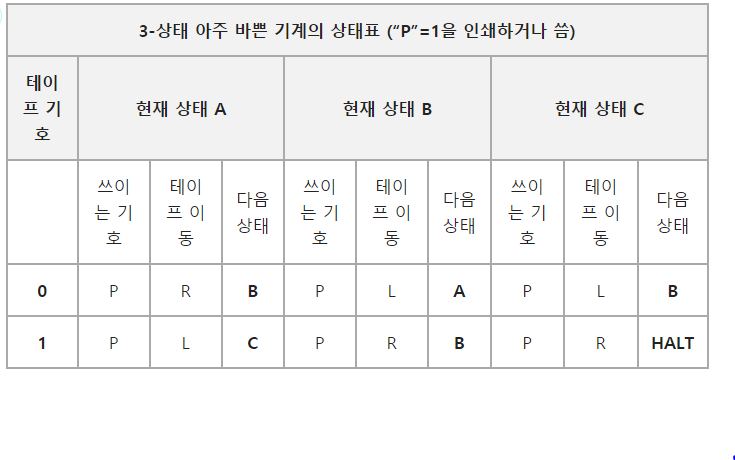

## 앨런 튜링의 류링 머신

### 괴델의 증명을 튜링 머신으로!

"기계적인 방식으로는 수학의 모든 사실들을 만들어 낼 수 없다"

- 튜링은 괴델의 증명을 간단한 기계 부품들(튜링 기계=궁극의 기계)로 정의했다

1. 기호를 표시할 수 있는 무한히 긴 테이프

2. 테이프를 읽고 쓸 수 있는 입출력 장치

3. 현재의 상태를 표시할 수 있는 장치

4. 작동 규칙표

* 몇개의 기호들을 테이프에 읽고 쓸지, 장치의 상태들이 몇 개인지, 작동 규칙표는 무엇인지, 테이프와 입출력 장치의 시작 위치, 상태가 정해진다

* 작동 규칙표에 정의되어 있는 규칙대로 정해진 계산을 진행한다

* 작동 규칙에 표현되는 기계의 작동은 테이프 칸의 기호를 읽고 쓰면서 테이프를 한 칸씩 좌우로 움직여 가는 일만 할 수 있다

- 모든 기계적인 계산을 할 수 있는 전제

  - 임의로 정의한 튜링 기계를 일렬로 된 테이프로 표현할 수 있다

  - 테이프에 표현된 기계의 정의를 이해하고, 그 동작을 그대로 흉내낼 수 있도록 작동 규칙표를 정의하였다

  -> 고정된 작동 규칙표를 따라 테이프에 기록된 임의의 기계를 그대로 흉내낼 수 있다!(보편 만능 기계)

- 튜링 기계의 상태 모식도

- 모식도는 일련의 계산 궤적을 나태내는 것이 아니라 순간을 포착해서 보여준다

- 각각의 원은 표의 상태를 지시, 명령은 화살표로 표현한다

- 화살표 위의 표식은 특정한 변화를 야기하는 읽히는 기호를 결정하고 슬래쉬 뒤의 동작은 따라오는 행동을 의미한다

### 보편 만능 기계, 현대 컴퓨터의 시초

- 세계 최초의 연산 컴퓨터 '콜로서스' : 튜링과 플라워스가 1943년 공동 제작한 컴퓨터

- 테이프는 메모리 칩, 테이프를 읽고 쓰는 장치는 입출력 장치와 메모리칩, 작동 규칙표는 CPU로 발전하였다.

- 실행 시키고 싶은 계산이 있다면 작동 규칙표(소프트웨어)를 만들어 메모리에 넣어주면 된다

### 튜링 머신의 미래

- 1990년대 초, MIT 하바 지젤만 교수는 튜링의 아이디어를 다음 단계로 발전시키는 연구를 해왔다

"튜링 머신이 고정된 트랙 위의 기차와 같다면, 슈퍼 튜링 머신은 비행기와 같다. 슈퍼 튜링 머신은 무거운 짐을 운반할 수 있을 뿐만 아니라, 수많은 방향으로 이동할 수 있으면 필요에 따라 목적지가 달라질 수 있다"

- 슈퍼 트링 머신 = 신경망 컴퓨터 : 자극에 반응하기 위해 각각의 연산 단계에서 스스로 변화하여 처리하는 복합 동적 시스템이다

- 신경세포와 같은 정보처리능력을 인공적으로 만들기 위해 신경세포와 시냅스를 신경칩, 퍼지칩 및 혼돈칩으로 구현한다 -> 학습기능을 가진 컴퓨터

- 디지털 컴퓨터는 이산 공간 모델(discrete-space model)에서 운영되나, 신경망 컴퓨터는 연속상 공간(continuous phase space)에 있어 들어오는 자극에 반응하여 비약적으로 진화할 수 있다

- 슈퍼 튜링 컴퓨터의 응용은 국가 안보와 테러리즘 근절 노력에 도움이 되며 더욱 인간적으로 다가올 수 있다

- Ex) 수많은 경험을 통해 미심쩍은 행동을 가진 사람들을 분류할 수 있고, 얼굴 패턴을 인식하고 비언어적 단서를 포착하여 인간과 컴퓨터의 대화에 더욱 인간적인 요건을 채울 수 있다