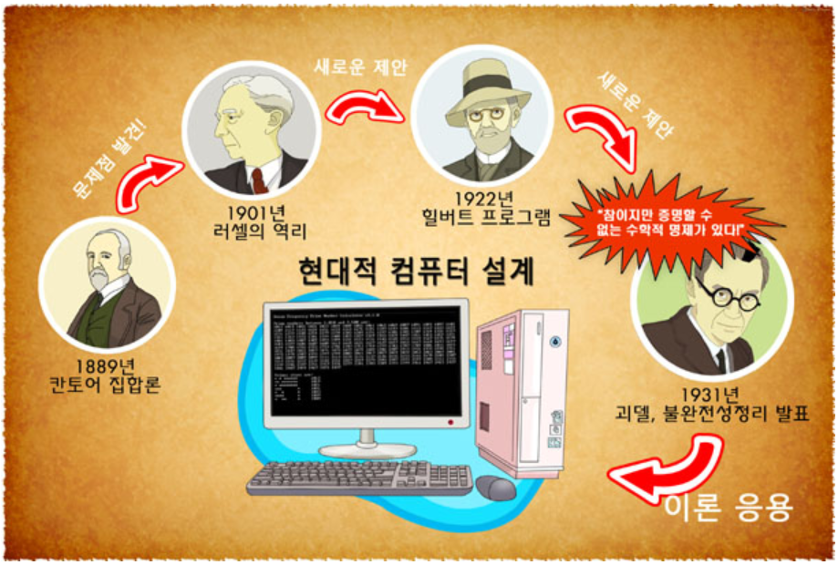

# HW3

## 1. 자신의 실험 결과에 대한 write-up 을 쓰세요. 

### 괴델의 불완전성 정리

1925년 다비트 힐베르트는 한 쪽 끝에 어떤 진술을 집어넣든지 간에, 일정한 추론규칙들이 부품이 되는 자동 장치를 만들어서 작동시키고 뒤로 물러앉아 있기만 하면 참/거짓이라는 증명이 계속해서 나오는 진리기계(형식화된 공식체계)를 구상했다.

즉 수학의 발전이라는 게 어차피 일정한 공리와 몇 가지 추론규칙으로 발전된 것 같으니까 그 추론규칙을 알고리즘으로 만들고 그 알고리즘을 작동시킬 수 있는 기계를 만들면 더 이상 고생할 필요없이 기계가 알아서 수학을 발전시켜주지 않겠냐는 것이다.

1931년 **쿠르트 괴델**은 이런 힐베르트의 불완전성 정리를 증명함으로써 이런 힐베르트의 프로그램이 존재할 수 없다는 것을 증명했다.

   - 괴델의 제1 불완전성 정리는 우리가 사용하고 있는 기본 산술을 포함한 모순 없는 수학적 시스템이 불완전하다는 것을 입증한 것이다.
   
     산수의 체계에서는 참이지만 증명할 수 없는 명제가 존재한다는 것. 

   - 괴델의 제2 불완전성 정리는 모순 없는 수학적 시스템 내에서 그 시스템의 무모순성이 증명될 수 없다는 것을 입증한 것이다. 

수학에서 참인지의 여부를 모르는 명제가 어떤 것이 있을지 궁금하게 되었다.  
찾아보니 골드바하의 추측이 대표적인 예라고 한다. 골드바하의 추측은 2보다 큰 모든 짝수는 두개의 소수의 합으로 표시할 수 있다는 것이다. 

    4 = 2 + 2
    6 = 3 + 3
    8 = 3 + 5 
    10 = 3 + 7 = 5 + 5
    12 = 5 + 7 
    14 = 3 + 11 = 7 + 7
    16 = 3 + 13 = 5 + 11
    18 = 5 + 13 = 7 + 11
    20 = 3 + 17 = 7 + 13
    ...

위의 예와 같이 짝수를 두개의 소수의 합으로 표현할 수 있다. 그러나! 모든 짝수에서 가능한지는 해결하지 못했다. 
현재는 어떤 수학자가 몇 백만 자리 수까지 계산해보았는데, 그 수까지는 골드바하의 추측이 옳다는 것이 밝혀졌다. 

괴델의 불완전성 정리는 현대적 컴퓨터 설계를 위한 이론 배경이 되었다. 

  * 힐베르트와 괴델의 뒷이야기
  괴젤이 불완전성 정리를 발표한 것은 1930년 쾨니히스베르크 회의에서 였는데, 당시에 힐베르트는 세계적인 명성을 떨치고 은퇴를 앞둔 교수였는 반면에, 괴델은 이제 막 박사학위를 받은 24살 청년이었다. 

  힐베르트는 자신의 프로그램을 통해 수학에서 모순이 도출되지 않는다는 것을 증명하고자 하였고 수학이 완전할 것이라고 믿었다. 사람들은 힐베르트 프로그램에 열광했고 그 계획이 실현될 것이라고 믿었다. 그러나 괴델이라는 천재가 이러한 믿음을 앗아가 버렸다. 당시에 괴델이 불완전성 정이를 발표했을 때 딱 한사람만 이것을 이해할 수 있었는데 그가 바로 폰 노이만이었다고 한다. 

  힐베르트가 받은 충격은 컸고 한동안 그는 화를 냈고 깊은 좌절감에 빠졌다. 그러나 그는 또 다시 연구에 매진한다.  

  사실상 괴델이라는 천재는 힐베르트라는 천재에 의해서 가능했다. 괴델이 제시한 불완전성 정리는 완전성, 불완전성, 무모순성 증명, 결정가능성 등 힐베르트의 선행된 연구와 개념규정을 토대로 가능했던 것이다. 

----

## 2. 아무거나 쓰세요 