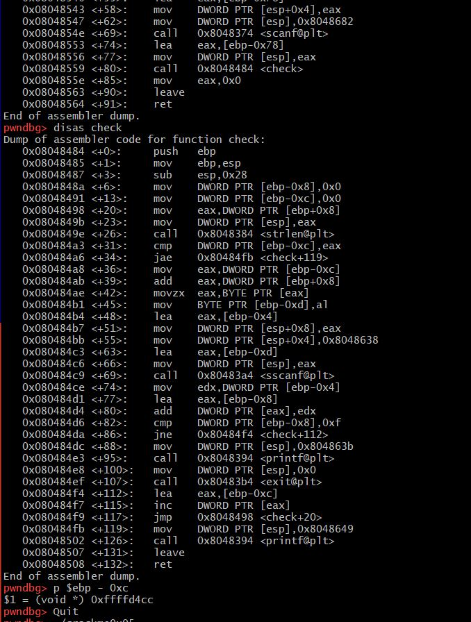
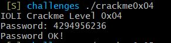

# crack0x04 풀이 과정

1. gdb crack0x04 입력 후 함수의 제일 마지막 부분인 _fini()에 브레이크포인트를 걸고 메인 함수 내에 check 함수로 들어간다

2. check 함수 내에 비밀번호를 비교하는 부분이 있어 보이기 때문에 check 함수 내에 분기점을 찾는다

3. cmp에서 비교하는 값 두개를 확인한다. cmp가 두개가 있는데 첫번째 cmp는 비교하는 값이 맞을 경우 check함수가 종료되고 두번째 cmp는 비교하는 값이 틀릴 경우 다시 스캔을 받는 알고리즘이다. 따라서 첫번째 cmp를 비교하는데 ebp-0xc 값과 eax를 비교했을때 eax가 들어오는 값이기 때문에 ebp-0xc의 값을 본다. p $ebp-0xc를 입력했을 때 나오는 값이 0xffffd4cc인데 이 값을 10진수를 변환하면 4294956236이다

4. 답으로 확인 되었다

# crack0x05 풀이 과정

1. gdb crack0x05 입력 후 함수의 제일 마지막 부분인 _fini()에 브레이크포인트를 걸고 메인 함수 내에 check 함수로 들어간다

2. 4번과 마찬가지로 분기점을 찾는데 첫번째 cmp의 ebp-0xc의 값으로 해봤더니 답이 안나왔다. 그래서 두번째 cmp의 ebp-0x8로 값을 쳐봤는데 답이 나왔다. 하지만 알고보니 오타였다. 0xffffd4c0을 10진수로 변환했어야 했는데 끝에 0을 빼고 변환해서 268434764가 나왔는데 그게 답이었다. 왜 그럴까 4와 코드를 비교해봤는데 parell이라는걸 call하는게 있었다. 이게 뭔지 검색해봤는데 정보가 나오지 않았다. 그래서 두번째 cmp 밑에 eax, DWORD PTR [ebp + 0x8]이 단서인것 같아서 찾아보았지만 알아내지 못했다. 전체 알고리즘은 첫번째 cmp에서 들어온 값이랑 비교하고 맞으면 종료, 틀리면 계속 입력받는걸 반복하는건 같은거 같은데 왜 정답이 ebp-0x8에서 나온 값에서 끝자리를 빼고 10진수로 변환한 답이 나오는지 알아낼 수 없었다.  

3. cmp에서 비교하는 값 두개를 확인한다. 

