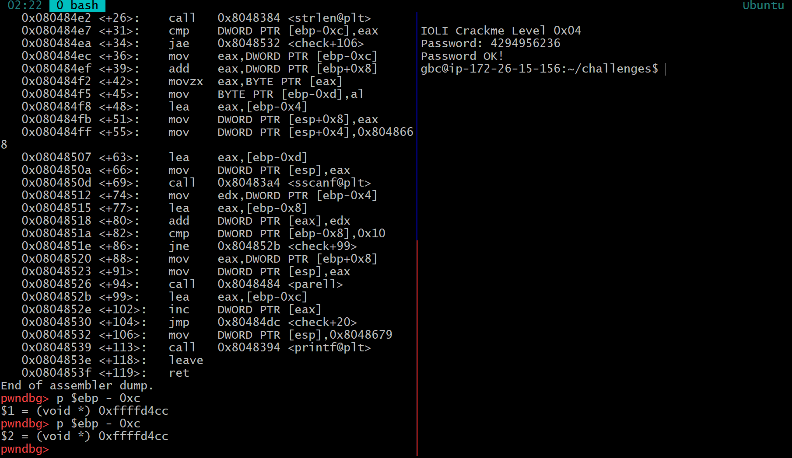

## Write up

### crackme0x04

- main에 보면 check 함수가 있어 disas chech로 check를 들어가보았다

- check 함수 안 cmp 부분이 값을 비교하는 부분이니 cmp 부분에서 받는 값인 [ebp-0xc]가 비밀번호다

- 16진수로 바꾸면 4294956236이다

### crackme0x05

- 먼저 메인에서 check 함수가 있으니 그 안을 들여다 보면 cmp 명령어가 보이는데 메인과 check 함수가 4번 문제와 거의 비슷했다

- 먼저 첫번째 cmp에서 ebp - 0xc 값을 받아보았으나 답이 아니여서 두번째 cmp에서 보이는 ebp - 0x8 값을 받아보았다

- ebp - 0x8의 값을 보니 stack 주소의 esp의 맨 끝부분 값과 0x4차이가 남을 보였다

- stack의 마지막 부분의 값에 뭔가가 있다는 것을 알았지만 이는 답이 아니라 고민하다 시간이 다 되었다