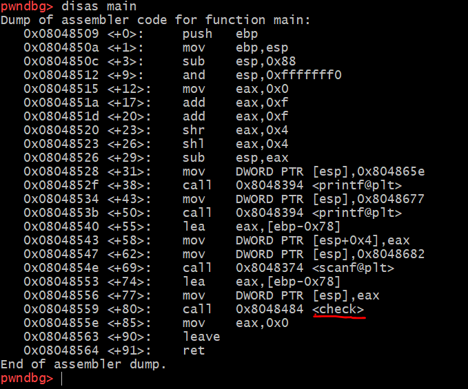
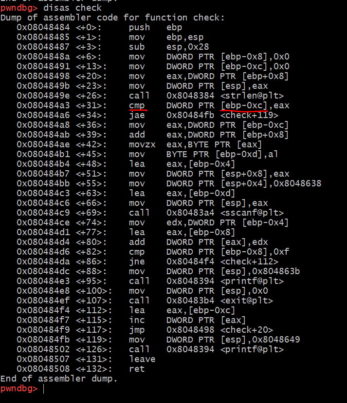
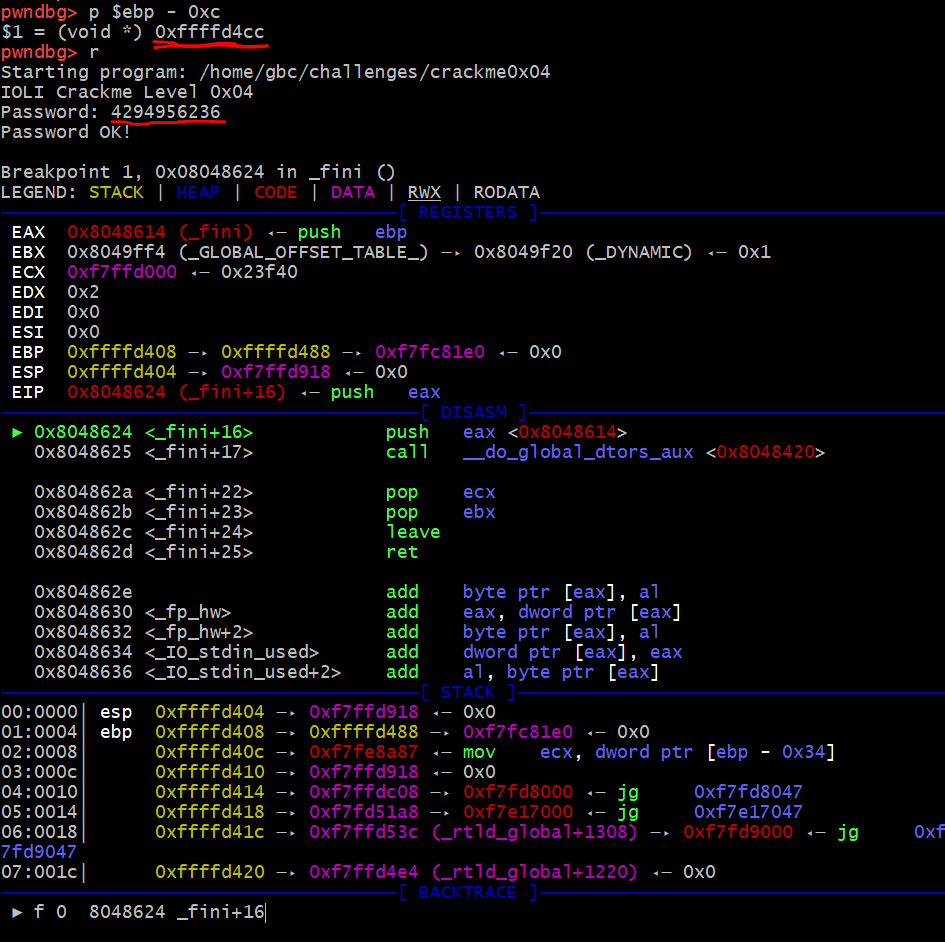
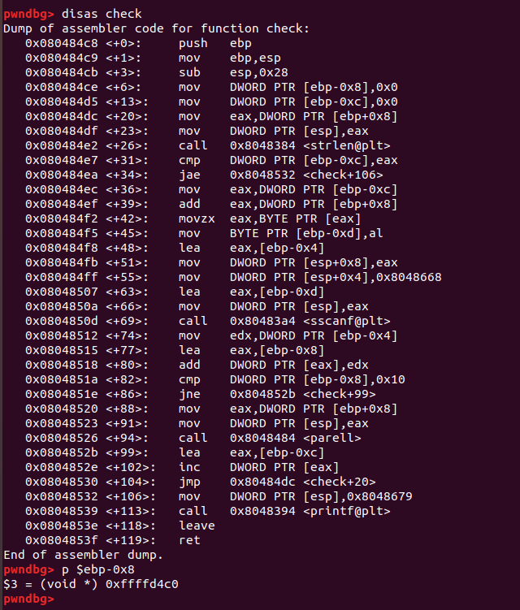
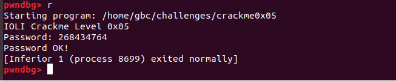

# HW

## 1. crackme0x04, crackme0x05 을 풀고 write-up 을 쓰세요. 

### **crackme0x04**

1. disas main을 통해서 "check"함수에서 비밀번호를 비교할 것이라고 예상할 수 있다. 

2. disas check를 통해 check함수를 본다. 
3. cmp부분에서 ebp-0xc와 비교한다는 것을 알 수 있고 
4. p $ebp-0xc 로 주소값을 확인하면 0xffffd4cc 이다. 
5. 16진수 0xffffd4cc 은 10진수로 바꾸면 4294956236이고 이 숫자가 비밀번호라는 것을 알 수 있다.

### **crackme0x05**

1. crackme0x04에서와 같이 disas main을 통해서 "check"함수에서 비밀번호를 비교할 것이라고 예상할 수 있다.

2. disas check를 통해 check함수를 본다. 

3. cmp에서 ebp-0x8과 비교한다는 것을 알 수 있고 
4. p $ebp-0x8 로 주소를 확인하면 0xffffd4c0
5. 0xffffd4c0를 10진수로 바꾸면 268434764 

## 2. 아무거나 쓰세요 
Wow
