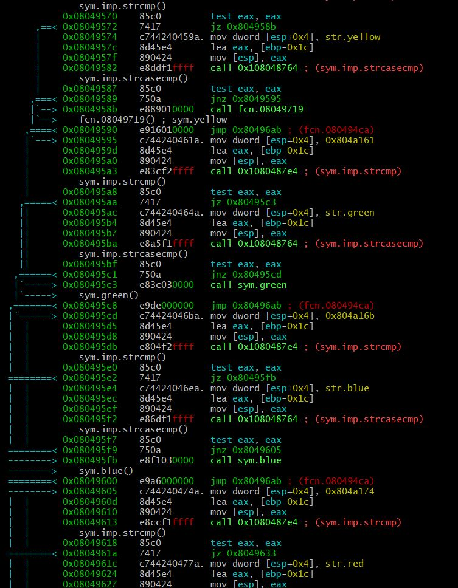
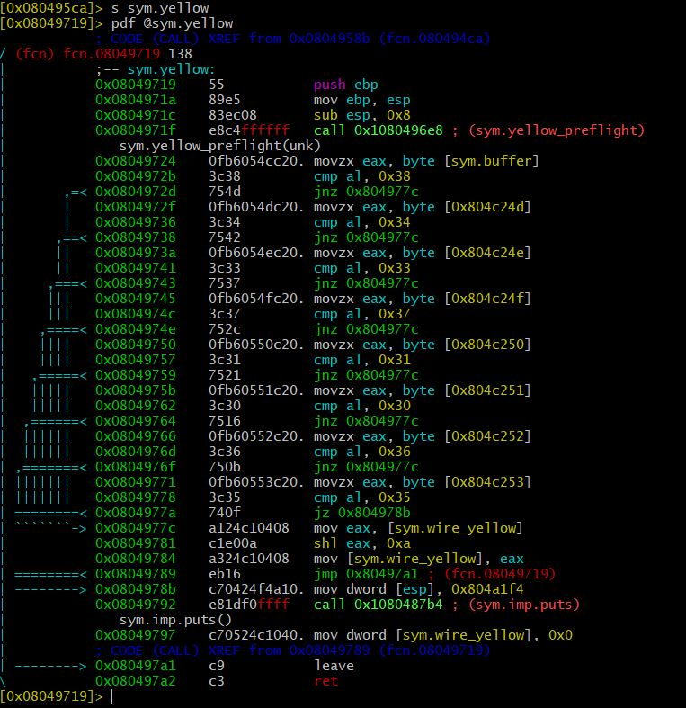
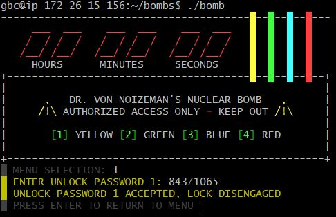

# Bomb 해제 시키기

## 1. bomb의 main 함수 분석

- s main, pdf @main 입력
- 매인함수의 흐름
  1. 그림과 옵션 출력 (sym.menu, sym.imp.printf)
  2. 입력 받기 (sym.imp.fgets)
  3. 케이스별로 함수 불러오기(숫자에 따라 다른 함수 호출 - sym.imp.strcmp, sym.imp.strcasecmp)
  4. 각 케이스 별로 색깔이 옆에 써 있고 test eax, eax 다음에 같을 때 특정 주소로 가라는 말이 있고 그 주소를 가면 해당 색깔이 써진 함수를 콜 하는 모습을 볼 수 있었다
  

  

  5. yellow의 경우 0x804958b로 가고 해당 주소는 sym.yellow라는 함수의 주소였다.
  

## 2. yellow 함수 분석

- s sym.yellow, pdf @sym.yellow 입력
- yellow 함수의 흐름
  1. 들어온 값(al)과 0x38, 0x34, 0x33, 0x37, 0x31, 0x30, 0x36, 0x35를 비교하고 있는데 비교할때마다 메모리가 한바이트씩 올라간다(0x804c24d ~ 0x804c253). 0x38, 0x34, 0x33, 0x37, 0x31, 0x30, 0x36는 아스키 코드 값으로 84371065이다. jnz값이 0이 아니면(즉 두 비교하는 대상이 같지 않으면) 0x804977c로 점프하라고 하고 있다. jz는 0일때 점프하라는 말이다(제일 마지막에 쓰인다. 이때(다른말로 입력받은 값이 84371065일때) 점프하는 주소가 0x0804978b인데 0x0804978b부턴 esp의 주소값을 0x804a1f4로 바꾸고 puts함수를 콜 하고 wire_yellow섹션의 주소를 0으로 초기화해준다. 
  만약 입력받은 값이 하나라도 틀리면 wire_yellow 섹션의 주소를 shl해서 바꾸고 함수를 종료한다.
  

## 결과 확인
   

