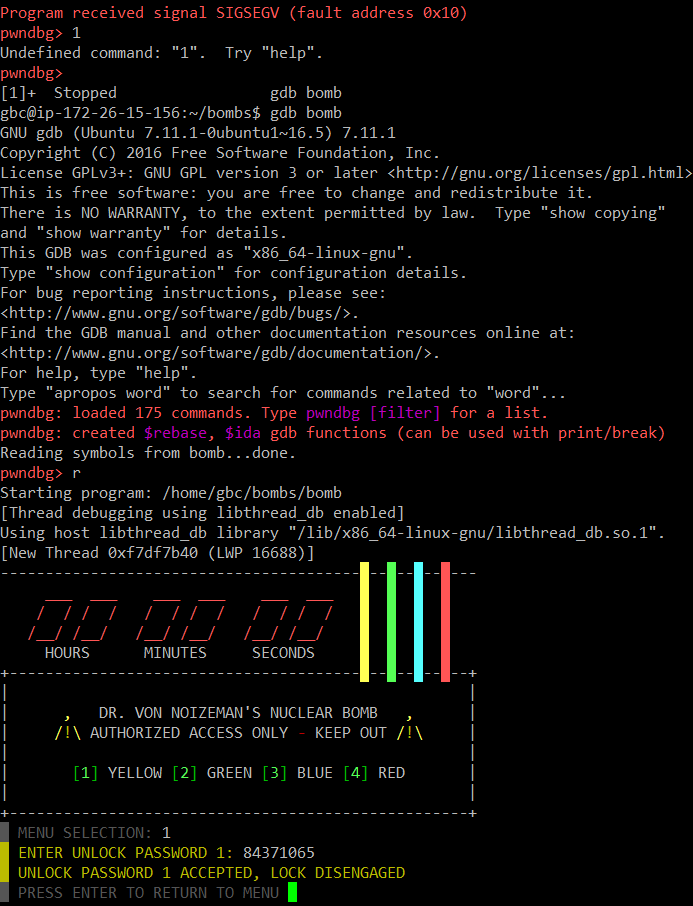
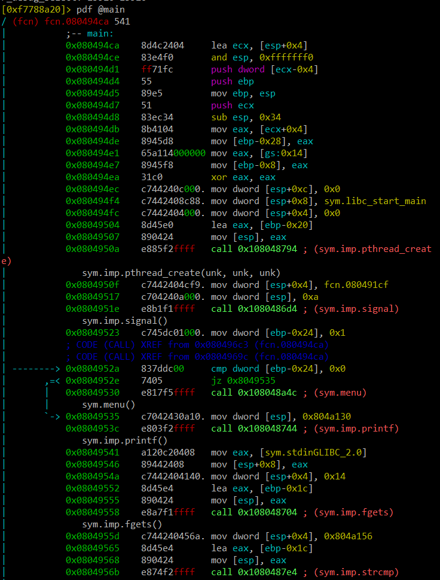
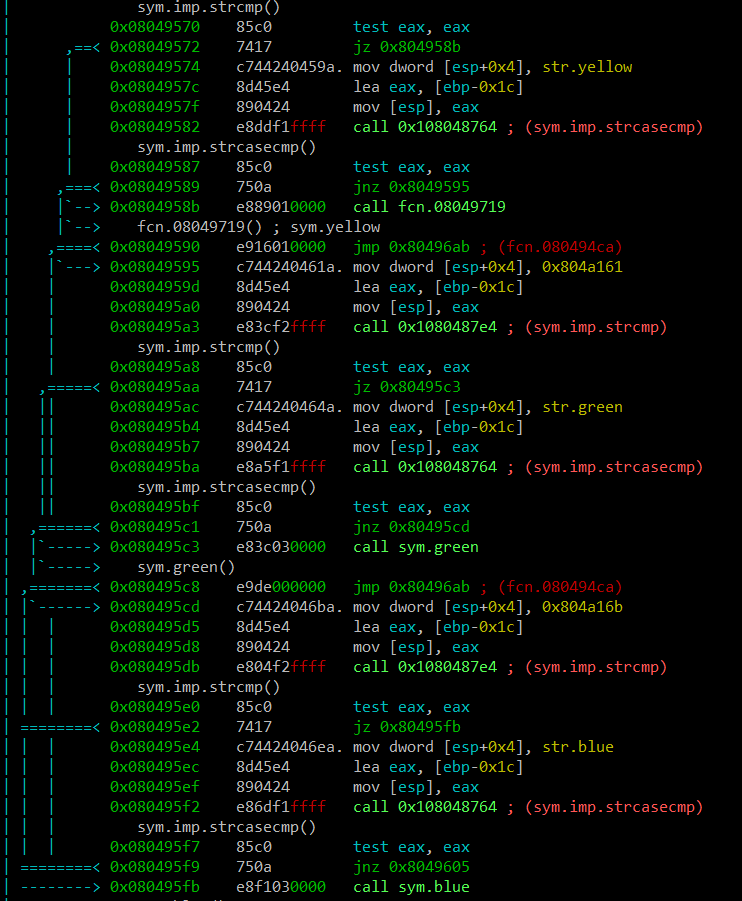
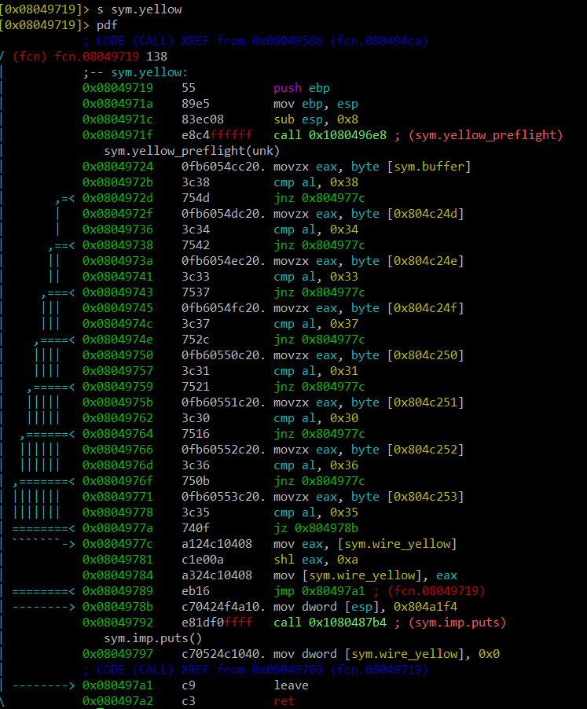

# yellow를 풀자

프로그램을 실행해보면 1,2,3,4 각각이 yellow, green, blue, red 선을 푸는 곳으로 연결해주는 것을 알 수 있다.

main을 우선 봤다. 받은 값들로 yellow, green, blue, red 함수들을 호출한다.

sym.yellow 함수를 보면 
0x38, 0x34, 0x33, 0x37, 0x31, 0x30, 0x36, 0x35 와 비교를 한다.
솔직히 이게 아스키 코드를 의미하는지 몰랐다...

암튼 이 값들을 합치면 "84371065"가 된다. 

bomb 프로그램을 실행하고 이 값을 입력하니 풀렸다....

앙 개꿀~ 좀 제대로 공부해야할 거 같다...힌트 덕분에 어쩌저찌 했지...후....