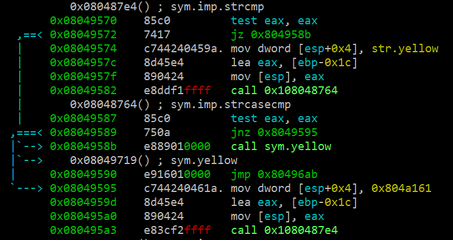
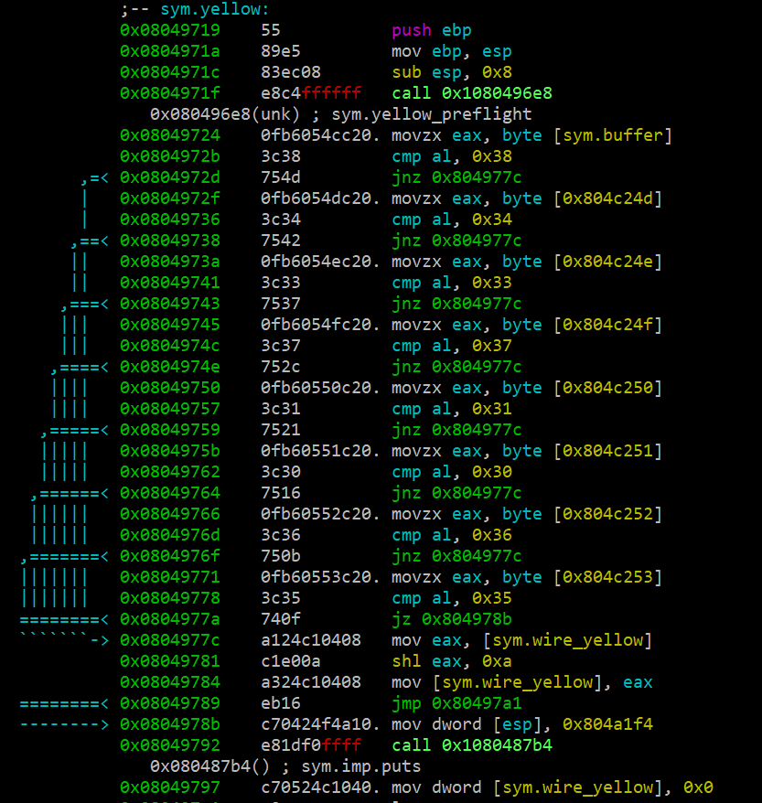
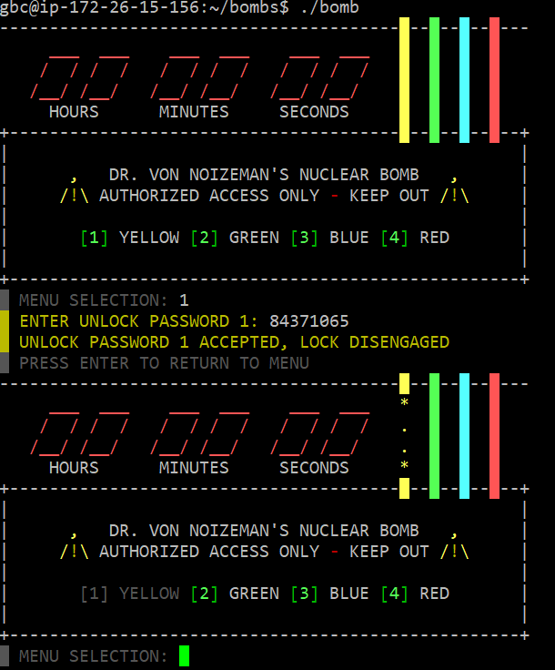

## bombs 노란색 선 제거

- radare2를 이용하여 정적분석으로 리버싱을 시도하였습니다

- pdf @main함수로 main함수를 분석하는데 yellow 선의 비밀번호를 알아내기 위해선 yellow 함수를 찾아야 하므로 중간에 strcmp를 통해 입력값(여기서는 1이 yellow를 들어간다)을 비교한 후, yellow 함수를 호출하는 부분을 찾았습니다

- pdf @sym.yellow를 통해 yellow 함수로 들어가보니 cmp로 어떤 값들을 계속 비교해 나가며 진행하는 모습을 볼 수 있었습니다

- cmp로 비교하는 값들을 아스키코드를 이용하여 문자로 바꿨을 때, 84371065임을 알 수 있고 이것과 일치하지 않을 땐 0x804977c로, 다 일치할 시 0x804978b로 이동하여 sym.wire_yellow 값을 0으로 초기화함을 알 수 있습니다

- yellow 말고도 다른 함수들도 wire_red, wire_blue 등이 있는 것으로 보았을 때, wire_yellow 값이 0으로 바뀌게 되면 해제가 됨을 유추할 수 있었고 실제로 답이 맞았습니다

