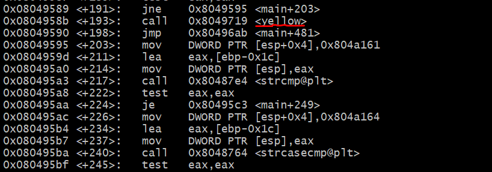
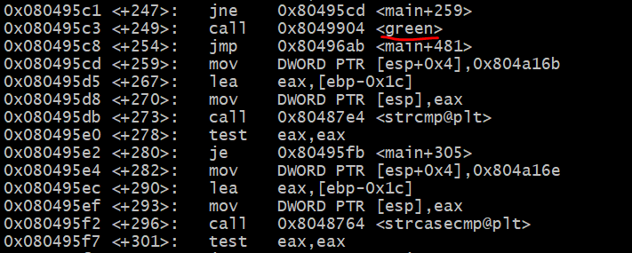
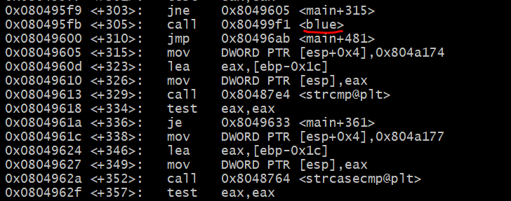
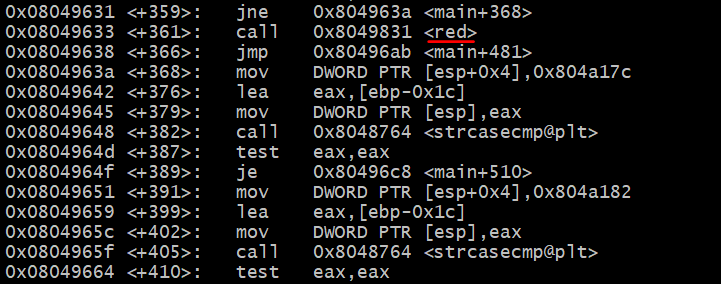
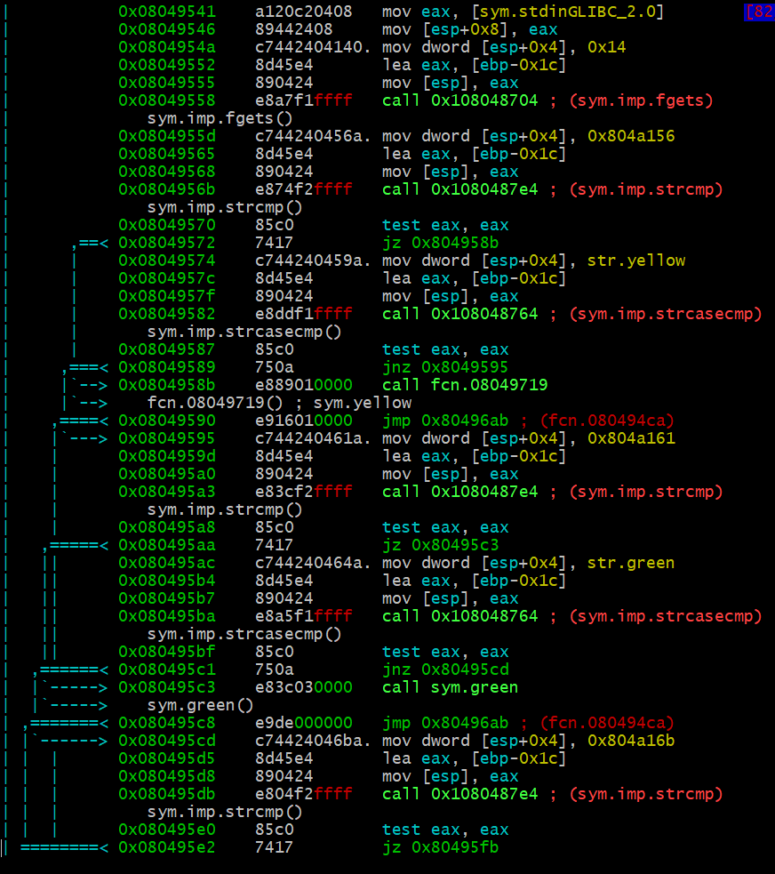
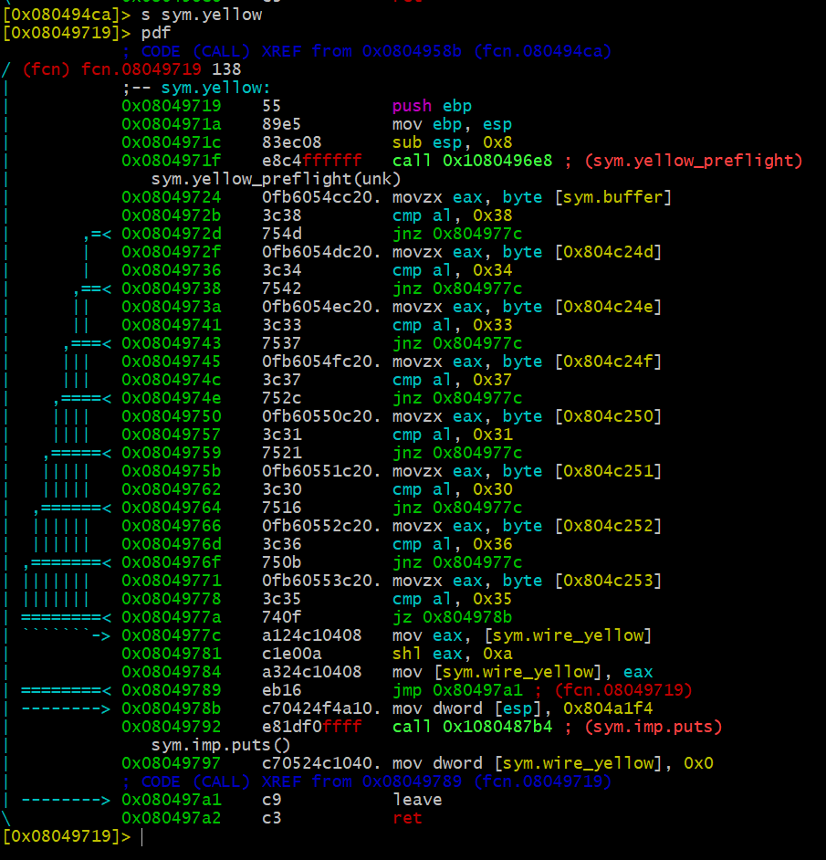

# HW5

## 1. bomb 의 노란선을 해제하고 write-up 을 쓰세요.

###  gdb
   
    disas main을 하고 어떤 함수가 있는지 살펴보았다. 

   노란색 선 

   
   초록색 선

   
   파란색 선

   
   빨간색 선

       strcasecmp(string1, string2) :string1과 string2를 대소문자 무시하고 비교한다. 

###  r2

    s main
    pdf

    입력 값이 1또는 yellow이면 yellow 함수로, 2또는 green이면 green함수로, 3또는 blue이면 blue함수로, 4또는 red이면 red함수로 간다. 

    s sym.yellow
    pdf 
    
    입력받은 값을 0x38, 0x34, 0x33, 0x37, 0x31, 0x30, 0x36, 0x35 와 비교하는데, 이 값들은 아스키코드다. 
    
    이 값을 문장으로 하면 84371065 이다. 이 값을 입력받으면 wire_yellow에서 0으로 초기화를 한다. 

    wire_yellow 부분이 초기화되면 폭탄 해체. 