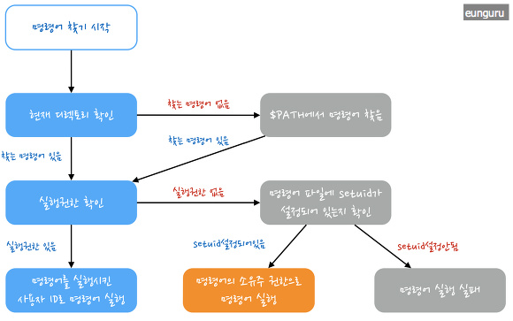
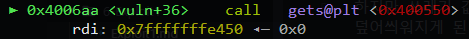
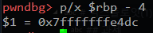

# 익스플로잇(1)

## 지금까지 했던 리버싱의 의미

지금까지 했던 리버싱은 비밀번호를 요구하는 프로그램을 해킹하는 것이었다. 입력한 값의 비밀번호를 판정하는 분기를 역추적하여 분기를 결정하는 조건을 이해하고 그 분기를 조작하는 것인데, 실제 해킹에서도 해커의 목표에 따른 분기점을 역공학으로 분석한 후 분기를 조작하는 것이다. 

- 현금 인출기에서 돈을 인출하는 분기를 조작 

https://www.youtube.com/watch?v=li08Tw9MjZI

- 게임 속 캐릭터를 보이게 하는 분기 조작 

https://youtu.be/6JmkmmJ4qgU?t=429

## 리눅스 특수 권한 복습하기 

https://eunguru.tistory.com/115

## 특수 권한 파일의 의미

해커가 서버에 접근하는 것은 웹 취약점이나 어플리케이션 취약점을 통해 접근하는 것이지만 정작 서버에 명령을 내리고 싶어도 권한이 없으면 명령을 내릴 수 없다. 그래서 권한 상승이 필요한데 그 권한 상승의 방법 중 하나가 setuid 가 설정된 파일을 사용하여 명령을 내리는 것이다. 



### 특수 권한 파일 검색 

setuid 비트 : `find /tmp/test -perm -4000 -ls`

setgid 비트 : `find /tmp/test -perm -2000 -ls`

sticky 비트 : `find /tmp/test -perm -1000 -ls`

### 프로그램의 흐름을 조작하는 가장 기초적인 방법 

해킹을 포괄적으로 말하면 결론적으로 **리버싱을 통해 프로그램의 작동방식**을 알아낸 후 **그 작동방식을 조작하는** 것이라고 여러번 말했었는데 그 작동방식을 조작하는 가장 기초적인 방법 중 하나가 Buffer Overflow(BOF) 이다. 한 마디로 다른 사람의 프로그램을 마음대로 다룰 수 있다는 것인데 BOF 로 어떻게 그것이 가능한지 알아보자. 


프로세스가 메모리에 할당될 때 위와 같이 메모리 구조가 형성된다. 만약 버퍼에 입력을 받는 프로그램일 경우 사용자가 버퍼에 입력할 데이터의 길이를 반드시 체크해야 하는데 그렇지 않으면 어떤 사용자가 버퍼에 데이터를 마음대로 넣음으로써 프로그램의 리턴 주소를 조작할 수 있기 때문이다. 리턴 주소를 조작한다는 의미는 프로그램의 흐름을 바꾼다는 뜻이고, 프로그램의 흐름을 바꿀 수 있다는 의미는 해킹 할 수 있다는 의미이다. 


---

#### bof0, bof1 시범

##### gets 함수

https://www.tutorialspoint.com/c_standard_library/c_function_gets.htm

##### strcpy 함수 

https://www.tutorialspoint.com/c_standard_library/c_function_strcpy

##### Buffer Overflow 취약점 이해 

- gets 함수와 strcpy 함수는 입력받은 값을 버퍼에 저장할 때 입력 데이터의 길이를 검증하지 않는다.

- 그렇기 때문에 정해진 버퍼의 길이를 초과해서 데이터를 전달해도 데이터가 그대로 스택에 복사된다. 

##### buf 와 innocent 사이의 거리 

1. 다음과 같이 gets 또는 strcpy 까지 가서 buf 의 주소값을 확인한다 



2. innocent 와 KEY 를 비교하는 cmp 명령어까지 가서 innocent 의 주소값을 확인한다. 


innocent 가 [rbp - 4] 이다. 



3. 그러면 이제 두 개의 주소값의 차이값을 구한다. 그 차이값이 140 이다.


##### innocent 변수 조작하기 

- 인자로 입력값을 받는 경우

이 경우는 `main` 함수에서 `argv[1]` 의 값을 가져와서 `strcpy` 함수를 사용하여 `buf` 에 복사하는 경우이다. 보통 다음과 같이 입력값이 전달된다. 

`./bof twice`

하지만 인자에 쓰레기 값 140 바이트를 전달하면 innocent 변수 직전까지 닿을 것이고 그 140 바이트 이후에 어떤 값을 입력하면 innocent 변수를 덮어쓸 수 있게 된다. 

```shell
./bof `python -c "print 'a'*140 + 'xxxx'"`
```

- 표준입력으로 입력값을 받는 경우 

이 경우는 프로그램이 입력값을 표준입력으로부터 받는 경우이기 때문에 파이프 `|` 를 통해서 조작된 입력값을 전달할 수 있다. 보통의 경우 다음과 같이 입력값이 전달된다. 

`echo twice | ./bof`

하지만 쓰레기 값 140 바이트를 전달한 후 이후에 어떤 값을 입력하면 innocent 변수가 덮어씌워지게 된다. 

```shell
python -c "print 'a'*140 + 'xxxx'" | ./bof
```

그런데 innocent 변수를 덮어썼을 때 쉘이 실행되었다면 입력 형태가 조금 달라진다. 

##### 파이프 `|` 와 입력 스트림

표준 입력을 받는 프로그램은 키보드로부터의 입력이 끝날 때까지 입력을 받고 입력 스트림이 끝났을 때 프로그램을 종료한다. 예를 들어서 `bash` 라는 쉘 프로그램은 표준 입력(키보드)로부터 입력을 받는데 단일 실행을 했을 때 명시적으로 프로그램을 종료 시켜야지 프로그램이 끝난다. 왜냐하면 일반적으로 표준 입력 스트림은 종료되지 않기 때문이다. 하지만 파이프 `|` 를 통해 입력 스트림을 표준 입력이 아닌 다른 프로그램의 출력으로 리다이렉트 시키면 다른 프로그램이 끝났을 때 입력 스트림도 종료되기 때문에 프로그램이 종료된다. 

```shell
echo ls | bash
```

bash 라는 프로그램은 원래 실행 되었을 때 입력이 계속되는 한 종료되지 않지만 위와 같이 파이프 `|` 를 통해서 입력 스트림을 표준 입력에서 `echo ls` 라는 프로그램의 출력으로 리다이렉트 시킨다면 `echo ls` 이 종료되었을 때 함께 종료된다. 왜냐하면 입력 스트림도 종료되기 때문이다. 

```shell
(python -c "print 'a'*140 + 'xxxx'";cat) | ./bof
```

그렇기 때문에 만약 innocent 변수를 덮어 썼을 때 루트 권한의 쉘이 얻어진다면 먼저 출력 프로그램과 `cat` 을 세미콜론과 괄호로 묶고 하나의 프로그램 처럼 여겨지게 해야 한다. 그러면 출력 프로그램이 종료되어도 `cat` 은 종료되지 않고 출력을 입력으로 리다이렉트 시켜주기 때문에 입력 스트림이 종료되지 않는다. 

### bof1.c ~ bof4.c

**SERVER1** : `ssh bof1@13.125.233.235` (pw : bof1)

**SERVER2** : `ssh bof1@13.125.71.164` (pw : bof1)

bofN 라는 프로그램들에는 Buffer Overflow 가 발생할 수 있는 취약점이 있다. 이 취약점을 통해 프로그램을 해킹한 후 루트 쉘(root shell) 을 탈취해보자. 

---

## 과제 

### 과제 가이드 

1. 자신의 **security** 디렉토리에 HW-6 디렉토리를 만든다. 

2. [HW-6.md](HW-6.md) 을 다운받아서 HW-6 디렉토리에 저장한다. 

3. HW-6.md 파일의 지시를 따르는 것이 과제이다. 

4. 다 했으면 다음 명령어를 참고해서 커밋 후 푸쉬한다.

5. 월요일에 발표할 수 있을 정도로 과제를 해와야 한다. 

```shell
cd /path/to/security
git add .
git commit -m "complete HW6!!!"
git push -u origin master
```