# BOF 3 Write-up

## 1. bof3.c 코드를 확인한다

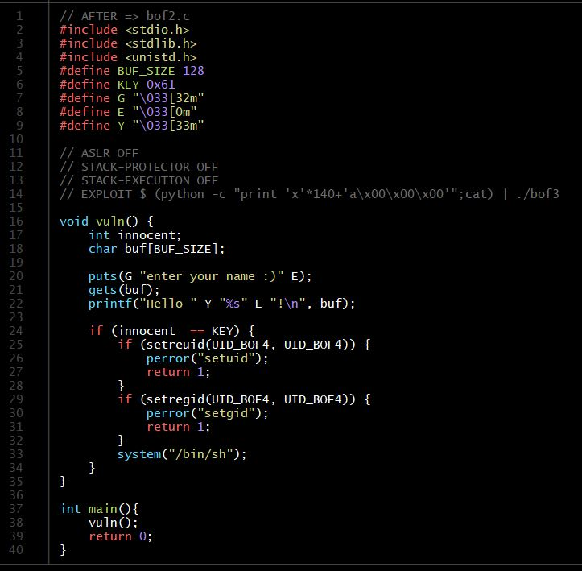
- innocent 변수와 KEY값을 비교해서 접근권한을 주는 것을 알 수 있다
- KEY는 고정값으로 16진수로 0x61이다

## 2. _bof3 실행파일을 디버그 모드로 연다
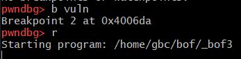
- 사실상 main 역할을 하는 vuln()함수에 breakpoint를 걸고 디버그모드를 실행한다

## 3. _bof3 디버그 모드에서 처음 입력받는 버퍼의 주소와 암호를 입력하는 주소의 거리를 구한다

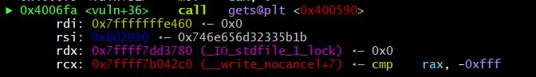
- 입력이 들어오는 버퍼 주소값(rdi)주소를 구한다

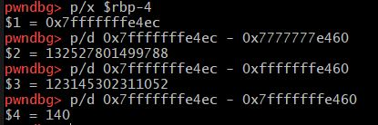
- innocent 변수의 주소값을 구하고 기존에 구했던 버퍼 주소값과의ㅣ 거리르 구한다. 거리는 140이다.

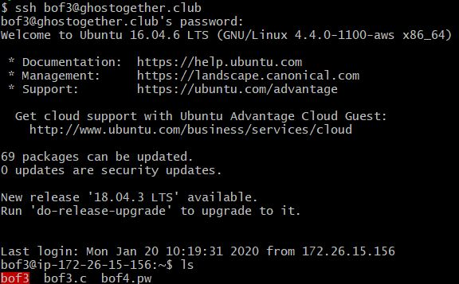
- bof3 서버에 들어간다. 비밀번호는 bof2에서 구했던 비밀번호이다. 

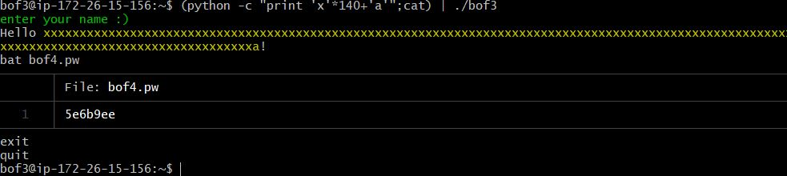
- 버퍼의 주소와 키값과 비교하는 innocent 변수의 거리가 140이었기 때문에 입력할 때 1바이트인 'x' 캐릭터를 140번 곱해서 입력해주고 키값이었던 0x61의 아스키코드 값인 'a'를 입력해주면 접근권한이 생기고 그 상태에서 bof4.pw문서를 읽는다. 입력할 때 주의할 점은 바로 종료 되지 않게 | (파이프)를 써준다. bof4서버의 비밀번호를 알았기 때문에 이제 buf4를 exploit한다. 

# BOF 4 Write-up
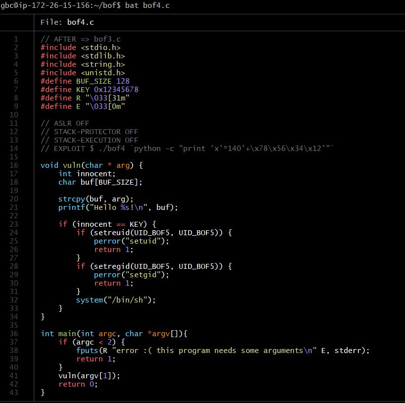
- 과정은 bof 3과 동일하다
- 실행파일을 디버그 모드로 열고 버퍼값 주소와 키값이랑 비교하게 되는 innocent값의 주소의 거리를 구하고 실행파일을 실행할 때 그 거리만큼 데이터를 채워주고 비밀번호를 입력하는 주소에 키값을 입력해준다

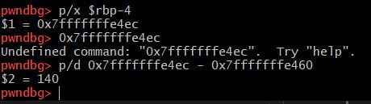
- 두 주소 사이의 거리는 bof3과 동일하게 140이 나왔다
- 두 주소 사이의 거리와 키 값을 알기 때문에 실행파일을 실행하면 된다
이때 주의할 점이 bof3과 다르게 이번에는 커맨드라인에서 바로 입력값을 받기 때문에 실행파일 실행할때 바로 데이터를 넘겨줘야 한다. 

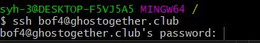
- 키값과 두 주소 사이의 거리를 알기 때문에 바로 bof4 서버로 접속한다
- 비밀번호는 bof3서버에서 구했던 5e6b9ee이다
- 이번에는 cmd에서 데이터를 넘기기 때문에 실행 파일 옆에다가 내용을 추가로 쓴다

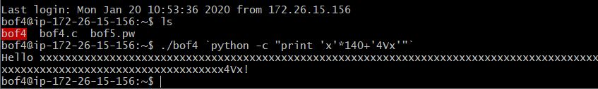

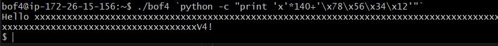

- 뭔가 잘못 되었다는 것을 알 수 있다. 키 값이었던 0x12345678의 아스키코드인 4Vx를 입력했더니 프로그램이 종료되어버렸다. 그래서 정답인 ./bof4 `python -c "print 'x'*140+'\x78\x56\x34\x12'"` 를 입력했더니 제대로 접근권한으로 들어왔다. 그 상태에서 bof5의 비밀번호를 구한다. '4Vx'로 입력했을 때는 안되고 '\x78\x56\x34\x12' 입력했을 때 됬던 이유는 저장 방식이 리틀 엔디안 방식이기 때문에 입력시 거꾸로 입력해야 원래의 키값으로 들어가기 때문이었고 값이 같으면 되기 때문에 굳이 아스키코드값으로 안넣어도 되는 것이었다. 

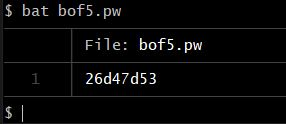
- 이제 bof5서버의 비밀번호를 알았기 때문에 이제 buf5를 exploit한다. 

# BOF 5 Write-up
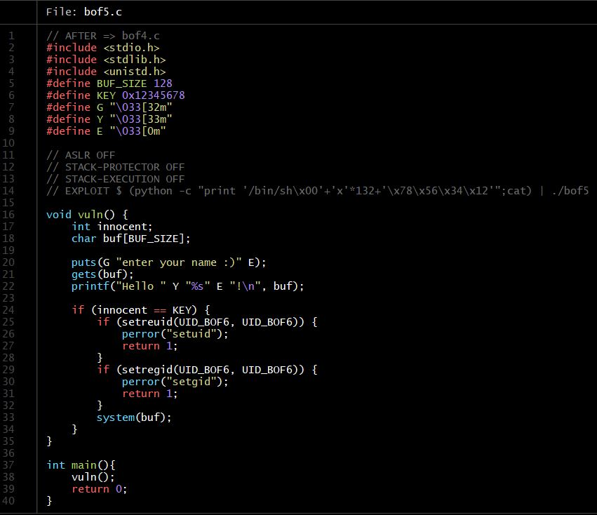

- bof5 역시 과정은 3,4와 동일하다. 
- 키값 역시 bof4와 동일하다
- bof 3,4와 동일한 과정을 거쳐 버퍼의 주소값(0x7fffffffe460)과 innocent변수의 주소값(0x7fffffffe4ec)과 그 거리(140)를 구한다.
- 그리고 bof4에서 구한 비밀번호를 이용해 bof5 실행파일에서 그 전과 동일하게 입력한다. 

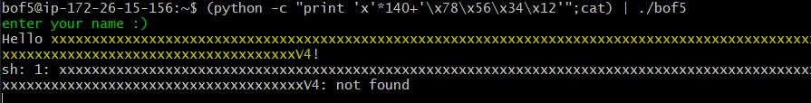
- 하지만 무슨 이유에서인지 확인이 안된다고 한다. bof5.c코드를 보니 기존과 다른 부분이 발견 되었는데 system("/bin/sh")가 아닌 system(buf)로 달라진 부분이다. '/bin/sh'를 검색해보니 쉘의 절대경로라고 한다. 즉 쉘과 관련된 문자열인데 추측하기로 system("/bin/sh")라는 말이 바로 쉘을 띄우란 소리가 아닐까 생각한다. 그리고 정답을 보면 bof3에는 없었던 '/bin/sh\x00'이 추가 되었는데 이건 코드에서 system(buf)라는 부분 때문에 bof3과 동일하게 코드가 끝나면 바로 쉘이 나타나게 하기 위함이 아닌가 생각한다. 검색해 보니 \x00 부분은 문자열 뒤에 넣는 거라고 한다. 그리고 거리가 140이 아닌 132로 바뀐 이유는 '/bin/sh\x00' 문자열이 8바이트를 차지하고 있기 때문일 것이다. 그리고 buf로 들어온 '/bin/sh/x00'문자열은 큰 if문 안의 맨 끝에서 system(buf) 에 들어가 기존의 system("/bin/sh")과 같은 역할(쉘을 다시 띄우는(?))을 하게 될 것이다.

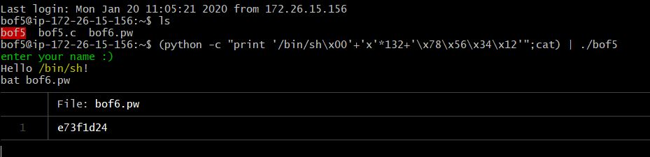
- bof6서버의 비밀번호를 알아냈다. 
