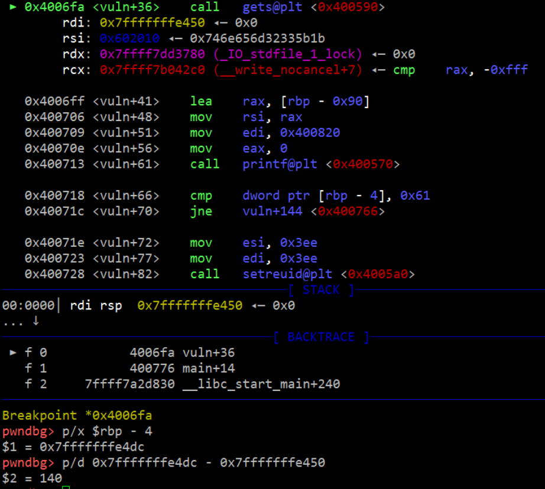
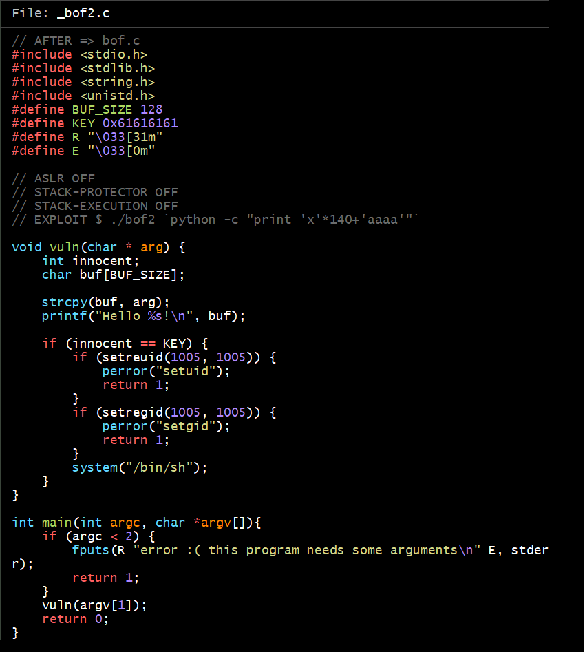
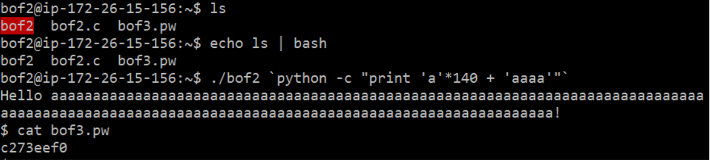
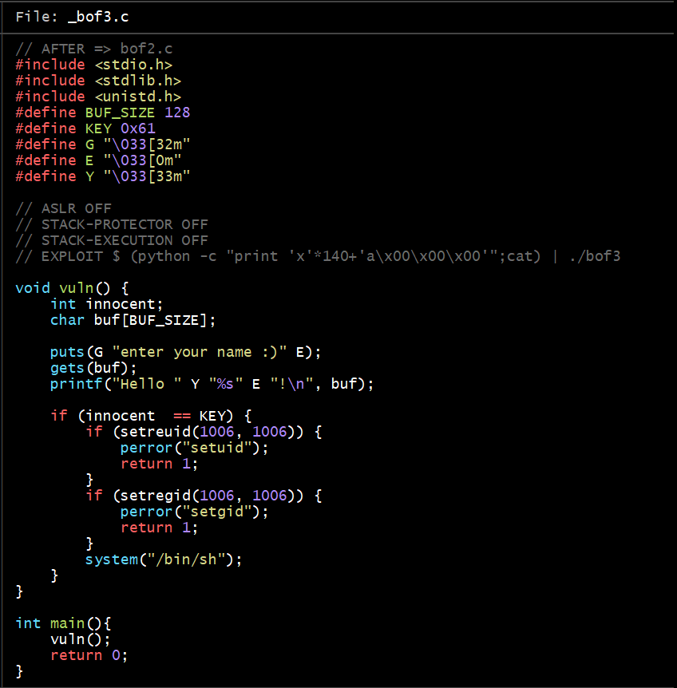
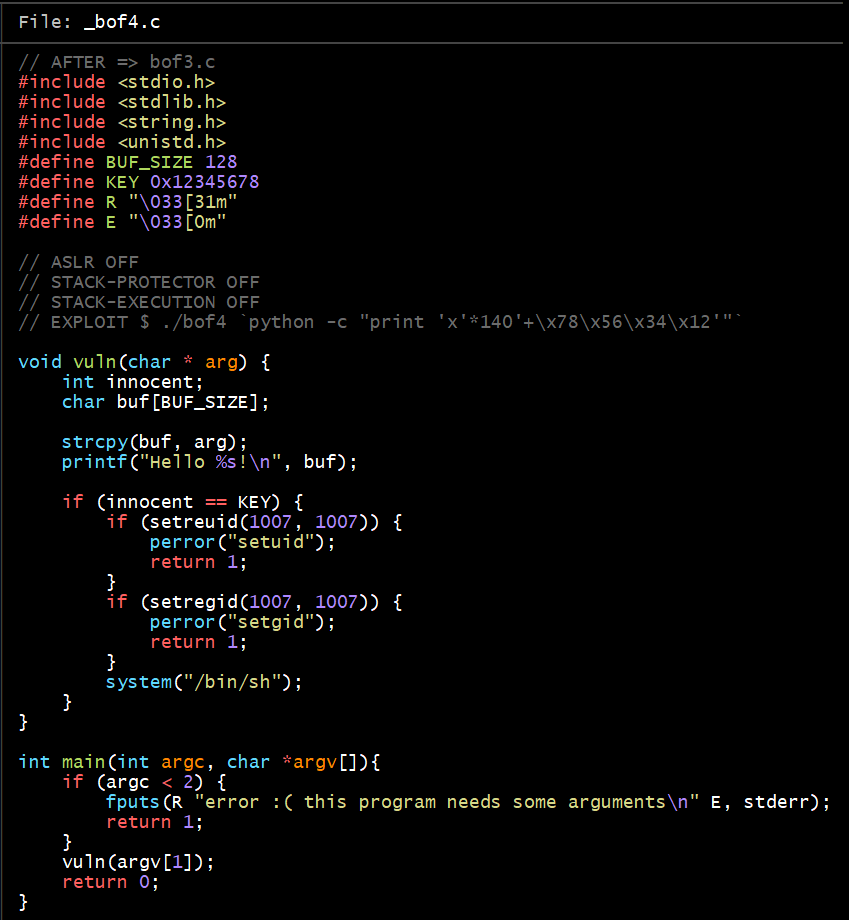
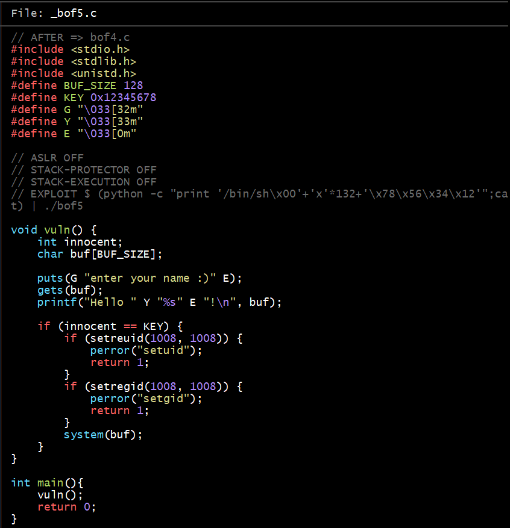
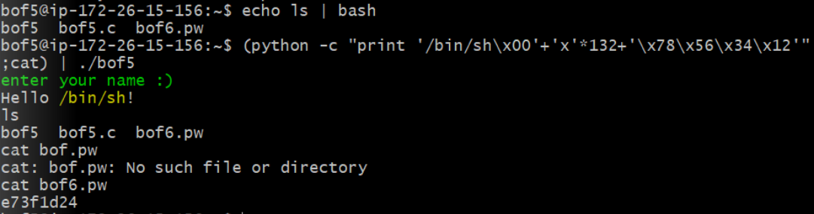
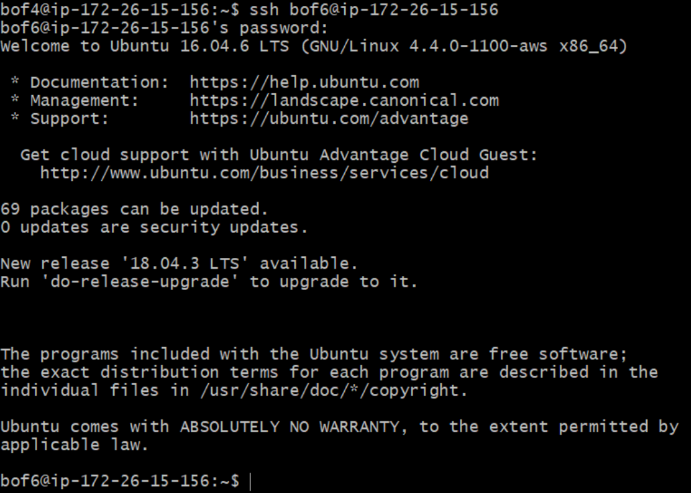

## bof 해킹 과정

- bof1부터 다음 단계로 가기 위해서는 pw를 알아야하는데  그 다음 단계의 권한이 있어야 pw를 알 수 있다

- 먼저 bof2에서 bof3로 가기 위해서는 리버싱 툴을 이용하여 bof2의 코드를 분석해야 한다

- vuln 안에 strcpy함수는 입력받은 값을 버퍼에 저장할 때 길이를 검증하지 않고 단순히 스택에 복사하기만 하니 버퍼의 길이를 초과하더라도 그대로 복사가 된다

- 이때, main에서 arg로 받기 때문에 먼저 입력값이 있어야 한다

- gets 함수로 받은 buf가 한계보다 더 큰 데이터를 입력받아 innocent 변수를 조작할 수 있다

- 위에 보이듯이 innocent 변수와 buf의 주소값의 차가 140임을 확인하였으니 그만큼의 버퍼의 길이를 늘려 kEY값을 입력하여 주면 그 다음 단계의 권한으로 넘어갈 수 있다

- 이때, 다음 단계로 넘어간 다음, 코드가 끝나 실행이 멈추면 다시 되돌아가므로 파이프 | 를 통해 입력 스트림이 끝나기 전에 다른 프로그램의 출력으로 리다이렉트 시키면 다른 프로그램이 끝날 때 입력 스트림이 종료되는 식으로 바꿀 수 있다

- 이에 해당되는 코드는 echo ls | bash 이다

- 위와 같이 buf에 140을 초과시키고 KEY값을 입력해야하니 ./bof2 'python -c "print 'x'*140 + 'aaaa'"' 를 받으면 다음 단계의 권한으로 프로그램이 실행되므로 cat bof3.pw를 통해 비밀번호를 받을 수 있다

### bof3

- bof2와 비슷한 방식으로 풀면 되지만 그 뒤 stack에 있는 문자열들을 넘겨주기 위한(?) 0x00이 필요하므로 (python -c print 'x'*140+'a\x00\x00\x00'";cat) | ./bof3 가 쓰입니다

### bof4

- bof3와 같은 방식으로 받지만 KEY값이 0x12345678이므로 뒤에서부터 0x78, 0x56, 0x34, 0x12 순으로 받습니다

### bof5

- gets 함수로 buf를 받는 걸 볼 수 있습니다

여기까지 진행하면 bof6으로 갈 수 있습니다

