# HW6

## 1. bof3, bof4 를 다시 해킹해보면서 루트 쉘을 탈취해보고 write-up 을 쓰세요.

## **bof3**

bof3로 접속한다. 이때, 비밀번호는 bof2에서 알아낸 c273eef0 이다. 

bat bof3.c를 통해서 코드를 보면 다음과 같다. 

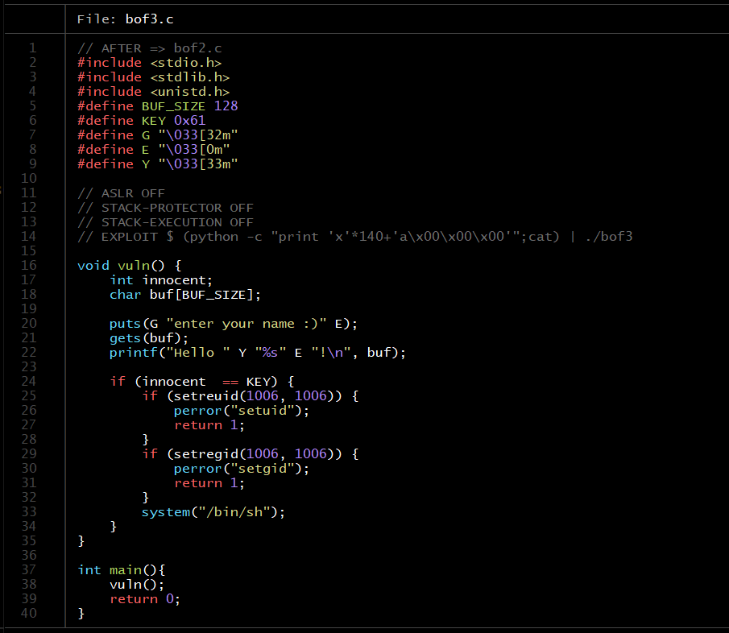

innocent와 KEY를 비교하고 있다는 것을 알 수 있다. KEY는 0x61로 고정되어있다. 따라서 innocent변수를 0x61로 만들면 bof4로 쉘이 실행되어서 bof4.pw를 읽을 수 있다. 

지금 코드에서 gets함수를 쓰고 있는데, 이 함수는 입력받은 값을 버퍼에 저장할 때 **입력 데이터의 길이를 검사하지 않고** 단순히 스택에 복사하기만 한다. 

그렇다면, 얼마나 데이터를 초과시켜야 buf의 경계를 넘어서 innocent의 값을 조작할 수 있는지 알기 위해서 두개의 주소값의 차이를 구한다. 

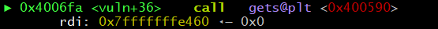

buf의 주소는 0x7fffffffe460 

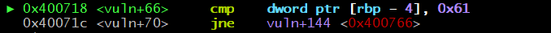

innocent와 KEY를 비교하는 부분이다. innocent는 rbp-4

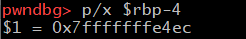

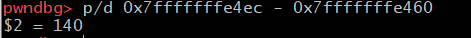

두 주소값의 차이를 구해보면 140

따라서 140 바이트를 전달한 이후에 어떤 값을 입력하면 innocent 변수가 덮어씌워지게 된다. KEY 값인 0x61 은 'a'이다.  

(python -c "print 'a'*140 + 'a'";cat) | ./bof3

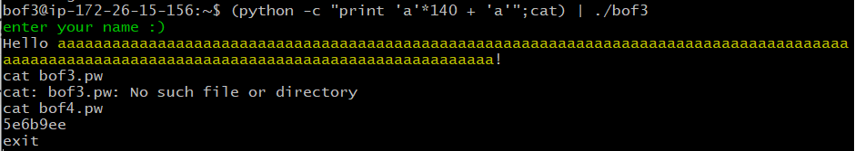

cat bof4.pw를 통해 bof4의 비밀번호는 5e6b9ee라는 것을 확인 

## **bof4**

bof4로 접속한다. 비밀번호는 bof3에서 알아낸 5e6b9ee이다. 

bat bof4.c로 코드를 보면 다음과 같다. 

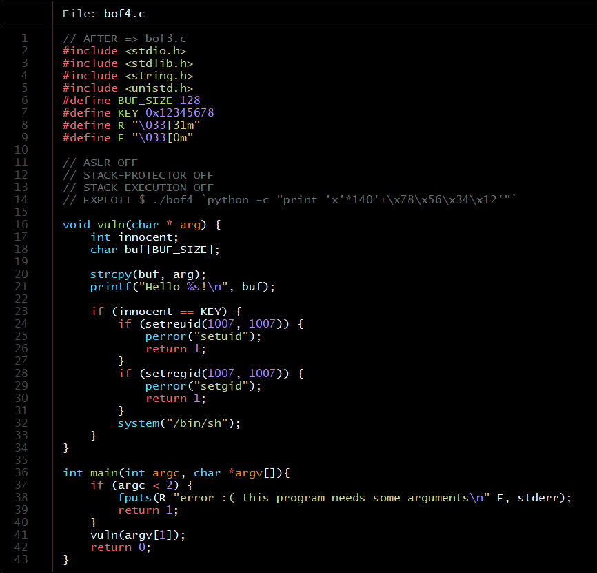

bof3과 같이 innocent와 KEY를 비교하고 있고, KEY는 0x12345678로 고정되어 있다. 

이번에는 strcpy로 입력을 받고 있는데, strcpy도 위의 gets와 마찬가지로 입력 데이터의 길이를 검사하지 않는다. 

bof3과 마찬가지로 얼마나 데이터를 초과시켜야 buf의 경계를 넘어서 innocent의 값을 조작할 수 있는지 알기 위해서 두개의 주소값의 차이를 구한다. 

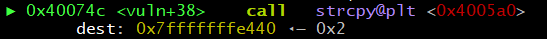

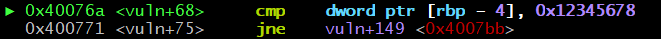

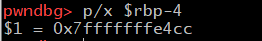

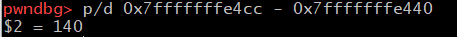 

두개의 주소값의 차이는 140이다. 

따라서 140 바이트를 전달한 이후에 어떤 값을 입력하면 innocent 변수가 덮어씌워지게 된다. KEY값인 0x12345678은 4Vx이다. 

여기에서 잘 이해가 안됨. 0x12345678이 어떻게 \x78\x56\x34\x12로 표현이 되지? --> 빅 엔디안 ..

./bof4 'python -c "print 'x'*140+'\x78\x56\x34\x12'"`

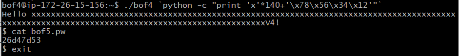 

빅엔디안: 큰 단위가 앞에 나오는 것. 
리틀 엔디안: 작은 단위가 앞에 나오는 것. 
미들 엔디안: 두 경우에 속하지 않거나 둘을 모두 지원하는 것.
 
cat bof5.pw를 통해 bof5의 비밀번호는 26d47d53라는 것을 확인

## 2. bof5 를 풀어보시고 write-up 을 쓰세요.

bof5로 접속한다. 비밀번호는 bof4에서 알아낸 26d47d53이다. 

bat bof5.c로 코드를 보면 다음과 같다. 

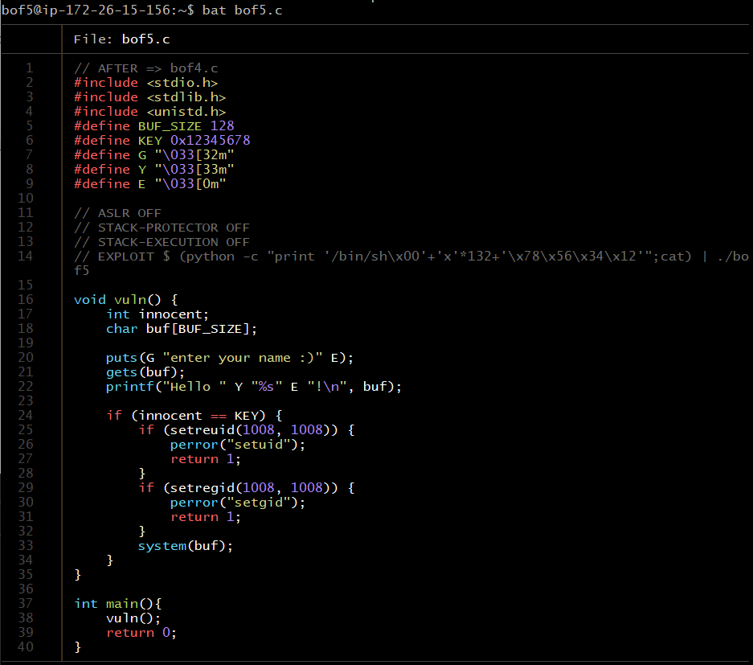 

innocent와 KEY를 비교하고 있고, KEY는 0x12345678로 고정되어 있다.

이번에는 gets로 입력을 받고 있다.

마찬가지로 얼마나 데이터를 초과시켜야 buf의 경계를 넘어서 innocent의 값을 조작할 수 있는지 알기 위해서 두개의 주소값의 차이를 구한다.

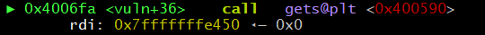

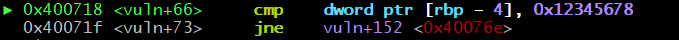

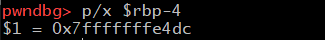

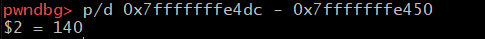

두개의 주소값의 차이는 140

따라서 140 바이트를 전달한 이후에 어떤 값을 입력하면 innocent 변수가 덮어씌워지게 된다. KEY값인 0x12345678은 4Vx이다.

그런데, bof5에서는 system 함수안에 /bin/sh가 아닌 buf가 들어있음. 

x * 140 이 아니라 132 를 한다. /bin/sh\  <--이거 8바이트.

(python -c "print '/bin/sh\x00' + 'x'*132+'\x78\x56\x34\x12'";cat)|./bof5

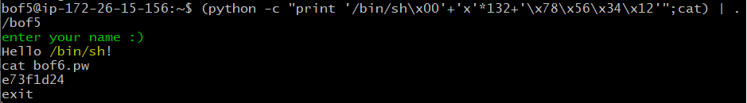

cat bof6.pw를 통해 bof6의 비밀번호는 e73fld24 라는 것을 확인 

---
**PASSWORD**

bof1: bof1

bof2: 16a092e9

bof3: c273eef0 

bof4: 5e6b9ee

bof5: 26d47d53

bof6: e73fld24