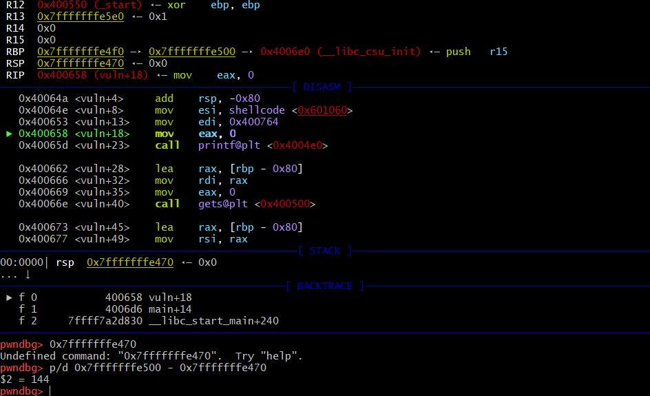

# bof6 write-up

- bof6.pw에서 알려줬던 비밀번호로 bof6 계정으로 들어와서 코드를 본다. 코드는 쉘 코드가 문자열로 들어가있는 c 파일이 들어있다. 여기서 권한을 상승시키는 방법이 뭘까 고민해본다. bof5.c와 다르게 innocent 변수와 KEY를 비교하는 코드는 없지만 gets()에서 데이터를 입력받는 코드는 그대로 있다. 저 쉘 코드는 권한 상승과 관련된 내용의 코드라고 짐작해본다. 그렇다면 KEY값이 주어지고 gets()의 입력받는 주소부터 KEY값과 비교하는 innocent 변수의 주소까지 쓰레기값을 채우고 KEY 값을 넣어줬던 방식이 아닌 저 쉘코드를 실행하는 방법을 찾아본다. 

- 일단 bof5에서 했던것과 동일하게 버퍼의 주소값을 구한다. 버퍼의 주소값은 0x7fffffffe460이다. 
- 과제 설명파일에 의하면 NOP 코드(쓰레기 값)을 리턴주소 직전까지 닿게 하고 리턴 어드레스를 쉘코드가 있는 곳의 주소값으로 덮어써버린다고 써있다. 그렇게 했을 때 권한이 상승된 쉘을 얻을 수 있다고 한다. 그렇다면 쉘 코드는 쉘권한 상승과 관련된 코드라는 것을 짐작할 수 있다. 
- 일단 리턴주소값을 구해본다. 
- 리턴 주소값은 vuln( ) 함수 초반에 함수의 메모리를 확보하는 부분에서 알 수 있다. add rsp, -0x80은 함수 시작할때 함수에 필요한 메모리를 -0x80만큼 확보하는 것을 의미하고 레지스터를 보면 현재 RBP는 0xfffffffe4f0 이고 RSP는 0x7fffffffe460이다. 버퍼가 들어오는 주소값과 같다. RBP는 리턴주소가 저장되어 있는 곳이고 RSP는 함수의 마지막 부분의 주소를 저장하는 곳인데 스택은 주소가 높은곳에서 낮은곳으로 자라기 때문에 버퍼주소값과 RSP값이 같다는 것은 함수의 시작 주소부터 데이터를 입력받는다는 뜻일 것이다. 

- 혹시 몰라서 메인에서도 확인하니 여기서도 RBP는 0xfffffffe4f0이고 RSP는 0x7fffffffe460이다. 

- 리턴주소값(RBP)과 버퍼주소값의 차이를 구했더니 144가 나왔다. 그렇다면 144만큼 덮고 마지막 부분은 쉘코드의 주소값을 넣어야 한다. 

- 뭔 짓을 해도 segmentation fault(core dumped)가 나온다. segmentation fault를 검색해보니 프로그램이 허용하지 않은 메모리 영역에 접근을 시도했거나 허용하지 않은 방법으로 메모리 영역에 접근을 시도했을 때 뜨는 에러라고 한다. 
- 리턴주소값과 버퍼주소값의 차이만큼 144를 채우고 쉘코드의 주소를 입력해보았다.

- 계속 segmentation fault(core dumped)가 뜬다.
- 정답을 확인해 보았다. 

- 주석처리된 정답을 입력했는데 안된다. 
- 정답을 보니 136바이트 만큼 쓰레기값을 채워주고 \x10\x50\x75\x55\x55\x55\x00\x00를 넣는데 \x10\x50\x75\x55\x55\x55\x00\x00가 쉘코드의 주소값인거 같고 크기는 8바이트여서 136 + 8 = 144가 되는거 보니 내가 찾은게 맞는거 같다. 그런데 왜 쉘코드의 주소값으로 출력되는 0x601060이 아닐까. 0x601060과 \x10\x50\x75\x55\x55\x55\x00\x00의 차이가 뭘까. 이게 정답이 맞다면 왜 segmentation fault가 뜰까. 뭔가를 지나치고 있는거 같아서 더 분석해봤다. 

- 혹시 몰라 거리를 다시 계산해 보았다. 똑같이 144가 나온다. 그렇다면 136바이트 만큼 쓰레기 값을 넣고 쉘코드의 주소를 8바이트 만큼 넣는것 역시 맞을 것이다. 다시 해본다.

- 와!!! 찾았다 ㅠㅠㅠㅠㅠ 왜 이걸 진작에 시도를 안해봤을까.. 아까도 이거 비슷한거 했었던거 같은데 왜 안됬지.. 쉘 코드를 4바이트만 설정해서 다시 해봐야 겠다. 

- 안된다. 왜 안될까. 리턴 주소가 들어있는 메모리의 용량이 8바이트인거 같다. 그래서 리턴 주소까지 136으로 맞춰주고 리턴주소가 8바이트이기 때문에 쉘코드가 3바이트여도 나머지 5바이트를 널 값으로 채워줘야 되는거 같다. 그렇지 않고서야 아직까지의 상황이 말이 안된다. 일단 비밀번호를 찾았으니 bof7을 분석해본다. 

# bof7 write-up

- bof7의 코드를 본다. 여기선 bof6과 다르게 메인함수에서 입력을 받는다. 그리고 친절하게 버퍼의 주소도 출력해주고 있다. 

- 디버깅 모드로 들어가서 본다. RBP의 초기값은 0x7fffffffe4f0이고 RSP의 초기값은 0x7fffffffe440이다. 

- 계속 진행해서 보는데 이부분에서 'asg'(실행할때 실행파일 다음으로 입력했던 argument)가 들어오는 부분의 주소가 보인다. 주소가 두개가 보이는데 0xfffffffe448과 0x7fffffffe810이다. 계속 진행해본다. 

- 일단 c 코드에서 버퍼 주소값을 확인해주는 코드가 있었기 때문에 실행해본다. 버퍼 주소값이 0x7fffffffe4a0이라고 한다. 출력하는건 필요하니까 출력되는거 아닐까. 일단 메모해 놓는다. 그런데 입력받는 곳은 메인 아닌가? 메인을 디버깅 해봐야 겠다. 

- 내가 입력했던 sadg라는 첫번째 인자가 메인을 통해 들어오고 rdi에 들어왔다. 메인의 버퍼 주소값은 0x7fffffffe80f이다.
- 이제 버퍼주소값부터 리턴주소값까지 계산만 하면 된다. 
- bof6과 비슷한 방식으로 하면 될것 같은데 거리에서 리턴주소값이 들어가 있는 메모리 용량만큼 쉘코드 주소로 덮어써주면 된다. 
- 그런데 쉘코드 주소는 어디 있는 것인가. 파일이 변형된 것인가? 일단 거리부터 구해야 겠다. 

- 일단 vuln( ) 함수의 RBP(리턴주소값)는 확실한 것 같아서 고정으로 놓고 찾은 모든 주소를 대입해본다. 마이너스가 나온 건 제외하고 80, 176, 168중에 맞는 거리가 무엇일까 생각해본다. 일단 80은 두번 나왔는데 첫번째는 초기 RSP 값이고 두번째는 출력했을 때 나왔던 값이다. 그리고 176과 168은 인자로 전달했던 'asg'라는 문자열이 들어올 때 보였던 두 주소(끝자리 448, 810)인데 어떤 주소인진 잘 모르겠지만 화살표 모양을 봐선 strcpy함수 내에서 arg인자와 buf인자의 주소역할을 하는거 같다. 그런데 느낌이 중요한 주소는 아닌거 같아서 일단 거리는 80으로 생각하고 계속 진행한다.  
- 쉘코드가 없기 때문에 일단 bof7 계정으로 들어가본다. 

- 거리가 80이 나왔으니 72만큼 쓰레기값을 넣어주고 bof6에서 썼던 쉘코드 주소값을 8바이트로 맞춰 넣어봤지만 안됬다. 일단 쉘코드 주소값(x601060)이 bof6.c안에 존재했던 주소값이니 안되는게 당연했고 생각해보니 bof7.c의 버퍼용량이 128이었기 때문에 80으로 bof를 할 수가 없었다. 그렇다면 거리가 80이 아니란 소린가보다. 모르겠다. 정답을 봐야겠다. 

- 왜 정답이 여러개가 있을까. 누가 편집하고 안지웠나? 일단 해본다. 

- 안된다. 정답이 아니라 누가 쓰다가 그대로 저장해 버린거 같다. 

- 쉘코드가 없길래 테스트용으로 bof6의 쉘 코드를 넣어봤다. 그래도 안된다. 거리가 80이 아닐 수도 있다는 생각이 들었다. 그리고 문제에 쉘코드가 없다면 쉘코드를 이용하는 문제가 아닐 수도 있다는 생각이 들었다. 