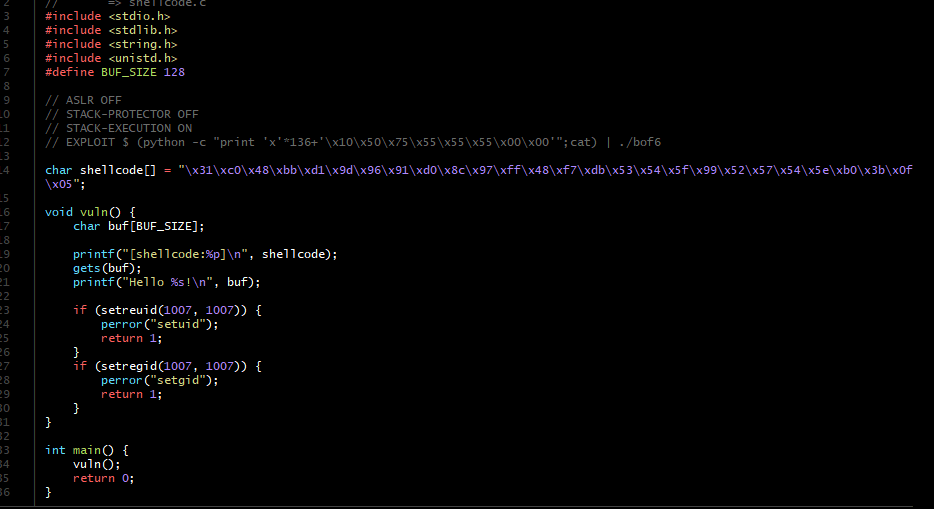
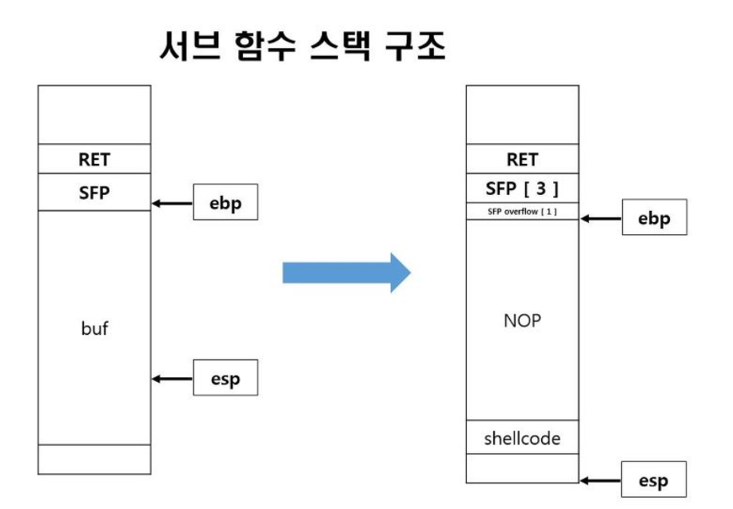
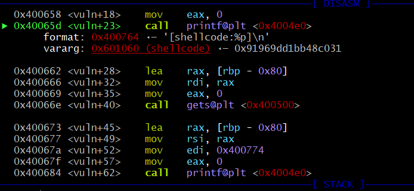

# hw7
## 6번
코드를 우선 보면

이번 과제를 요약하면 아래와 같다.

그래서 리턴 값에 우리가 넣어주려는 쉘의 주소값을 넣어주면 된다.

shell의 주소는

그래서 몇 번 시도했는데 후...주소를 저따구로 넣어서 안됐다.
![image-4] (error.png)
버퍼가 128이고 SFP가 4 바이트니까 리턴값이 132라고 생각을 했었다.

![image-5] (FINAL.png)
