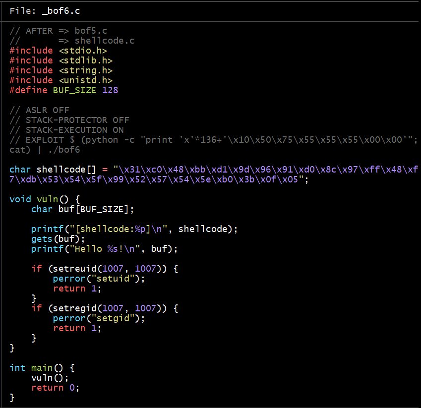
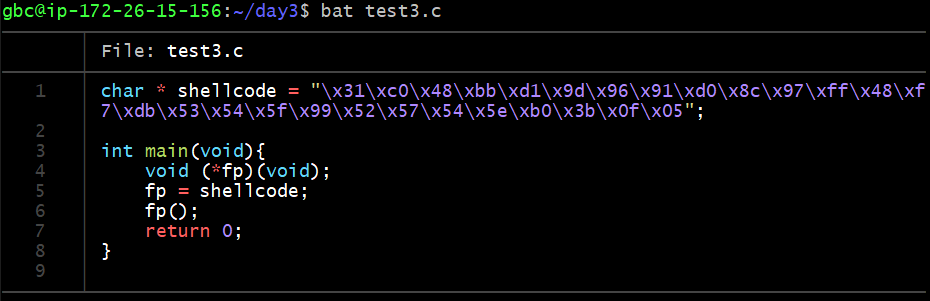
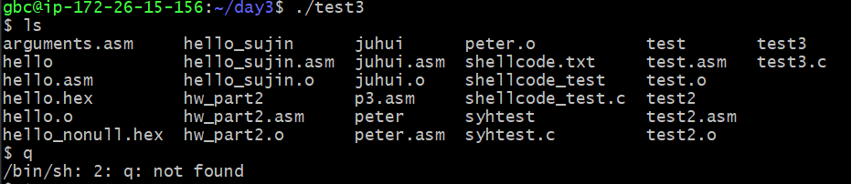
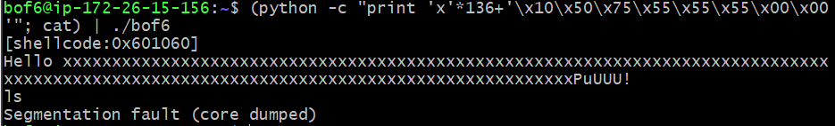
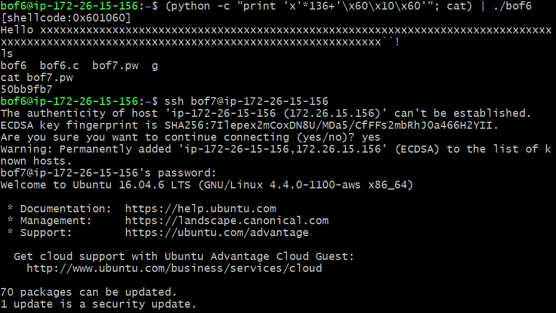
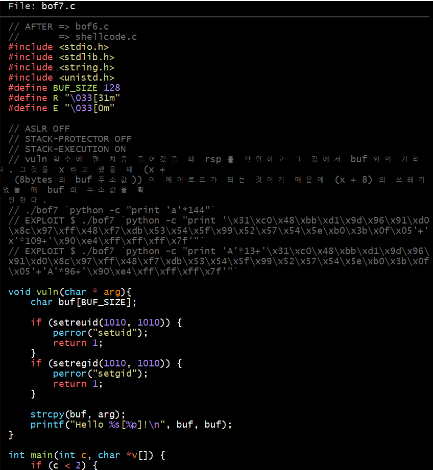

### bof 5 해킹

- system 호출부분에 /bash/bin 대신 buffer을 받는다고 하니 buffer에 /bash/bin 값이 있어야 합니다

- buffer와 innocent의 주소값 차이가 140이니 buffer에는 쓰레기값 140이 들어가야 하지만 먼저 /bash/bin\0값을 넣어주고 그만큼의 크기를 뺀 나머지(132)를 쓰레기값으로 채워주면 그 다음 권한으로 넘어갈 수 있습니다

### bof 6 해킹

- 이해하는 걸 써보면, shellcode 부분이 그 전까지 풀던 방식(system을 이용하여 다음 권한을 얻는 법)을 shellcode로 실행하라는 것 같아서 한번 실험을 해봤습니다

- 먼저 shellcode에 있는 부분을 따로 test3.c에서 옮겨와 컴파일을 해보니

- 역시나 /bash/bin 이 실행됨을 알 수 있었습ㄴ디ㅏ

- 그렇다면 우리가 해야할 것은 쉘 코드를 버퍼에 삽입한 후, 어느 정도의 쓰레기 값을 넣어줘서 return address 직전까지 닿게 한다음, 그 곳을 쉘코드가 있는 주소값으로 덮어버리면 그 다음 단계 권한을 얻으면서 /bash/bin이 실행되니 문제를 해결할 수 있을 것 같다

- 변환 자체가 익숙하지 않아서 일단은 주석되있는 부분으로 시도해봤는데 segmentation fault가 떴다

- 이 부분에서 제일 모르겠는 부분은 return address까지 거리와 그 거리 안에서 왜 \x10부분을 해주는 지를 잘 모르겠다 분명 return address까지 거리에 쓰레기값을 넣는다고 한다면 x*136부분까지가 쓰레기값을 넣는 부분일거고 나머지 부분이 그 주소를 불러오는 부분일텐데 왜 저 값을 넣을까...

- 궁금해서 아스키 코드 변환을 시도해 혹시 저 값 자체가 변환하면 주소가 되지 않을까 확인해봤지만 그것 역시 실패

- 일단 가장 궁금한 점은 마지막에 왜 \x00\x00 두번을 넣었을 까, 저 값은 그냥 널인데 왜 굳이 2개를 넣었을까

- 그래서 그냥 (python -c "print 'x'*136+'\x60\x10\x60'"; cat) | ./bof6 으로 했더니 성공!

### bof 7 해킹

- 이번 코드에는 shellcode가 안주어져 있다 감으로 봤을때는 먼저 return address까지 거리를 구하고 그 거리까지 쓰레기값으로 채운 후, 쉘 코드를 저장한 값을 실행하면 될 거 같은데 일단 한번 시도해보겠다

- 이번에는 이상하게 안된다 Illegal instruction이라는 말은 처음 들어본다 아예 접근 자체가 잘못된 것일까? 먼저 이번 코드는 main에서 arg를 받는 것이니 ./bof7을 먼저 쳐서 열어주고 시작하면 되는데 내가 생각한 이번 해결방법은 먼저 buffer에 쉘코드를 입력해주고 그 buffer의 주소를 기억했다가 return address까지 쓰레기값으로 채운 후, 버퍼의 주소를 입력해주면 알아서 찾아가서 실행시켜주는 식으로 해보았으나 이상한 오류로 실패하였다