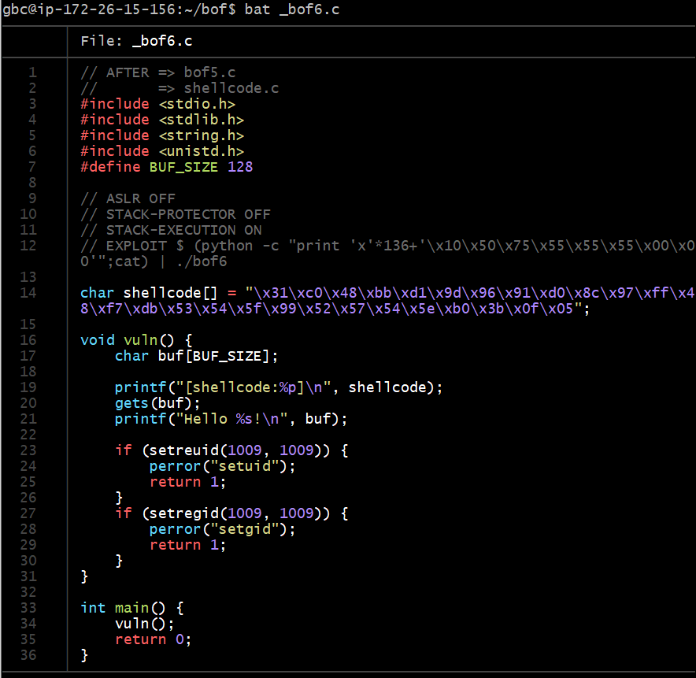
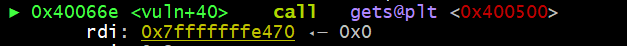

# HW7

## bof5

(HW6과 같은 내용)

bof5로 접속한다. 

bat bof5.c로 코드를 보면 다음과 같다. 

 

innocent와 KEY를 비교하고 있고, KEY는 0x12345678로 고정되어 있다.

이번에는 gets로 입력을 받고 있다.

얼마나 데이터를 초과시켜야 buf의 경계를 넘어서 innocent의 값을 조작할 수 있는지 알기 위해서 두개의 주소값의 차이를 구한다.

두개의 주소값의 차이는 140

따라서 140 바이트를 전달한 이후에 어떤 값을 입력하면 innocent 변수가 덮어씌워지게 된다. KEY값인 0x12345678은 4Vx이다.

그런데, bof5에서는 system 함수안에 /bin/sh가 아닌 buf가 들어있음. 

x * 140 이 아니라 132 를 한다. /bin/sh\x00  <--이거 8바이트. (\x00 개행문자가 1바이트)

(python -c "print '/bin/sh\x00' + 'x'*132+'\x78\x56\x34\x12'";cat)|./bof5

cat bof6.pw를 통해 bof6의 비밀번호는 e73fld24 라는 것을 확인 

-----
----

## bof6

bat _bof6.c를 통해 코드를 보면 다음과 같다. 

쉘코드 주소값을 출력하고 있다. 그 부분 자세히 봐야할 듯

gets로 입력을 받는데 buf 에 입력받고 있다.

----

gdb를 통해서 vuln함수를 살펴보았다.

shellcode 의 주소?! 0x601060을 발견했다. 

그러면 이 주소를 리턴주소값으로 덮어 씌워야 하는데, 리턴주소값?? 그게 뭔지 못 찾겠다. 

----
----

## bof7

----
----