# Bof 7 Write-up

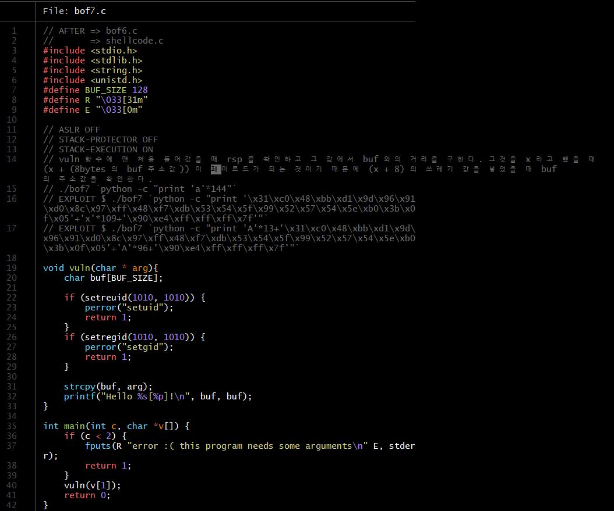
- bof7.c의 코드를 확인한다
- bof6.c와 비슷하지만 메인에서 인자를 받는 것을 확인할 수 있다. 
- 메인에서 인자를 받는 경우 스택의 주소값이 밀리기 때문에 의도했던 대로 버퍼 값의 주소를 알 수가 없는 상황이 발생한다. 
- 여기서 해야 할 것은 크게 세가지 이다.
  1. 버퍼에서부터 리턴 어드레스까지의 거리를 구한다
  2. 그 거리를 A라고 했을 때 A + 8바이트로 리턴 어드레스를 덮어 써야 한다. 
  3. 그러기 위해서 144바이트를 인자로 전달 한 후에 버퍼 주소를 알아 내서 그 버퍼 주소로 리턴 어드레스 주소를 덮어 써야 한다. 
- 위의 3가지 과정을 거칠 때 쉘 코드를 실행하고 동시에 우리가 원하는 bof8의 비밀번호를 알아낼 수 있다.  

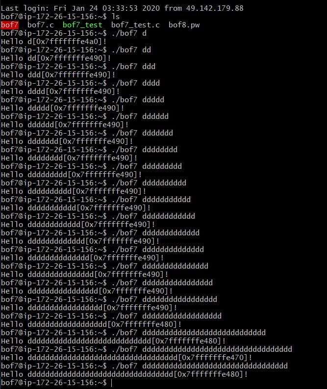
- 인자를 늘릴 때마다 버퍼의 주소값이 바뀌는걸 알 수 있다. 
- buf 부터 리턴 어드레스 사이까지의 거리가 136이라는 것을 아는 상황에서 8바이트 주소값을 덮어 써야 하기 때문에 144바이트를 인자로 넘기고 그때의 buf 주소를 구한다

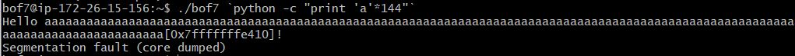
- 144바이트를 넘겼을때의 buf주소는 0x7fffffffe410이다
- 페이로드를 만드는데 쉘코드를 인자로 넘기고 마지막에 8바이트만큼 방금 구했던 buf 주소를 넘기고 그 중간은 쓰레기 값으로 채운다. 

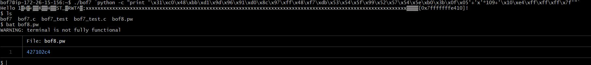
- bof8의 비밀번호를 구했다. 

# Bof 8 Write-up

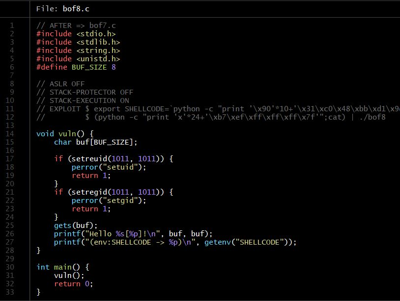
- bof8의 코드를 확인한다.
- 코드만 봐선 알 수 없어서 주석을 참고해서 따라해본다. 
- 쉘코드를 환경변수로 설정해준다.
- 코드에서 버퍼의 주소와 쉘코드의 주소를 출력해주는데 이 쉘코드의 주소를 인자로 버퍼에 인자로 넘김으로서 상승권한을 얻을 수 있다. 

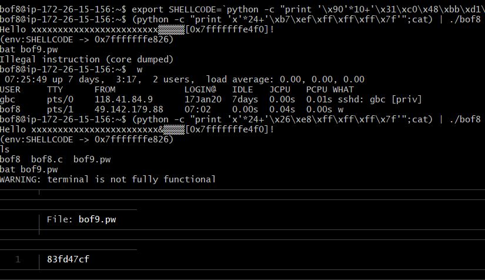
- bof9의 비밀번호를 얻었다. 

# Bof 9 Write-up

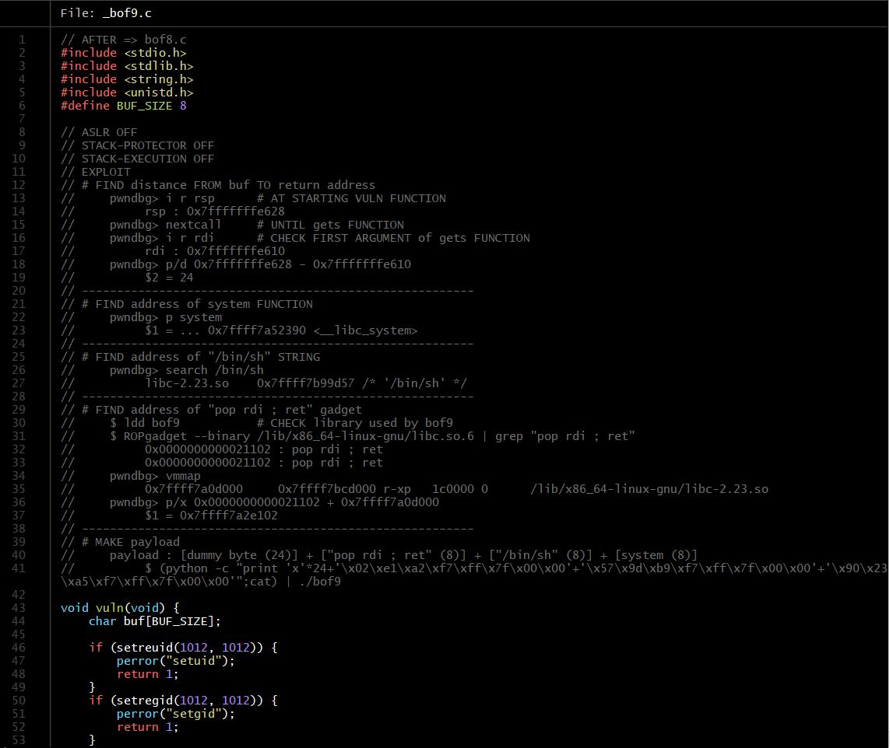
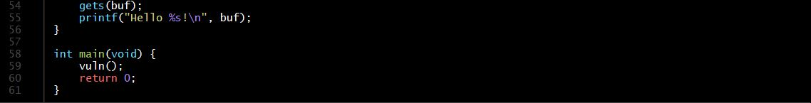
- bof9.c의 코드를 확인한다
- 확인해도 모르겠으니까 설명파일대로 따라가본다. 

1. 버퍼와 리턴 어드레스까지의 거리를 구한다.
   1. 리턴 어드레스를 구하기 위해 vuln함수의 시작에서 rsp를 구한다. 리턴 어드레스값은 0x7fffffffe4e8이다
   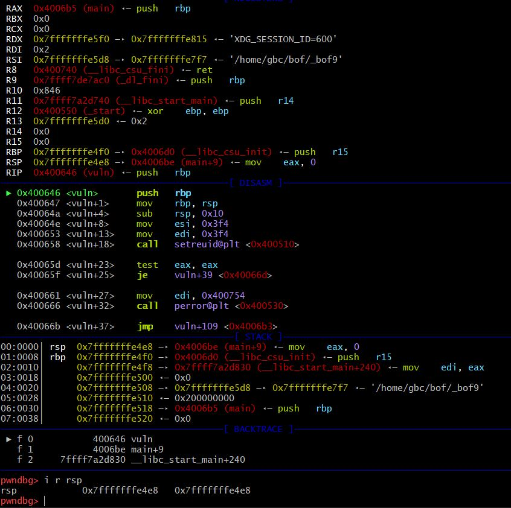

   2. 버퍼 주소를 구하기 위해 gets함수로 간다.  
   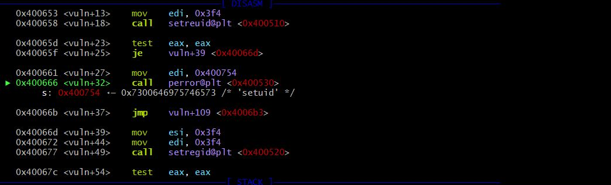
   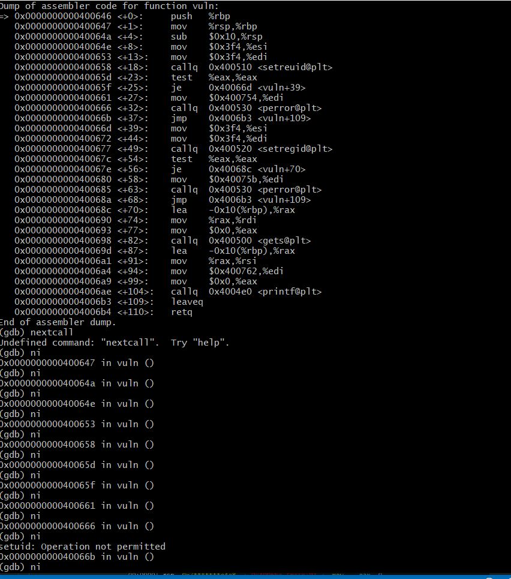
   - 그런데 뭔가 잘못된거 같다. gets함수로 가지질 않는다. 
   - gets로 받을 인자를 안줘서인것 같다. 디버깅시 인자를 줘본다. 

   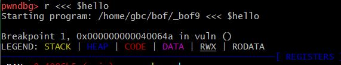
   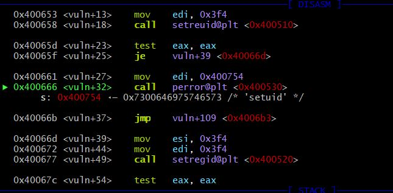

   - 그래도 계속 if문 안으로 들어가서 gets함수로 가기 전에 리턴되버린다. 
   - 권한이 없어서 계속 if문 안으로 들어가는거 같으니까 bof9 계정에서 해본다. 
   - 이번에는 브레이크 포인트를 vuln함수와 gets함수에 건다. 

   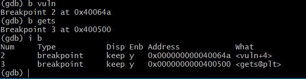
   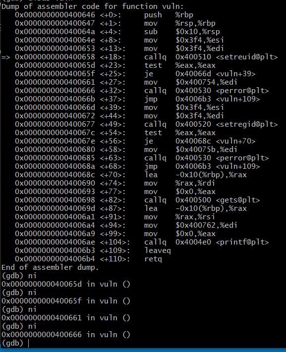
   - 여기에서도 계속 if문 안으로 들어가서 gets함수로 갈 수가 없다. 
   - 이렇게 된 이상 야매법을 시전해본다. 
   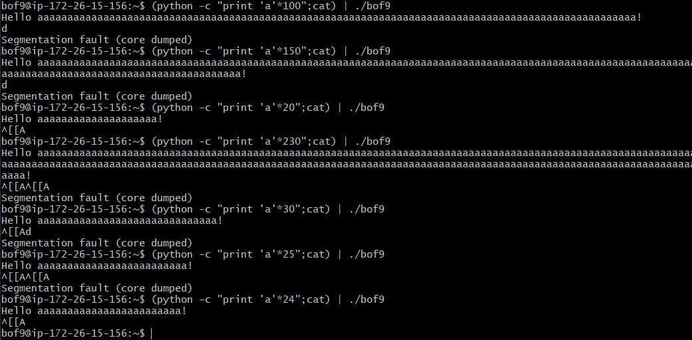
   - 25에서 segmentation fault가 뜨던게 24에서 안뜬다. 즉, 버퍼주소에서 리턴주소까지 거리가 24라는 말이다. 

2. 시스템 함수의 주소값을 찾는다.
   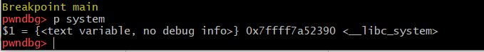  
   - 0x7ffff7a52390으로 확인되었다. 

3. /bin/sh 문자열의 주소값을 찾는다.
   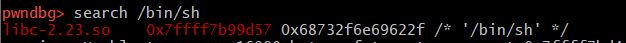  
   - 0x7ffff7b99d57로 확인되었다. 

4. pop rdi ; ret 가젯의 주소값을 찾는다.
   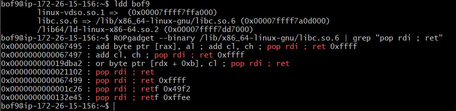  
   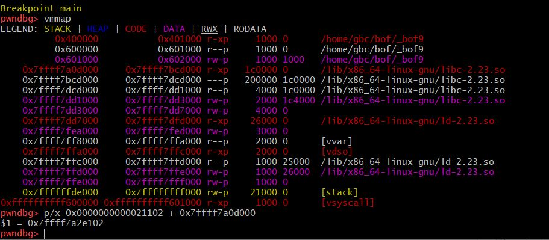  
   - pop rdi ; ret 가젯의 주소는  0x7ffff7a2e102이다. 

5. payload를 만든다. 
   - ['a'*(버퍼와 리턴 어드레스까지의 거리)] + [pop rdi ; ret 가젯의 주소(8 바이트)] + [/bin/sh 문자열 주소(8 바이트)] + [system 함수의 주소(8 바이트)] 
   - (python -c "print 'a'*24 + '\x02\xe1\xa2\xf7\xff\x7f\00\00' + '\x57\x9d\xb9\xf7\xff\x7f\x00\x00' + '\x90\x23\xa5\xf7\xff\x7f\x00\x00'";cat) | ./bof9  

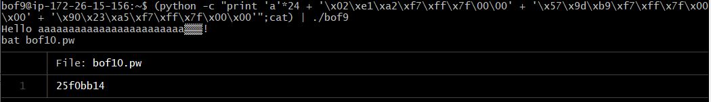 
- bof10의 비밀번호를 구했다.  
- 설명을 따라서 구하긴 했지만 전부 이해하지는 못했다.
- 추측하기로는 아직까지 했던 리턴주소에 쉘코드의 주소를 덮어 써주는 방식이 아닌 system("/bin/sh")함수를 주소를 통해 호출함으로써 euid의 권한으로 /bin/sh를 실행할 수 있는 것 같다. 

### 그동안 정말 고생 많으셨습니다!

