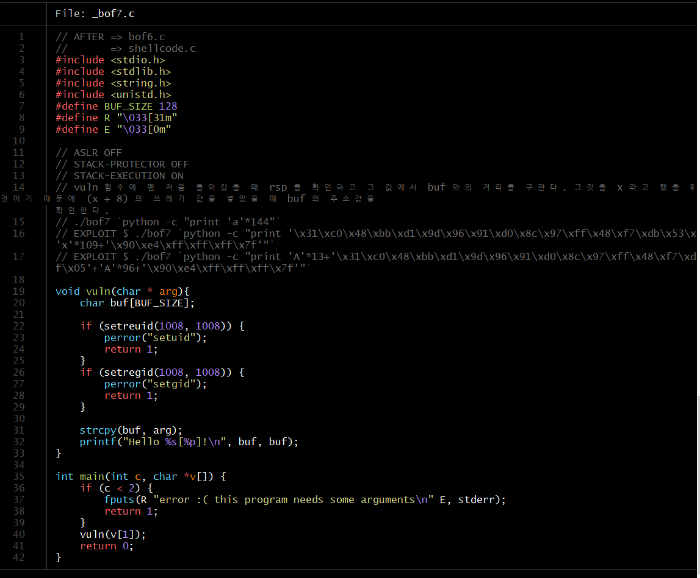
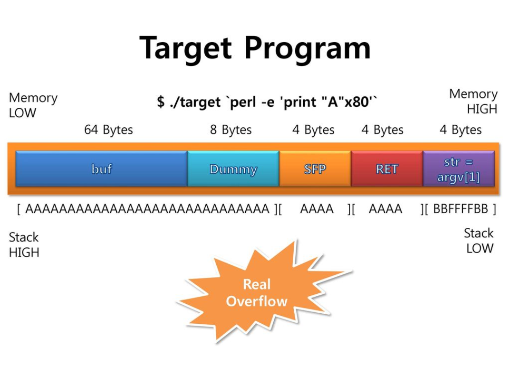
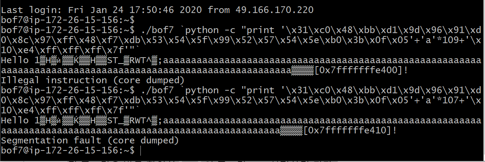

# bof 7

우선 코드를 보면

우리는 취약점이 있는 코드를 타겟팅하는 것인데
구조를 보면 아래와 같다.

버퍼와 맨 처음 들어갔을 때의 rsp의 거리를 구하고 거기에
SFP와 RET의 크기를 더하면 페이로드가 되고 쓰레기값으로 덮어쓴다.

쉘 코드가 27바이트 쓰레기 값이 109 바이트이고 리턴 어드레스가 8바이트인 것을 생각했을 때

근데 나는 안나옴 허허허
자괴감 x 100 ... 나레기... 스트레스 이빠이 ㅠㅠ
후... 