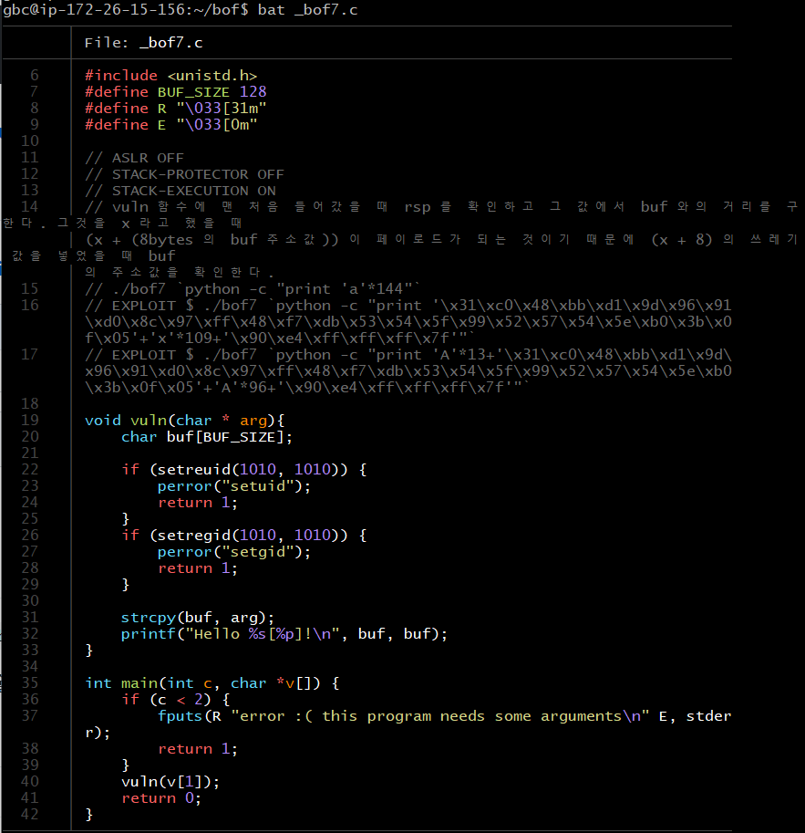
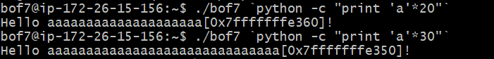
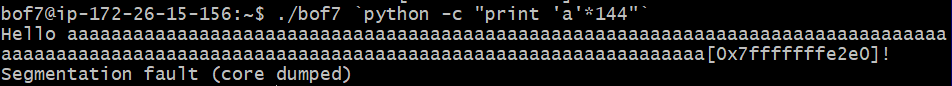
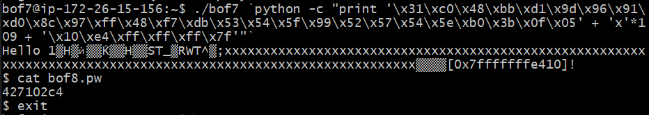
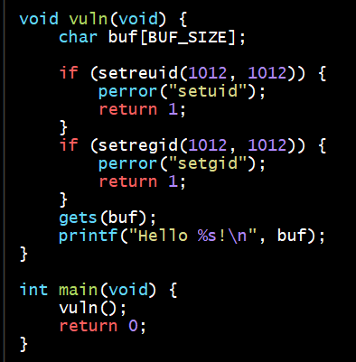
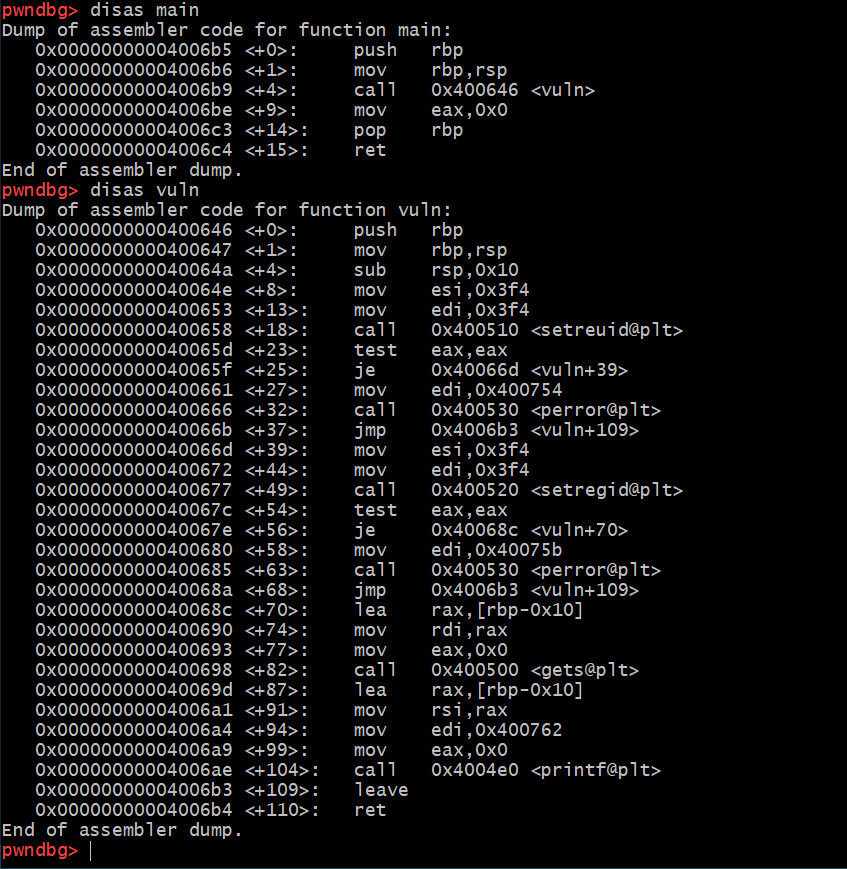
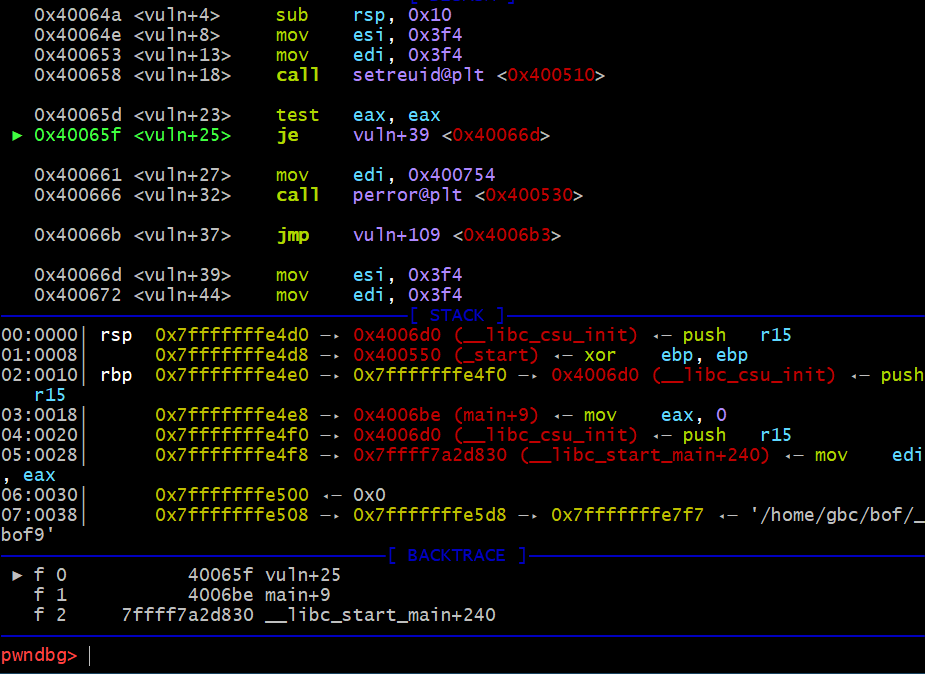

# HW8

## bof7

bof7의 코드는 위와 같다. 

입력은 strcpy로 받고있다. 그리고 입력을 buf에 받으면 buf와 함께 buf의 주소값을 출력하고 있다. 

그런데 이번에는 main함수인자의 길이에 따라서 buf의 주소값이 달라지고 있다. 인자가 클 경우에 메모리를 더 사용해서 stack영역을 더 밑으로 내려가게 한다. 그래서 더 큰 값을 넣을 수록 메모리 주소값이 더 낮아지는 것을 볼 수 있다. 

buf 와 return address 까지의 거리는 136 이고 그 이후에 8 바이트 주소값을 덮어써야 한다. 그러므로 최종으로 전달해야 할 인자의 길이는 144 바이트이다. 따라서 먼저 144 바이트 인자를 전달해 보고 그때의 buf 의 주소값을 알아내야 한다.

144바이트 인자를 전달하면 buf의 주소값으로 [0x7fffffffe2e0]이 나오는 것을 볼 수 있다. 
--> 이 주소로 return address를 덮어써야 한다.  

----

## bof9

다음은 bof9의 코드이다. 

gets를 통해서 buf에  입력을 받고 있다. 

buf와 return address 의 간격을 알아야 한다. 

그러러면 vuln함수에서 rsp를 찾고, gets 함수에서 rdi를 찾아야한다. 

 

그런데 gdb 에서 gets를 못찾아서 허우적 거리고 있다..

nextcall을 해도 gets를 왜 못찾지?